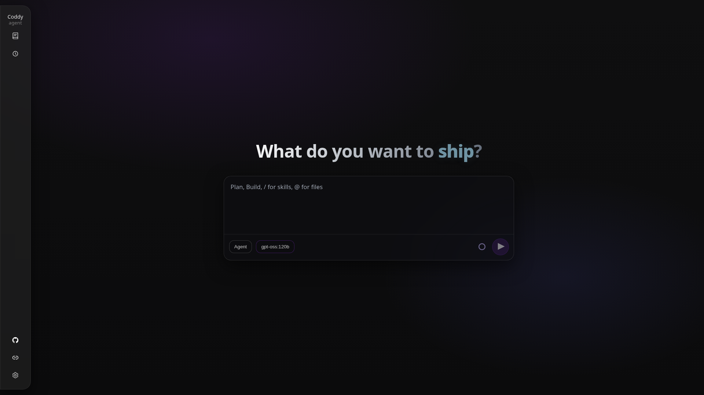
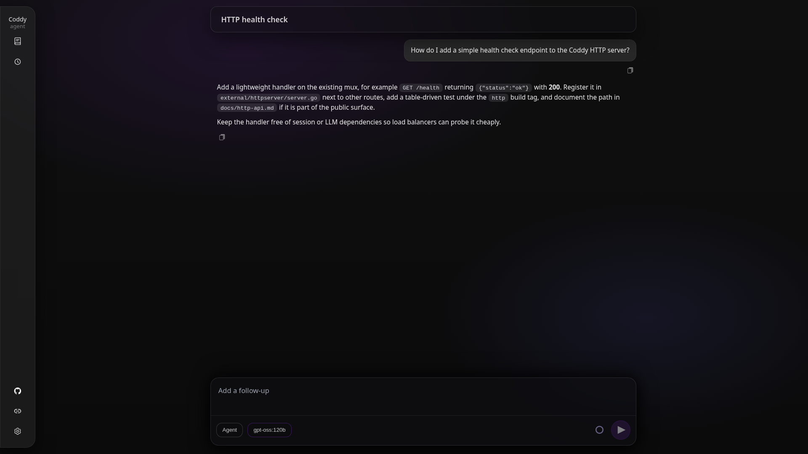
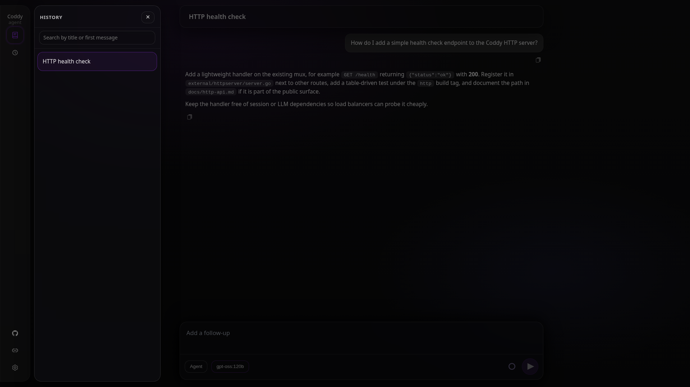
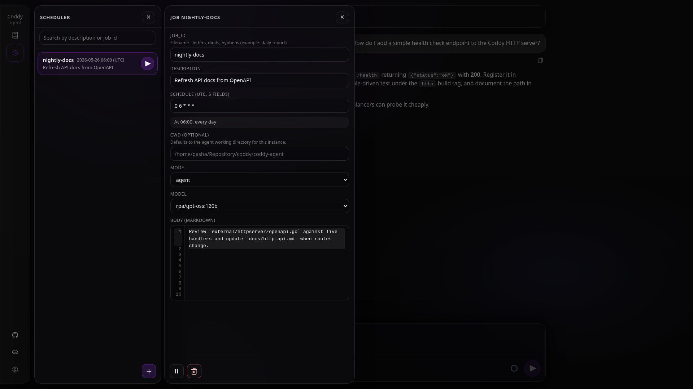
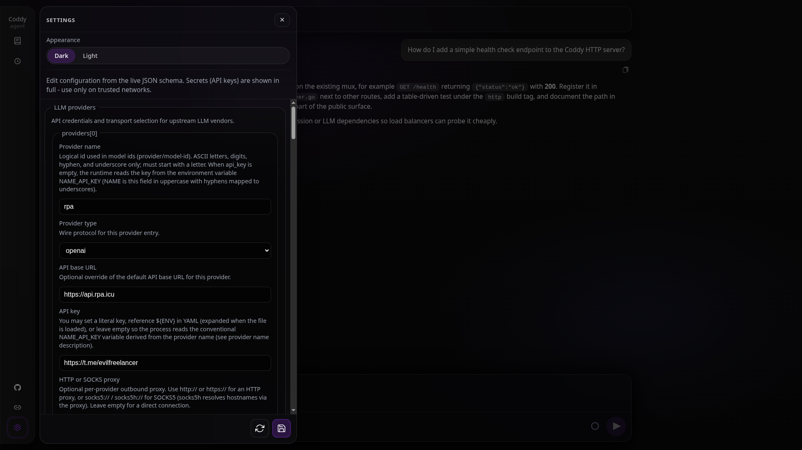

<p align="center">
  <a href="https://go.dev/doc/go1.25"></a>
  <a href="LICENSE"></a>
  <a href="https://github.com/EvilFreelancer/coddy-agent/actions/workflows/tests-on-pr.yaml"></a>
  <a href="https://agentclientprotocol.com/"></a>
  
  
</p>

<p align="center">
  
</p>

<p align="center">
  <strong>Run a full general purpose agent from one static Go binary.</strong><br />
  ReAct, filesystem and shell tools, MCP, Skills, optional OpenAI-compatible API with an embedded UI, scheduler, and long-term memory.
</p>



<details>
<summary>More screenshots</summary>

| Chat | History |
| --- | --- |
|  |  |
| Scheduler (list + job) | Settings |
|  |  |

Screenshots at **1920×1080** from the embedded UI (`coddy http` + Vite dev). Spec and dev workflow: [`docs/ui.md`](docs/ui.md), layout tokens: [`DESIGN.md`](DESIGN.md).

</details>

Coddy is a distroless-friendly **harness**: drop it into minimal images (`scratch`, `distroless`, read-only workspaces) without a full OS shell. The harness layer (ACP RPC, sessions, prompts, providers) stays the same if you tighten the toolset or drive it from automation instead of an IDE.

## Contents

- [Features](#features)
- [Quick start](#quick-start)
  - [Installation](#installation)
  - [Build tags](#build-tags)
  - [Docker](#docker)
  - [Paths (`CODDY_HOME`, `CODDY_CWD`)](#paths-coddy_home-coddy_cwd)
  - [Configuration](#configuration)
- [How to update](#how-to-update)
- [Operating modes](#operating-modes)
- [Editor and IDE integration](#editor-and-ide-integration)
- [Cursor rules and skills](#cursor-rules-and-skills)
- [MCP server integration](#mcp-server-integration)
- [Configuration (reference)](#configuration-1)
- [Architecture](#architecture)
- [Documentation](#documentation)
- [Examples (ACP over stdio)](#examples-acp-over-stdio)
- [Persistent sessions](#persistent-sessions)
- [Development](#development)
- [License](#license)

## Features

- **Harness-first** - ACP server, session lifecycle, prompts, LLM backends, MCP merge, distroless-ready binary
- **ReAct loop** - LLM alternates between reasoning, acting (tool calls), and observing results (coding-agent persona out of the box)
- **Two operating modes** - `agent` (full tool access) and `plan` (planning + text files only)
- **Cursor rules support** - reads `.cursor/rules/` and skills from the same on-disk layout Cursor uses when those paths appear in **`skills.dirs`**
- **MCP server integration** - connect any MCP server for additional tools
- **Multi-provider LLM** - OpenAI, Anthropic, Ollama, any OpenAI-compatible API
- **ACP protocol** - Coddy is an **ACP server** (`coddy acp`); pair it with editors or scripts that implement an ACP client (see [Editor and IDE integration](#editor-and-ide-integration))

## Editor and IDE integration

Coddy speaks **ACP as the server** over stdin/stdout. A compatible **client** must spawn `coddy acp` and exchange JSON-RPC messages (see **`docs/acp-protocol.md`** and **`examples/acp/`**).

- **Zed** and other products that support **external ACP agents** can point their agent command at **`coddy acp`** (exact settings depend on that product; see its ACP or external-agent docs).
- **Cursor Desktop** (in-app Agent or Composer) does **not** document a supported way to replace the built-in agent with a custom **`coddy acp`** binary. Cursor's published ACP guide describes **`agent acp`**, where **Cursor's own agent** runs as the ACP **server** for third-party **clients** (for example Neovim or JetBrains integrations that connect **to** Cursor). That is the opposite wiring from running Coddy as your local agent process.
- **Cursor-style paths on disk** - Coddy can still load rules and skills from **`.cursor/rules/`**, **`~/.cursor/skills`**, and other **`skills.dirs`** entries in **`config.yaml`**. That is file-layout compatibility with Cursor, not Cursor acting as the Coddy runtime host.

## Quick Start

### Installation

**Prerequisites**

- **Go** - same minor version as [`go.mod`](go.mod) (currently **1.25**).
- **Git** - used by the Makefile for the embedded version string.
- **Node.js / npm** - only if you build with **`http`** and **`ui`** (the Makefile runs **`ui-build`** for embedded assets).

**Install with Go (quick, default upstream tags)**

```bash
go install github.com/EvilFreelancer/coddy-agent/cmd/coddy@latest
```

That builds whatever the module ships **without** custom `-tags`. For **`coddy http`**, the bundled SPA, scheduler, and long-term memory together, **build from source** with the tags below (same defaults as [`Dockerfile`](Dockerfile) / [`docker-compose.dev.yml`](docker-compose.dev.yml)).

**Recommended full binary from source (HTTP + UI + scheduler + memory)**

Pass the **`memory`** build tag to link long-term memory; optional HTTP, SPA, and scheduler use their own tags (see [Build tags](#build-tags)). Runtime **`memory.enabled`** in YAML only applies when the binary includes **`memory`**.

```bash
git clone https://github.com/EvilFreelancer/coddy-agent
cd coddy-agent
make build TAGS="http ui scheduler memory"
```

The CLI is written to **`build/coddy`** (not the repo root).

**Install `build/coddy` onto your PATH**

Reuses **`build/coddy`** when it already exists; otherwise builds with all optional modules first.

```bash
make build TAGS="http ui scheduler memory"
make install
```

- **root** - **`/usr/local/bin/coddy`**
- **regular user** - **`~/.local/bin/coddy`** (put that directory on **`PATH`** if needed)

**Build without installing**

```bash
make build TAGS="http ui scheduler memory"
```

**Manual `go build` (same as Makefile)**

When **`TAGS`** includes **`http`** and **`ui`**, run **`make ui-build`** first (or rely on **`make build`**, which triggers it).

```bash
make ui-build   # required before go build when using -tags=...,ui,... with http
VERSION="$(make -s print-version)"
go build -tags=http,ui,scheduler,memory \
  -ldflags "-X github.com/EvilFreelancer/coddy-agent/internal/version.Version=${VERSION}" \
  -o build/coddy \
  ./cmd/coddy/
```

Lean **ACP-only** binary (no **`coddy http`**, no embedded UI, no scheduler packages):

```bash
make build
```

After any local build, prefer **`./build/coddy`** or **`make install`** so you do not accidentally run another **`coddy`** already on **`PATH`**. Check with **`which coddy`** and **`coddy -v`**.

To upgrade an existing install from GitHub Releases, see **[How to update](#how-to-update)**.

Full detail, **`LDFLAGS`**, and **`make print-version`** - **[docs/build.md](docs/build.md)**.

The agent speaks ACP over stdio. An **ACP client** (your editor integration or harness) launches **`coddy`** once it is configured to spawn **`coddy acp`**. **`coddy -v`** or **`coddy --version`** prints the embedded build version (**`dev`** if not set at link time). Flags for ACP live on the subcommand, for example **`coddy acp --help`** (**`--log-level`**, **`--home`**, **`--cwd`**, **`--config`**, etc.).

### Build tags

Use **`Makefile`** variable **`TAGS`** with **spaces** (**`make build TAGS="http ui scheduler memory"`**). **`go build`** uses **commas** (**`-tags=http,ui,scheduler,memory`**).

| Tag | Enables | Docs |
|-----|---------|------|
| **`memory`** | Long-term memory copilot (**`memory.enabled`** in YAML); with **`http`**, session memory REST under **`/coddy/sessions/{id}/memory/*`** | [`external/memory/README.md`](external/memory/README.md) |
| **`http`** | **`coddy http`**, REST gateway, **`/docs`**, **`/openapi.yaml`** | [`docs/http-api.md`](docs/http-api.md) |
| **`ui`** | Embedded SPA on **`/`** (needs **`http`**) | [`docs/ui.md`](docs/ui.md), [`DESIGN.md`](DESIGN.md) |
| **`scheduler`** | Scheduler daemon and **`coddy_scheduler_*`** tools; with **`http`**, **`/coddy/scheduler`** REST | [`docs/scheduler.md`](docs/scheduler.md), [`external/scheduler/README.md`](external/scheduler/README.md) |

Extended narrative and Docker alignment - **[docs/build.md](docs/build.md)**.

### Docker

Release images are published on **[GitHub Container Registry](https://github.com/coddy-project/coddy-agent/pkgs/container/coddy-agent)** as **`ghcr.io/coddy-project/coddy-agent`** (tags such as **`latest`** and **`X.Y.Z`**, **linux/amd64** and **linux/arm64**). Each SemVer git tag also gets **GitHub Release** archives (Linux, Windows, macOS Intel and Apple Silicon) - see **[docs/build.md](docs/build.md#release-binaries-ci)**. The default image includes **`http`**, **`ui`**, **`scheduler`**, and **`memory`** - the same feature set as **`make build TAGS="http ui scheduler memory"`**.

**1. Config and workspace** (from the repo root, or any directory where you keep **`config.yaml`**):

```bash
cp config.example.yaml config.yaml
mkdir -p workspace coddy_home
# Edit config.yaml: at least one provider api_key (or rely on OPENAI_API_KEY etc. in compose)
```

**2. Start with Compose** (pull published image, no local build):

```bash
docker compose pull
docker compose up -d
```

To **build the image locally** instead, use **`docker-compose.dev.yml`**: **`docker compose -f docker-compose.dev.yml up -d --build`**.

**3. Open the bundled UI** in a browser on the host:

```text
http://127.0.0.1:12345/
```

The SPA is served on **`GET /`** by **`coddy http`**. Pick a **model** in the composer (YAML backends from **`GET /v1/models`**), choose **agent** or **plan** mode, then send a message - the UI creates a session and streams the reply via **`POST /v1/responses`**. Agent files and shell tools use the mounted workspace (**`./workspace`** → **`/workspace`** in the container). Live YAML editing: **`http://127.0.0.1:12345/#/settings`**.

Sanity check without a browser: **`curl -sS http://127.0.0.1:12345/v1/models | head`**.

There is **no login** on the HTTP surface - expose port **12345** only on trusted networks. Full compose options, volumes, and CI image tags: **[docs/docker.md](docs/docker.md)**. Smoke script: **`examples/httpserver/docker.sh`**.

### Paths (`CODDY_HOME`, `CODDY_CWD`)

- **`CODDY_HOME`** (or **`coddy acp --home`**) is the agent state directory. Default **`~/.coddy`**. The process creates **`sessions/`** and **`skills/`** under it. Config defaults to **`$CODDY_HOME/config.yaml`**.
- **`CODDY_CWD`** (or **`coddy acp --cwd`**) is the default session working directory when `session/new` sends an empty **`cwd`**. Default is the process current directory at startup. Editors that pass a path in **`session/new`** use that path instead.

### Configuration

**`CODDY_HOME`** defaults to **`~/.coddy`**. Unless you set **`CODDY_CONFIG`** or pass **`--config`**, the primary config file is **`config.yaml`** at **`$CODDY_HOME/config.yaml`**.

Copy the example and edit it:

```bash
mkdir -p ~/.coddy && cp config.example.yaml ~/.coddy/config.yaml
```

If **`$CODDY_HOME/config.yaml`** is absent, the loader may use **`config.yaml`** in the process working directory (useful when running from a repository clone). See **`docs/config.md`**.

**Providers and models**

- **`providers`** - named backends (**`type`**: **`openai`** for OpenAI and OpenAI-compatible HTTP APIs, **`anthropic`** for Anthropic). Each **`name`** must be ASCII letters, digits, hyphen, or underscore, starting with a letter (it becomes the prefix in model ids). Each row has **`api_key`** (literal, **`${ENV}`** expanded when the file loads, or empty to read **`NAME_API_KEY`** from the environment at LLM call time, with **`NAME`** derived from **`providers[].name`** in uppercase and hyphens mapped to underscores), and optionally **`api_base`** when the API is not the vendor default.
- **`models`** - selectable models. Each **`model`** string is **`<provider_name>/<api_model_id>`** where **`provider_name`** matches **`providers[].name`**. Tunables include **`max_tokens`**, **`temperature`**, and optional **`max_context_tokens`**.
- **`agent`** - **`model`** picks the default ReAct model (must match one **`models[].model`** entry). **`max_turns`** and **`max_tokens_per_turn`** bound one user turn.

Example (**`openai`** provider and **`gpt-5.4-mini`**; store secrets in the environment, not in git):

```yaml
providers:
  - name: openai
    type: openai
    api_key: "${OPENAI_API_KEY}"

models:
  - model: "openai/gpt-5.4-mini"
    max_tokens: 400000
    temperature: 0.2

agent:
  model: "openai/gpt-5.4-mini"
  max_turns: 35
  max_tokens_per_turn: 128000
```

Then export the key the YAML references:

```bash
export OPENAI_API_KEY="sk-..."
```

Other setups (Anthropic, Ollama, a non-default **`api_base`**, and env-based defaults) are covered in **`config.example.yaml`** and **[docs/config.md](docs/config.md)**.

## How to update

Official CLI binaries are published on **[GitHub Releases](https://github.com/coddy-project/coddy-agent/releases)** (assets such as **`coddy_0.9.3_linux_amd64.tar.gz`**). Each release matches the full feature set from **`make build TAGS="http ui scheduler memory"`**.

**`coddy update`** downloads the archive for your OS/architecture and replaces the binary you invoked (symlinks resolved). That is the usual path after **`make install`** (**`~/.local/bin/coddy`**) or when you run **`./build/coddy update`** to refresh a local build artifact.

**1. See what you run today**

```bash
which coddy
coddy -v
```

**2. Check for a newer release**

```bash
coddy update --check
```

Exit code **0** means you are already on the latest published **`X.Y.Z`** (or newer). Exit code **1** means a newer release is available.

**3. Install**

```bash
coddy update          # asks [y/N]
coddy update -y       # no prompt
```

**4. Confirm**

```bash
coddy -v
coddy http --help     # only when the binary includes -tags=http (release builds do)
```

**Common flags**

| Flag | Purpose |
|------|---------|
| **`--check`** | Only report whether an update exists (no download). |
| **`-y`** / **`--yes`** | Install without confirmation. |
| **`--version X.Y.Z`** | Install a specific release, not only "latest". |
| **`--repo owner/name`** | Alternate GitHub repo (default **`coddy-project/coddy-agent`**). |

**Notes**

- Update the same binary you intend to use. If **`which coddy`** points at **`~/.local/bin/coddy`**, run **`coddy update`** from that install, not a different copy on **`PATH`**.
- **`$CODDY_HOME`** (config, sessions, skills) is untouched; only the executable changes.
- To build from source or change tags, use **`make build`** instead. For containers, use **`docker compose pull`**. See **[docs/update.md](docs/update.md)** for platform tables, limitations, and other upgrade paths.

## Operating Modes

### Agent Mode (default)

Full task execution mode. The agent has access to all tools:
- Read and write files
- Execute shell commands (with permission prompt)
- Search codebase
- Call MCP server tools

Best for: code generation, refactoring, debugging, feature implementation.

### Plan Mode

Planning and documentation mode. Restricted tools:
- Read files (no write to code files)
- Write/edit text and markdown files
- Search codebase

When the plan is ready, switch to **agent** mode yourself for full tools and implementation.

Best for: architecture planning, writing specs, design documents, code review.

Use your editor session mode selector (or **`session/set_config_option`**).

## Cursor Rules and Skills

By default the agent reads skill files and rules from (see **`skills`** in **`docs/config.md`**):

1. **`$CODDY_HOME/skills/`** (installed skills)

Rules support the standard Cursor frontmatter format:

```markdown
---
description: "Go coding standards"
globs: ["**/*.go"]
alwaysApply: false
---

Write all comments in English.
Use fmt.Errorf("context: %w", err) for error wrapping.
```

See [Skills Guide](docs/skills.md) for details.

## MCP Server Integration

Connect external tools via MCP servers. Configured globally in `config.yaml` or
passed per-session by the ACP client.

Example adding a GitHub MCP server in config:

```yaml
mcp_servers:
  - name: "github"
    command: "npx"
    args: ["-y", "@modelcontextprotocol/server-github"]
    env:
      - name: "GITHUB_PERSONAL_ACCESS_TOKEN"
        value: "${GITHUB_TOKEN}"
```

See [MCP Integration Guide](docs/mcp-integration.md) for details.

## Configuration

Full configuration reference in [docs/config.md](docs/config.md).

Key settings:

```yaml
providers:
  - name: local
    type: openai
    api_key: "${OPENAI_API_KEY}"
    api_base: "${OPENAI_API_BASE}"

models:
  - model: "local/gpt-4o"
    max_tokens: 8192
    temperature: 0.2

agent:
  model: "local/gpt-4o"
  max_turns: 30

tools:
  require_permission_for_commands: true
```

## Architecture

```
ACP client (editor / script / CI)
        |
    JSON-RPC 2.0 over stdio
        |
    ACP Server Layer
        |
    Session Manager
        |
    ReAct Agent Loop
 /      |       |      \
LLM   Tools    Skills    MCP
```

See [Architecture docs](docs/architecture.md) for full details.

## Documentation

- [Build from source](docs/build.md) - prerequisites, **`make build`**, **`TAGS`** vs **`go build -tags`**, **`build/coddy`**
- [Updating Coddy](docs/update.md) - **`coddy update`**, release assets, **`PATH`** vs **`make install`**
- [Docker](docs/docker.md) - GHCR image, **`docker compose`**, bundled UI at **`http://127.0.0.1:12345/`**
- [Architecture](docs/architecture.md) - system design and component overview
- [ACP Protocol](docs/acp-protocol.md) - protocol reference and message formats
- [ReAct Agent](docs/react-agent.md) - ReAct loop design and tool specifications
- [Configuration](docs/config.md) - full config file reference
- [HTTP API](docs/http-api.md) - REST gateway (**`-tags=http`**) and embedded UI (**`-tags=http,ui`**); includes **`/coddy/config`** for live YAML editing from the SPA (**#/settings**).
- [Embedded UI](docs/ui.md) - functional spec, Vite dev workflow, build tags
- [DESIGN.md](DESIGN.md) - UI tokens and layout (English)
- [AGENTS.md](AGENTS.md) - repo map and contributor notes for automation
- [Skills & Rules](docs/skills.md) - cursor rules and skills guide
- [MCP Integration](docs/mcp-integration.md) - MCP server integration guide

## Examples (ACP over stdio)

[**`examples/acp/acp_e2e_todo.py`**](examples/acp/acp_e2e_todo.py) is a newline-delimited JSON-RPC harness against **`coddy acp`** ( **`stdbuf -oL`**, permission auto-reply, nil-result responses). Use it as reference when building your own minimal client rather than chaining naive **`echo`** lines into a pipe.

[**`examples/acp/acp_e2e_memory.py`**](examples/acp/acp_e2e_memory.py) drives **`build/coddy`**, an isolated **`CODDY_HOME`**, and **`RPA_API_KEY`** to verify recall, persist, and optional prune of markdown under **`$CODDY_HOME/memory`**. See the script docstring for flags. Overview of all harnesses - [**`examples/README.md`**](examples/README.md).

## Persistent sessions

By default, `coddy acp` and `coddy http` store each session bundle under **`$CODDY_HOME/sessions/<sessionId>/`** (default **`~/.coddy/sessions/`**) with `session.json`, `messages.json`, an `assets/` directory, and `todos/active.md` (plus `todos/archive/` when completed lists are replaced). Override the root with **`coddy acp --sessions-dir`**, **`coddy http --sessions-dir`**, or **`sessions.dir`** in **`config.yaml`**. If the sessions directory cannot be created, startup fails with an error.

- **`coddy sessions list`** prints stored sessions (`--sessions-dir` and `--cwd` filters supported).
- **`coddy acp --session-id <id>`** makes the **next** `session/new` either reopen snapshots for that folder (if present) or create a fresh bundle whose directory name matches that id.
- **`session/load`** restores history and notifies the client; **`session/list`** lists bundles for ACP-aware clients.

The coddy todo tools keep the active checklist mirrored to `todos/active.md`. A wholesale **`coddy_todo_plan_replace`** while items are incomplete is rejected until you finish rows or run **`coddy_todo_plan_archive`**; replacing when every row is **`completed`** moves the prior `active.md` into **`todos/archive/`** (`todo-<nanos>.md`). **`coddy_todo_plan_archive`** finishes open rows to **`completed`**, writes **`todos/archive/plan_<unix_seconds>.md`**, then clears the session plan when persistence is on.

When the persisted plan is **non-empty**, the agent injects **`### Current todo checklist`** plus rendered markdown checklist lines into the system prompt template (embedded defaults, or files under **`prompts.dir`** using **`prompts.agent_prompt`** and **`prompts.plan_prompt`**, which default to **`agent.md`** and **`plan.md`**) via `{{if .TodoList}}` … `{{end}}`. That block is omitted when there is nothing to track. Before **each** LLM call inside one **`session/prompt`** turn, Coddy refreshes that system message so a todo list created or updated earlier in the same ReAct episode stays visible immediately.

## Development

```bash
# Run tests
go test ./...
make test

# Example harnesses (see examples/README.md): ./examples/build_coddy.sh && ./examples/test_acp.sh && ./examples/test_httpserver.sh

# Full-featured local binary (HTTP + UI + scheduler), same defaults as Docker
make build TAGS="http ui scheduler memory"

./build/coddy -v    # same as --version

# Run with debug logging (ACP mode); optional --log-output, --log-file, --log-format
coddy acp --log-level debug

# Single-line sanity check only (responses may omit JSON-RPC "result" for nil payloads; prefer examples/acp/acp_e2e_todo.py)
echo '{"jsonrpc":"2.0","id":0,"method":"initialize","params":{"protocolVersion":1,"clientCapabilities":{}}}' | coddy acp
```

## License

This project is licensed under the MIT License, see the [LICENSE](LICENSE) file in the repository root for details.
