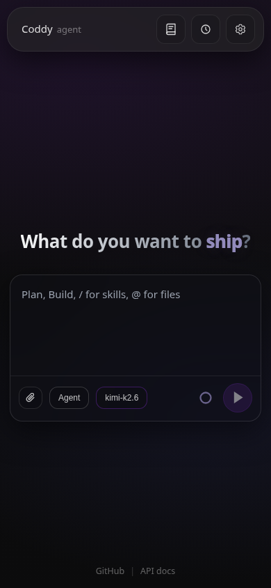
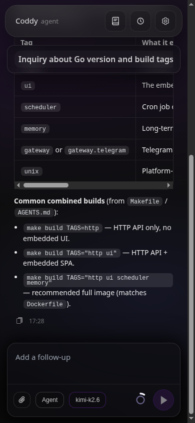
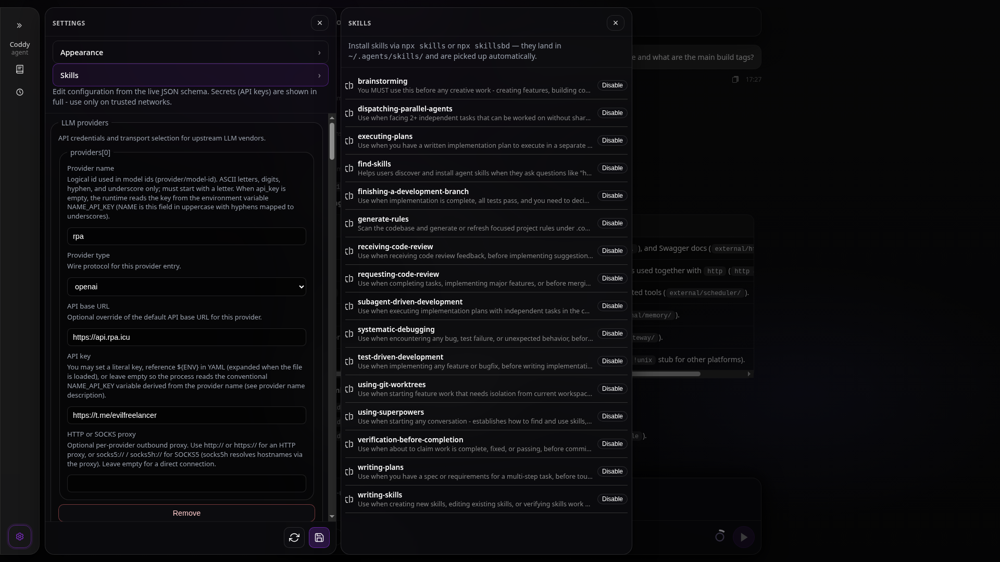
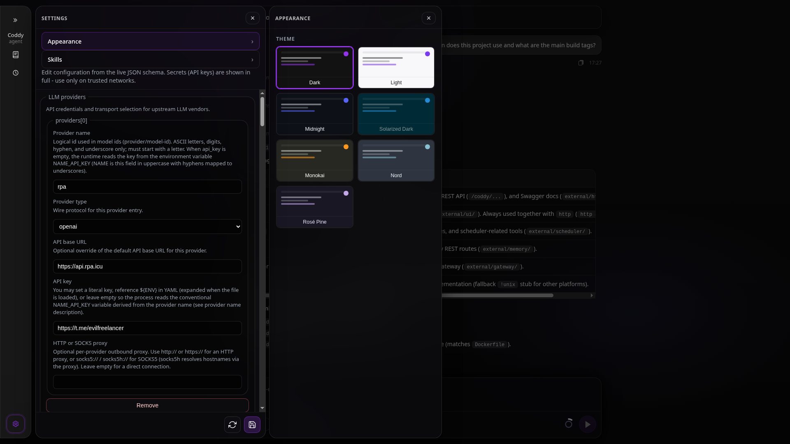

<p align="center">
  <a href="https://go.dev/doc/go1.25"></a>
  <a href="LICENSE"></a>
  <a href="https://github.com/hijera/foxxycode-agent/actions/workflows/tests-on-pr.yaml"></a>
  <a href="https://agentclientprotocol.com/"></a>
  
  
</p>

<h1 align="center">FoxxyCode Agent</h1>

<p align="center">
  <strong>Run a full general purpose agent from one static Go binary.</strong><br />
  ReAct, filesystem and shell tools, MCP, Skills, optional OpenAI-compatible API with an embedded UI, scheduler, and long-term memory.<br />
  An IDE-friendly fork that is easy to adapt to your editor of choice.
</p>

> **Foxxy Agent is based on [coddy-agent](https://github.com/coddy-project/coddy-agent)** by the Coddy project (MIT).
> This fork keeps the upstream architecture and stays merge-compatible with it, while rebranding the
> distribution (repository, binary name, releases) and focusing on easy IDE adaptation.

| Desktop (1920×1080) | Mobile (390×844) |
|---|---|
|  |  |

<details>
<summary>More screenshots</summary>

| Chat | Mobile chat |
|---|---|
|  |  |
| **History** | **Scheduler** |
|  |  |
| **Settings** | **Settings — Skills** |
|  |  |
| **Settings — Appearance** | |
|  | |

Screenshots: desktop at **1920×1080**, mobile at **390×844** from the embedded UI (`foxxycode http` + Vite dev). Spec and dev workflow: [`docs/ui.md`](docs/ui.md), layout tokens: [`DESIGN.md`](DESIGN.md). The UI targets **Chromium 104** (JCEF) and supports IDE-driven theme switching for embedding in an IntelliJ IDEA / PhpStorm plugin: [`docs/intellij-embedding.md`](docs/intellij-embedding.md).

</details>

FoxxyCode is a distroless-friendly **harness**: drop it into minimal images (`scratch`, `distroless`, read-only workspaces) without a full OS shell. The harness layer (ACP RPC, sessions, prompts, providers) stays the same if you tighten the toolset or drive it from automation instead of an IDE. The design also targets **container fleets** - many FoxxyCode instances in Docker (orchestrator-defined limits, read-only rootfs, mounted workspace) with **full control of each container**, similar in spirit to agent OS / swarm-style agents, not a single shared chat pool.

## Contents

- [Features](#features)
- [Quick start](#quick-start)
  - [Install](#install)
  - [Other installation methods](#other-installation-methods)
  - [Build tags](#build-tags)
  - [Docker](#docker)
  - [Paths (`FOXXYCODE_HOME`, `FOXXYCODE_CWD`)](#paths-foxxycode_home-foxxycode_cwd)
  - [Configuration](#configuration)
- [How to update](#how-to-update)
- [Operating modes](#operating-modes)
- [Editor and IDE integration](#editor-and-ide-integration)
- [Rules](#rules)
- [Skills](#skills)
- [MCP server integration](#mcp-server-integration)
- [Messenger gateway](#messenger-gateway)
- [Configuration (reference)](#configuration-1)
- [Architecture](#architecture)
- [Documentation](#documentation)
- [Examples (ACP over stdio)](#examples-acp-over-stdio)
- [Persistent sessions](#persistent-sessions)
- [Development](#development)
- [License](#license)

## Features

- **Harness-first** - ACP server, session lifecycle, prompts, LLM backends, MCP merge, distroless-ready binary
- **ReAct loop** - LLM alternates between reasoning, acting (tool calls), and observing results (coding-agent persona out of the box)
- **Three operating modes** - `agent` (full tool access), `plan` (planning without code execution), and `docs` (markdown documentation only)
- **Rules** - auto-discovers **`.cursor/rules/`**, **`.foxxycode/rules/`**, **`.claude/rules/`**, **`.codex/rules/`**, and nested **`**/AGENTS.md`** ([agents.md](https://agents.md/)) under the session cwd - see [Rules](docs/rules.md)
- **Skills** - slash commands and **`SKILL.md`** packs from **`skills.dirs`** (defaults: **`~/.agents/skills`**, **`~/.foxxycode/skills`**, **`${CWD}/.foxxycode/skills`**; later dirs override earlier) - see [Skills](docs/skills.md)
- **MCP server integration** - connect any MCP server for additional tools
- **Multi-provider LLM** - OpenAI, Anthropic, Ollama, any OpenAI-compatible API
- **Multimodal / file attachments** - attach images and files via the composer (📎) when `multimodal: true` in the model config; assets saved to `~/.foxxycode/sessions/<id>/assets/` and injected into the agent context; file chips displayed in the user bubble
- **Reasoning level** - for reasoning models (gpt-5, o-series, Claude thinking models) a composer dropdown picks the effort level (`minimal`/`low`/`medium`/`high`), mapped to OpenAI `reasoning_effort` or Anthropic extended-thinking `budget_tokens`; levels auto-detect from the model id and are configurable per model — see [Configuration](docs/config.md)
- **ACP protocol** - FoxxyCode is an **ACP server** (`foxxycode acp`); pair it with editors or scripts that implement an ACP client (see [Editor and IDE integration](#editor-and-ide-integration))
- **SSH remote execution** - built-in `ssh_run_command` tool runs commands on remote hosts over pure-Go SSH (no external binary); authenticates via SSH agent (`SSH_AUTH_SOCK`) or `~/.ssh` key files — see [Configuration](docs/config.md#ssh-remote-execution)
- **Messenger gateway** - optional Telegram bot adapter (`-tags gateway.telegram`); per-user sessions, group isolation modes, admin ACL; extensible to Discord, Slack, etc. — see [Messenger Gateway](docs/gateway.md)

## Editor and IDE integration

FoxxyCode is an **ACP server** (`foxxycode acp`). **Obsidian**, **VS Code**, **Zed**, scripts, and the bundled **`foxxycode http`** UI are clients that share the same **`FOXXYCODE_HOME`** sessions when configured with the same home directory.

Configure clients with the **absolute path** to the binary rather than relying on `PATH` — some harnesses spawn the agent via `cmd /c` or `sh -c` without the user `PATH` (on Windows: `%LOCALAPPDATA%\Programs\foxxycode\foxxycode.exe`; see [`docs/install.md`](docs/install.md#windows)).

Protocol details: **`docs/acp-protocol.md`**. Harness examples: **`examples/acp/`**.

## Quick Start

### Install

**Build from source** (recommended - see prerequisites under "Other installation methods"):

```bash
git clone https://github.com/hijera/foxxycode-agent
cd foxxycode-agent
make build TAGS="http ui scheduler memory"
make install   # copies build/foxxycode to ~/.local/bin or /usr/local/bin
```

On **Windows** (or without GNU Make), use the interactive wizard instead:
**`python scripts/build.py`** — Russian console menus for CLI binary, IntelliJ plugin, VS Code VSIX,
build tags, and cross-platform targets. See **[`docs/build.md`](docs/build.md#interactive-build-wizard)**.

Or download an archive for your platform from **[GitHub Releases](https://github.com/hijera/foxxycode-agent/releases)** and put the **`foxxycode`** binary on **`PATH`**.

Bootstrap the config: **`mkdir -p ~/.foxxycode && cp config.example.yaml ~/.foxxycode/config.yaml`**.

> **Windows.** Put the binary at `%LOCALAPPDATA%\Programs\foxxycode\foxxycode.exe`; config and sessions live under `%USERPROFILE%\.foxxycode\` (use `$env:USERPROFILE`, not `$HOME`). A terminal open during install does not see the updated `PATH` — open a new one or refresh it in place. Details: [`docs/install.md`](docs/install.md#windows).

Then set a provider key in **`~/.foxxycode/config.yaml`** (or **`OPENAI_API_KEY`** in the environment) and run **`foxxycode http`** for the UI, or **`foxxycode acp`** for an editor client.

**Docker** - same full binary in **`ghcr.io/hijera/foxxycode-agent`**: **`docker compose up -d`** (see [Docker](#docker)).

Upgrade later with **`foxxycode update -y`** ([How to update](#how-to-update)).

<details>
<summary><strong>Other installation methods</strong> (build from source, Go install, manual)</summary>

**Prerequisites for building**

- **Go** - same minor version as [`go.mod`](go.mod) (currently **1.25**).
- **Git** - used by the Makefile for the embedded version string.
- **Node.js / npm** - only if you build with **`http`** and **`ui`** (the Makefile runs **`ui-build`** for embedded assets).

**Install with Go (lean module default, no `http` / UI tags)**

```bash
go install github.com/hijera/foxxycode-agent/cmd/foxxycode@latest
```

Note: `go install` names the binary after the package directory (**`foxxycode`**). For **`foxxycode http`**, the bundled SPA, scheduler, and memory, use a **release archive** or **build from source** (see [Install](#install)).

**Manual `go build`**

When **`TAGS`** includes **`http`** and **`ui`**, run **`make ui-build`** first.

```bash
make ui-build
VERSION="$(make -s print-version)"
go build -tags=http,ui,scheduler,memory \
  -ldflags "-X github.com/hijera/foxxycode-agent/internal/version.Version=${VERSION}" \
  -o build/foxxycode \
  ./cmd/foxxycode/
```

Lean **ACP-only** binary: **`make build`** (no **`http`** / UI / scheduler / memory tags).

**Windows desktop app** (WebView2 GUI, double-click **`foxxycode-desktop.exe`**):

```bash
make build-desktop
```

The desktop app opens projects as folders: the project pill in the chat header opens the native Windows folder dialog, new chats run in the chosen folder, and recently opened projects are kept in `~/.foxxycode/projects.json` (**`GET/PUT /foxxycode/project`**, **`GET /foxxycode/projects/recent`**). Without an explicit **`-cwd`**, the last opened project is restored on start.

Build reference: **[`docs/build.md`](docs/build.md)**.

</details>

**`foxxycode -v`** prints the embedded version. **`foxxycode acp --help`** lists ACP flags (**`--home`**, **`--cwd`**, **`--config`**, etc.).

### Build tags

Use **`Makefile`** variable **`TAGS`** with **spaces** (**`make build TAGS="http ui scheduler memory"`**). **`go build`** uses **commas** (**`-tags=http,ui,scheduler,memory`**).

| Tag | Enables | Docs |
|-----|---------|------|
| **`memory`** | Long-term memory copilot (**`memory.enabled`** in YAML); with **`http`**, session memory REST under **`/foxxycode/sessions/{id}/memory/*`** | [`external/memory/README.md`](external/memory/README.md) |
| **`http`** | **`foxxycode http`**, REST gateway, **`/docs`**, **`/openapi.yaml`** | [`docs/http-api.md`](docs/http-api.md) |
| **`ui`** | Embedded SPA on **`/`** (needs **`http`**) | [`docs/ui.md`](docs/ui.md), [`DESIGN.md`](DESIGN.md) |
| **`scheduler`** | Scheduler daemon and **`foxxycode_scheduler_*`** tools; with **`http`**, **`/foxxycode/scheduler`** REST | [`docs/scheduler.md`](docs/scheduler.md), [`external/scheduler/README.md`](external/scheduler/README.md) |
| **`gateway.telegram`** | Telegram bot adapter — **`foxxycode gateway`** subcommand, per-user sessions, access control | [`docs/gateway.md`](docs/gateway.md) |
| **`gateway`** | All messenger adapters (superset of `gateway.telegram`; add Discord/Slack without changing the core) | [`docs/gateway.md`](docs/gateway.md) |
| **`desktop`** | Windows WebView2 desktop app (**`foxxycode desktop`** / **`foxxycode-desktop.exe`**; needs **`http`**, **`ui`**, Windows) | [`docs/build.md`](docs/build.md#desktop-windows-webview2) |

Extended narrative and Docker alignment - **[docs/build.md](docs/build.md)**.

### Docker

Release images are published on **[GitHub Container Registry](https://github.com/hijera/foxxycode-agent/pkgs/container/foxxycode-agent)** as **`ghcr.io/hijera/foxxycode-agent`** (tags such as **`latest`** and **`X.Y.Z`**, **linux/amd64** and **linux/arm64**). Each SemVer git tag also gets **GitHub Release** archives (Linux, Windows, macOS Intel and Apple Silicon) - see **[docs/build.md](docs/build.md#release-binaries-ci)**. The default image includes **`http`**, **`ui`**, **`scheduler`**, and **`memory`** - the same feature set as **`make build TAGS="http ui scheduler memory"`**.

**1. Config and workspace** (from the repo root, or any directory where you keep **`config.yaml`**):

```bash
cp config.example.yaml config.yaml
mkdir -p workspace foxxycode_home
# Edit config.yaml: at least one provider api_key (or rely on OPENAI_API_KEY etc. in compose)
```

**2. Start with Compose** (pull published image, no local build):

```bash
docker compose pull
docker compose up -d
```

To **build the image locally** instead, use **`docker-compose.dev.yml`**: **`docker compose -f docker-compose.dev.yml up -d --build`**.

**3. Open the bundled UI** in a browser on the host:

```text
http://127.0.0.1:12345/
```

The SPA is served on **`GET /`** by **`foxxycode http`**. Pick a **model** in the composer (YAML backends from **`GET /v1/models`**), choose **agent**, **plan**, or **docs** mode, then send a message - the UI creates a session and streams the reply via **`POST /v1/responses`**. Agent files and shell tools use the mounted workspace (**`./workspace`** → **`/workspace`** in the container). Live YAML editing: **`http://127.0.0.1:12345/#/settings`**.

Sanity check without a browser: **`curl -sS http://127.0.0.1:12345/v1/models | head`**.

There is **no login** on the HTTP surface - expose port **12345** only on trusted networks. Full compose options, volumes, and CI image tags: **[docs/docker.md](docs/docker.md)**. Smoke script: **`examples/httpserver/docker.sh`**.

### Paths (`FOXXYCODE_HOME`, `FOXXYCODE_CWD`)

- **`FOXXYCODE_HOME`** (or **`foxxycode acp --home`**) is the agent state directory. Default **`~/.foxxycode`**. The process creates **`sessions/`** and **`skills/`** under it. Config defaults to **`$FOXXYCODE_HOME/config.yaml`**.
- **`FOXXYCODE_CWD`** (or **`foxxycode acp --cwd`**) is the default session working directory when `session/new` sends an empty **`cwd`**. Default is the process current directory at startup. Editors that pass a path in **`session/new`** use that path instead.

### Configuration

**`FOXXYCODE_HOME`** defaults to **`~/.foxxycode`**. Unless you set **`FOXXYCODE_CONFIG`** or pass **`--config`**, the primary config file is **`config.yaml`** at **`$FOXXYCODE_HOME/config.yaml`**.

Copy the example and edit it:

```bash
mkdir -p ~/.foxxycode && cp config.example.yaml ~/.foxxycode/config.yaml
```

If **`$FOXXYCODE_HOME/config.yaml`** is absent, the loader may use **`config.yaml`** in the process working directory (useful when running from a repository clone). See **`docs/config.md`**.

**Providers and models**

- **`providers`** - named backends (**`type`**: **`openai`** for OpenAI and OpenAI-compatible HTTP APIs, **`anthropic`** for Anthropic). Each **`name`** must be ASCII letters, digits, hyphen, or underscore, starting with a letter (it becomes the prefix in model ids). Each row has **`api_key`** (literal, **`${ENV}`** expanded when the file loads, or empty to read **`NAME_API_KEY`** from the environment at LLM call time, with **`NAME`** derived from **`providers[].name`** in uppercase and hyphens mapped to underscores), and optionally **`api_base`** when the API is not the vendor default.
- **`models`** - selectable models. Each **`model`** string is **`<provider_name>/<api_model_id>`** where **`provider_name`** matches **`providers[].name`**. Tunables include **`max_tokens`**, **`temperature`**, and optional **`max_context_tokens`**.
- **`agent`** - **`model`** picks the default ReAct model (must match one **`models[].model`** entry). **`max_turns`** and **`max_tokens_per_turn`** bound one user turn.

Example (**`openai`** provider and **`gpt-5.4-mini`**; store secrets in the environment, not in git):

```yaml
providers:
  - name: openai
    type: openai
    api_key: "${OPENAI_API_KEY}"

models:
  - model: "openai/gpt-5.4-mini"
    max_tokens: 400000
    temperature: 0.2

agent:
  model: "openai/gpt-5.4-mini"
  max_turns: 35
  max_tokens_per_turn: 128000
```

Then export the key the YAML references:

```bash
export OPENAI_API_KEY="sk-..."
```

Other setups (Anthropic, Ollama, a non-default **`api_base`**, and env-based defaults) are covered in **`config.example.yaml`** and **[docs/config.md](docs/config.md)**.

## How to update

Official CLI binaries are published on **[GitHub Releases](https://github.com/hijera/foxxycode-agent/releases)** (assets such as **`foxxycode_0.9.3_linux_amd64.tar.gz`**). Each release matches the full feature set from **`make build TAGS="http ui scheduler memory"`**.

**`foxxycode update`** downloads the archive for your OS/architecture and replaces the binary you invoked (symlinks resolved). That is the usual path after **`make install`** (**`~/.local/bin/foxxycode`**) or when you run **`./build/foxxycode update`** to refresh a local build artifact.

**1. See what you run today**

```bash
which foxxycode
foxxycode -v
```

**2. Check for a newer release**

```bash
foxxycode update --check
```

Exit code **0** means you are already on the latest published **`X.Y.Z`** (or newer). Exit code **1** means a newer release is available.

**3. Install**

```bash
foxxycode update          # asks [y/N]
foxxycode update -y       # no prompt
```

**4. Confirm**

```bash
foxxycode -v
foxxycode http --help     # only when the binary includes -tags=http (release builds do)
```

**Common flags**

| Flag | Purpose |
|------|---------|
| **`--check`** | Only report whether an update exists (no download). |
| **`-y`** / **`--yes`** | Install without confirmation. |
| **`--version X.Y.Z`** | Install a specific release, not only "latest". |
| **`--repo owner/name`** | Alternate GitHub repo (default **`hijera/foxxycode-agent`**). |

**Notes**

- Update the same binary you intend to use. If **`which foxxycode`** points at **`~/.local/bin/foxxycode`**, run **`foxxycode update`** from that install, not a different copy on **`PATH`**.
- **`$FOXXYCODE_HOME`** (config, sessions, skills) is untouched; only the executable changes.
- To build from source or change tags, use **`make build`** instead. For containers, use **`docker compose pull`**. See **[docs/update.md](docs/update.md)** for platform tables, limitations, and other upgrade paths.

## Operating Modes

### Agent Mode (default)

Full task execution mode. The agent has access to all tools:
- Read and write files
- Execute shell commands (with permission prompt)
- Search codebase
- Call MCP server tools

Best for: code generation, refactoring, debugging, feature implementation.

### Plan Mode

Planning and documentation mode. Restricted tools:
- Read files (no write to code files)
- Write/edit text and markdown files
- Search codebase

When the plan is ready, switch to **agent** mode yourself for full tools and implementation.

Best for: architecture planning, writing specs, design documents, code review.

### Docs Mode

Documentation mode. Explores the codebase and updates markdown files only:
- Read and search the codebase
- Write or edit `.md` files (`README.md`, `AGENTS.md`, `DESIGN.md`, `docs/**/*.md`) via **`docs_write`** and **`docs_edit`**
- Run shell commands for read-only inspection

Cannot modify source code or configuration files outside markdown. Switch to **agent** mode for implementation work.

Best for: keeping README and `docs/` aligned with the code, updating operator guides, API prose.

Use your editor session mode selector (or **`session/set_config_option`**).

## Rules

Project rules (injected as **`{{.Rules}}`**) are discovered under the session working directory from **`.foxxycode/rules`**, **`.cursor/rules`**, **`.claude/rules`**, **`.codex/rules`**, and nested **`**/AGENTS.md`** ([agents.md](https://agents.md/) convention; the root `AGENTS.md` is injected separately as a project docs preamble) when **`rules.auto_discover`** is true. See **[`docs/rules.md`](docs/rules.md)**.

Rule files often use Cursor-style frontmatter, for example:

```markdown
---
description: "Go coding standards"
globs: ["**/*.go"]
alwaysApply: false
---

Write all comments in English.
Use fmt.Errorf("context: %w", err) for error wrapping.
```

## Skills

Slash commands and **`SKILL.md`** packs (injected as **`{{.Skills}}`**) extend the agent with domain knowledge and specialized workflows.

**Default directories (lowest → highest priority):**

| Priority | Path | Purpose |
|----------|------|---------|
| lowest | `~/.agents/skills/` | Global skills — installed by `npx skills` or `npx skillsbd`, shared with all agents |
| ↑ | `~/.foxxycode/skills/` | FoxxyCode-specific skills; may contain symlinks into `~/.agents/skills/` |
| highest | `${CWD}/.foxxycode/skills/` | Project-local skills — override anything from higher directories |

Later directories override earlier ones when the same skill name appears in multiple locations.

**Finding and installing skills:**

- **[skills.sh](https://skills.sh)** — community registry, install with `npx skills add <owner/repo@skill>`
- **[neuraldeep.ru/skills](https://neuraldeep.ru/skills)** — skillsbd registry curated for FoxxyCode, install with `npx skillsbd install <name>`
- **Settings → Skills** in the web UI (`foxxycode http`) — browse and install from the skillsbd registry without leaving the browser

**CLI:**

```bash
foxxycode skills list              # list installed skills with enabled/disabled status
foxxycode skills enable <name>     # enable a skill
foxxycode skills disable <name>    # disable without uninstalling
```

See **[`docs/skills.md`](docs/skills.md)** for the full reference.

## MCP Server Integration

Connect external tools via MCP servers. Configured globally in `config.yaml` or
passed per-session by the ACP client.

Example adding a GitHub MCP server in config:

```yaml
mcp_servers:
  - name: "github"
    command: "npx"
    args: ["-y", "@modelcontextprotocol/server-github"]
    env:
      - name: "GITHUB_PERSONAL_ACCESS_TOKEN"
        value: "${GITHUB_TOKEN}"
```

See [MCP Integration Guide](docs/mcp-integration.md) for details.

## Messenger gateway

Build with **`-tags gateway.telegram`** (Telegram only) or **`-tags gateway`** (all adapters) to enable `foxxycode gateway`.

```bash
make build TAGS="gateway.telegram"
./build/foxxycode gateway --config ~/.foxxycode/config.yaml
```

Minimal config addition (`config.yaml`):

```yaml
gateways:
  telegram:
    enabled: true
    token: "${TELEGRAM_BOT_TOKEN}"
    admins: [YOUR_USER_ID]
    default_access: "admins"   # all | admins | group:<name>
    default_isolation: "admin" # individual | shared | admin
    rich_messages: true        # Bot API 10.1 Rich Messages (native Markdown + tool blocks)
```

Each user or chat gets its own isolated session. In group chats the bot responds only when @mentioned or replied to. `/clear` (no space) starts a fresh session.

With `rich_messages: true` the bot uses [Bot API 10.1 Rich Messages](https://core.telegram.org/bots/api#rich-messages): the agent's full Markdown (headings, tables, code, task lists) renders natively, tool activity streams as a "Thinking…" placeholder, and executed tools appear in a collapsible block. It falls back to legacy formatting if the Bot API server doesn't support it. See [docs/gateway.md](docs/gateway.md#rich-messages).

Full guide — access levels, group isolation modes, per-chat overrides, and how to write adapters for new messengers: **[docs/gateway.md](docs/gateway.md)**.

## Configuration

Full configuration reference in [docs/config.md](docs/config.md); field-by-field tables in [docs/config-reference.md](docs/config-reference.md). A [JSON Schema](docs/config.schema.json) enables editor autocomplete and validation via a `# yaml-language-server: $schema=...` header (see `config.example.yaml`).

Key settings:

```yaml
providers:
  - name: local
    type: openai
    api_key: "${OPENAI_API_KEY}"
    api_base: "${OPENAI_API_BASE}"

models:
  - model: "local/gpt-4o"
    max_tokens: 8192
    temperature: 0.2

agent:
  model: "local/gpt-4o"
  max_turns: 30

tools:
  require_permission_for_commands: true
```

## Architecture

```
ACP client (editor / script / CI)        Messenger (Telegram, …)
        |                                        |
    JSON-RPC 2.0 over stdio              gateway Hub (per adapter goroutine)
        |                                        |
    ACP Server Layer                     session.Manager (shared)
        |                                        |
    Session Manager ─────────────────────────────┘
        |
    ReAct Agent Loop
 /      |       |      \
LLM   Tools    Skills    MCP
```

See [Architecture docs](docs/architecture.md) for full details.

## Documentation

- [Build from source](docs/build.md) - prerequisites, **`make build`**, **`TAGS`** vs **`go build -tags`**, **`build/foxxycode`**
- [Updating FoxxyCode](docs/update.md) - **`foxxycode update`**, release assets, **`PATH`** vs **`make install`**
- [Docker](docs/docker.md) - GHCR image, **`docker compose`**, bundled UI at **`http://127.0.0.1:12345/`**
- [Architecture](docs/architecture.md) - system design and component overview
- [ACP Protocol](docs/acp-protocol.md) - protocol reference and message formats
- [ReAct Agent](docs/react-agent.md) - ReAct loop design and tool specifications
- [Configuration](docs/config.md) - full config file reference; [field tables](docs/config-reference.md) and [JSON Schema](docs/config.schema.json) for editor validation
- [HTTP API](docs/http-api.md) - REST gateway (**`-tags=http`**) and embedded UI (**`-tags=http,ui`**); includes **`/foxxycode/config`** for live YAML editing from the SPA (**#/settings**).
- [Embedded UI](docs/ui.md) - functional spec, Vite dev workflow, build tags
- [DESIGN.md](DESIGN.md) - UI tokens and layout (English)
- [AGENTS.md](AGENTS.md) - repo map and contributor notes for automation
- [Rules](docs/rules.md) - project rules (`.cursor/rules`, `.foxxycode/rules`, …)
- [Skills](docs/skills.md) - slash commands and **`skills.dirs`**
- [MCP Integration](docs/mcp-integration.md) - MCP server integration guide
- [Messenger Gateway](docs/gateway.md) - Telegram bot adapter, session isolation, ACL, and how to write new adapters

## Examples (ACP over stdio)

[**`examples/acp/acp_e2e_todo.py`**](examples/acp/acp_e2e_todo.py) is a newline-delimited JSON-RPC harness against **`foxxycode acp`** ( **`stdbuf -oL`**, permission auto-reply, nil-result responses). Use it as reference when building your own minimal client rather than chaining naive **`echo`** lines into a pipe.

[**`examples/acp/acp_e2e_memory.py`**](examples/acp/acp_e2e_memory.py) drives **`build/foxxycode`**, an isolated **`FOXXYCODE_HOME`**, and **`RPA_API_KEY`** to verify recall, persist, and optional prune of markdown under **`$FOXXYCODE_HOME/memory`**. See the script docstring for flags. Overview of all harnesses - [**`examples/README.md`**](examples/README.md).

## Persistent sessions

By default, `foxxycode acp` and `foxxycode http` store each session bundle under **`$FOXXYCODE_HOME/sessions/<sessionId>/`** (default **`~/.foxxycode/sessions/`**) with `session.json`, `messages.json`, an `assets/` directory, and `todos/active.md` (plus `todos/archive/` when completed lists are replaced). Override the root with **`foxxycode acp --sessions-dir`**, **`foxxycode http --sessions-dir`**, or **`sessions.dir`** in **`config.yaml`**. If the sessions directory cannot be created, startup fails with an error.

- **`foxxycode sessions list`** prints stored sessions (`--sessions-dir` and `--cwd` filters supported).
- **`foxxycode acp --session-id <id>`** makes the **next** `session/new` either reopen snapshots for that folder (if present) or create a fresh bundle whose directory name matches that id.
- **`session/load`** restores history and notifies the client; **`session/list`** lists bundles for ACP-aware clients.

The foxxycode_todo_* tools keep the active checklist mirrored to `todos/active.md`. A wholesale **`foxxycode_todo_plan_replace`** while items are incomplete is rejected until you finish rows or run **`foxxycode_todo_plan_archive`**; replacing when every row is **`completed`** moves the prior `active.md` into **`todos/archive/`** (`todo-<nanos>.md`). **`foxxycode_todo_plan_archive`** finishes open rows to **`completed`**, writes **`todos/archive/plan_<unix_seconds>.md`**, then clears the session plan when persistence is on.

When the persisted plan is **non-empty**, the agent injects **`### Current todo checklist`** plus rendered markdown checklist lines into the system prompt template (embedded defaults, or files under **`prompts.dir`** using **`prompts.agent_prompt`**, **`prompts.plan_prompt`**, and **`prompts.docs_prompt`**, which default to **`agent.md`**, **`plan.md`**, and **`docs.md`**) via `{{if .TodoList}}` … `{{end}}`. That block is omitted when there is nothing to track. Before **each** LLM call inside one **`session/prompt`** turn, FoxxyCode refreshes that system message so a todo list created or updated earlier in the same ReAct episode stays visible immediately.

## Development

```bash
# Run tests
go test ./...
make test

# Example harnesses (see examples/README.md): ./examples/build_foxxycode.sh && ./examples/test_acp.sh && ./examples/test_httpserver.sh

# Full-featured local binary (HTTP + UI + scheduler), same defaults as Docker
make build TAGS="http ui scheduler memory"

./build/foxxycode -v    # same as --version

# Run with debug logging (ACP mode); optional --log-output, --log-file, --log-format
foxxycode acp --log-level debug

# Single-line sanity check only (responses may omit JSON-RPC "result" for nil payloads; prefer examples/acp/acp_e2e_todo.py)
echo '{"jsonrpc":"2.0","id":0,"method":"initialize","params":{"protocolVersion":1,"clientCapabilities":{}}}' | foxxycode acp
```

## License

This project is licensed under the MIT License, see the [LICENSE](LICENSE) file in the repository root for details.
