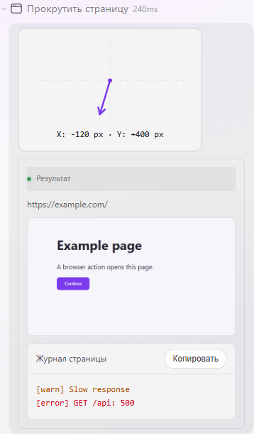
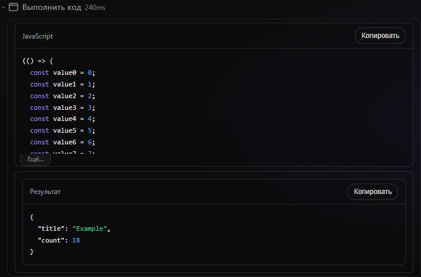

# Browser tool presentation verification

The screenshots below were captured from the production React transcript components in Chromium, not from a design mockup. The fixture covers all eleven browser tools and the three inspect modes. The screenshot displayed inside each action is itself captured from a local browser page during the test.

The baseline was captured before implementation in text-only mode (screenshots disabled). The final captures also exercise screenshot results, so those image regions have no matching baseline image.

| View | Dark | Light |
| --- | --- | --- |
| Before, 390 px | [Baseline](before/browser-tools-dark-390.png) | [Baseline](before/browser-tools-light-390.png) |
| Before, 1280 px | [Baseline](before/browser-tools-dark-1280.png) | [Baseline](before/browser-tools-light-1280.png) |
| After, 390 px | [All tools](after/browser-tools-dark-390.png) | [All tools](after/browser-tools-light-390.png) |
| After, 1280 px | [All tools](after/browser-tools-dark-1280.png) | [All tools](after/browser-tools-light-1280.png) |
| Compact, 390 px | [Collapsed](after/compact-dark-390.png) | [Collapsed](after/compact-light-390.png) |
| Compact, 1280 px | [Collapsed](after/compact-dark-1280.png) | [Collapsed](after/compact-light-1280.png) |
| JavaScript expanded, 390 px | [More](after/browser-1-expanded-dark-390.png) | [More](after/browser-1-expanded-light-390.png) |
| JavaScript expanded, 1280 px | [More](after/browser-1-expanded-dark-1280.png) | [More](after/browser-1-expanded-light-1280.png) |





The real embedded HTTP SPA was also checked at `/` with a persisted test session: tool history, full argument recovery, image asset routes, and the four primary cards were exercised without a model call.

To repeat the automated visual checks, install the UI dependencies and build the embedded assets, then run:

```sh
go test -tags=http,ui,browser ./external/ui -run '^(TestBrowserToolPresentationFeature|TestUILayoutColumnsAlign)$' -count=1 -timeout=100s
```

Set `FOXXYCODE_BROWSER_SCREENSHOTS` to an output directory to save all screenshot states. The test owns and closes its Vite process, browser, and local image server.
