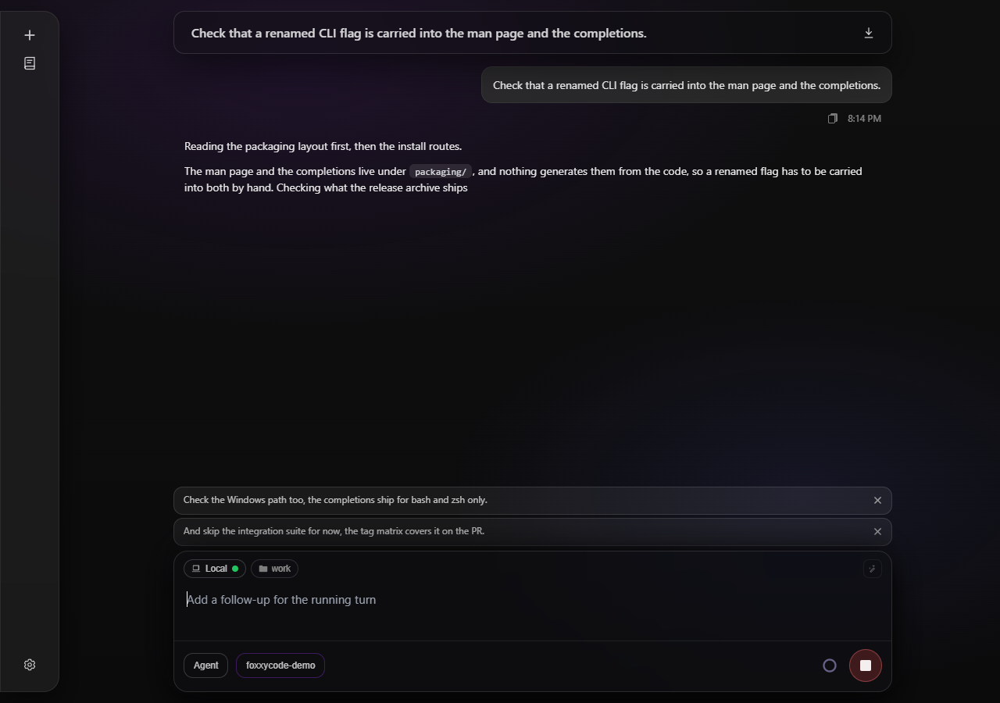
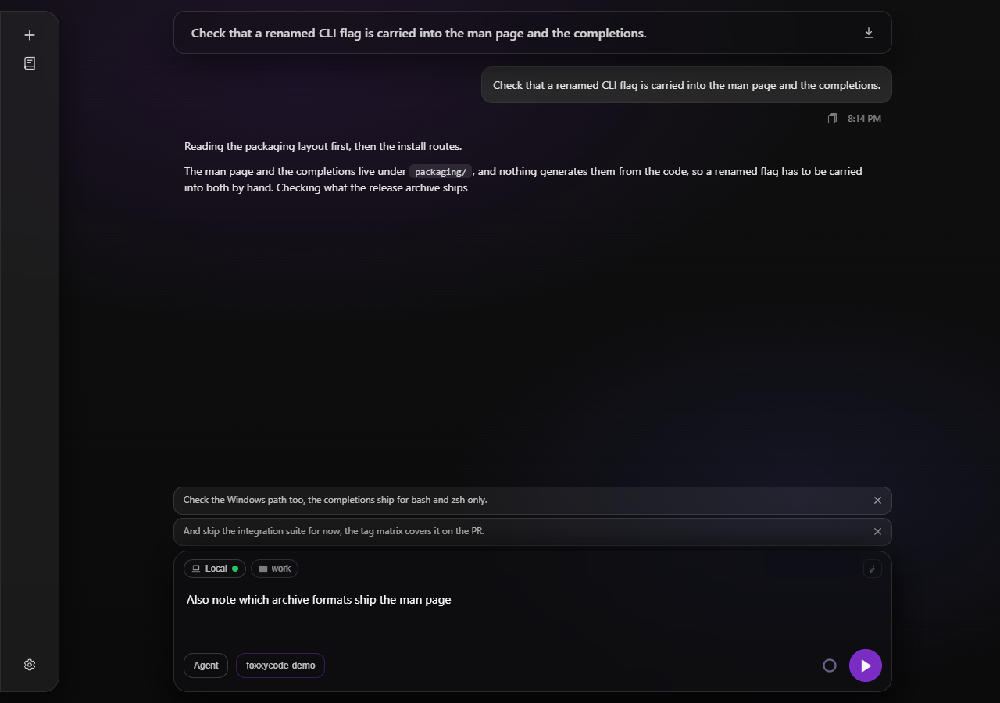
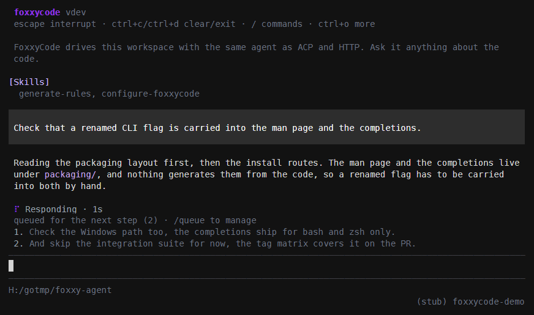

# Message queue

The moment an operator knows most about what the agent should do next is while it is working — the tool call that read the wrong file, the platform nobody mentioned, the constraint that only becomes obvious once the plan is on screen. Until now that was the one moment nothing could be said: the composer turn lock refuses a second prompt, so the correction had to wait for the answer or cost a Stop.

A message written **during** a turn is therefore queued on the session instead of refused, and the running turn reads it **at its next step** — between the tool calls the model just made and the request that follows them. The correction lands while the work is still happening rather than after it is finished. Until the agent reads it, a queued message is still yours: it can be taken back.

## What the agent sees

A queued message becomes an ordinary user message in the conversation, at the point where it was read. Nothing tells the model it was queued: it is a person talking in the middle of the work, which is what it is. The stored message carries a `queued` flag that only clients read - a client re-attaching to the running turn uses it to tell the prompt the turn started from apart from the follow-ups the turn's stream replays. Several messages written during the same step are read together, in the order they were written.

The read happens at two places in the turn, and both are the same idea — the earliest moment the model can act on it:

- **Between steps.** The ReAct loop drains the queue at the top of every iteration, before it builds the request that answers the tool results it just collected. This is the mid-turn read, and it is what the feature is for.
- **At the end.** A message written while the answer was already being composed would otherwise have to wait for the next prompt. Instead the same turn reads it and keeps going, so it is answered by the turn it was written into. This read happens **after** the `Stop` hooks have had their say, so a hook still fires on every answer that ends a turn. It needs one more step to be read in, counted in the model's own steps: iterations spent recovering from a silent provider do not use up `agent.max_turns`.

The continuation belongs to the ordinary prompt path. A turn that is not one — a permission resume, a saved plan being run — still opens a queue and still reads it between its own steps, but what arrives in its final moments is dropped with a warning rather than answered.

Only a turn that ended with an **answer** continues this way. A cancelled turn is a **Stop**, and a Stop drops what was waiting rather than answering it; a turn that stopped for any other reason — its turn cap, a refusal, a hook — has already said why, and running it again would bury that. The continuations are also capped (8 per admitted turn): each one is a fresh run with its own `agent.max_turns` budget, so without a bound one admission could hold the session's turn lock for as long as somebody keeps typing. Past the cap the queue is closed and what is left is dropped with a warning, exactly as a Stop drops it.

### While the provider is recovering

With `agent.llm_stall_retry` on, an iteration that re-issues a request the provider left unanswered, waits out a usage limit, replays an empty answer or carries on an answer the stream cut is not a step the model took, and it does not read the queue. A re-issue is meant to be the request that failed, and a continuation is meant to follow the half-written answer: a follow-up slipped in between would be answered by the replay, and in the transcript it would split the answer from its own continuation. It is read at the next real step instead - or at the end of the turn. The nudges that bring a looping model or an empty answer back to work do read it: a correction is what those steps need.

## The lifetime of the queue

The queue belongs to the **turn**, not to the session bundle:

- it opens when a turn is admitted and is gone when that turn releases;
- a session that is not working holds nothing, and a message cannot be queued onto it — the surface sends that text as an ordinary prompt instead;
- nothing is persisted. A queued message the turn never read is dropped when the turn ends, which is also what **Stop** means: cancelling a turn cancels what was waiting for it.

At most **20** messages wait at once. The queue is a composer affordance, not a batch runner: beyond that the surface says so rather than growing a slice that the next step would paste into the model's context in one go.

A **child (subagent) session** takes nothing. Its only turn is the task its parent wrote, and it is read-only everywhere else for the same reason.

## In the browser



*Two follow-ups waiting above the composer while the agent works; each card has its own cross*

The composer stays live while the agent works. With text in the field, the round control at its right queues that text for the running turn instead of stopping it; with the field empty it is still **Stop**, which is how a turn is cancelled. The key that sends a message does the same as the control: **Enter** by default, **Ctrl+Enter** under `ui.send_mode: ctrl_enter`, and none with `off`. The editor panels in IntelliJ and VS Code host the same composer.

Queued messages stack above the composer in the order the agent will read them, each with a cross in its corner that takes it back - and puts the text back into the field, so taking a message back is how it gets edited. A message the agent read before the cross was pressed is already in the conversation, and nothing returns. A message the agent has just read leaves the stack and appears in the conversation in the same breath.

The browser checks the selected session's activity and queue when opening it and reconnecting, but skips both reads while its own prompt request awaits admission. Stop and queueing remain available for a running turn even when that tab has lost its stream reader or the session is outside the current History page. Stop sends the cancellation request and closes the tab's own reader right away, so the request never waits for the connection that reader holds when other tabs have taken the rest a browser allows to one host; a failed request shows an error, the tab rejoins the running turn, and the controls stay available for another attempt. The server may still need time to release the turn after acknowledging Stop; an old turn-end event overlapping the next pending or admitted prompt requires a fresh activity read before the browser declares idle.



*With a draft in the field mid-turn the primary control queues it; emptying the field brings Stop back*

## A shared session has a shared queue

A session is not owned by the tab that opened it. Two browsers, a third window on a phone and a console attached over `--remote` can all be looking at the same session, and the queue belongs to the session rather than to any one of them: what anyone queues appears for everyone, and a message one person takes back disappears for everyone.

That works whether or not a client is reading the stream of the turn that is running. Every change travels down two paths:

- the **turn's own stream**, so the client driving the turn and anyone teed onto it (`GET /foxxycode/sessions/{id}/composer-stream`) has it immediately;
- **`GET /foxxycode/events`**, the server-wide stream every browser holds open (one connection shared by its tabs) and the console subscribes to under `--remote`, which carries `event: message_queue` with the session id, the whole queue and its version.

The answer to whichever request made the change carries the same list and version, so it is a third delivery of the same fact rather than a separate truth.

Those are separate connections, so deliveries can arrive in either order. Each carries a **version** that counts the changes of that session's queue; ordinary deliveries keep the highest version seen and drop anything older. The server reads the list and version under one lock for both events and HTTP responses. The counter is process-wide rather than per session, so rebuilding live state does not reuse an earlier version within that process. For browser recovery after a server restart, a fresh queue GET may establish a lower version, including `0`, only if no queue delivery crosses the read. That recovery advances a local epoch, so the browser ignores mutation responses and own/relay stream queue frames captured in earlier epochs. A replayed turn-start event does not by itself clear the client's version or waiting messages. A tab that re-attaches to a turn already running - after a reload, or an IDE panel shown again - reads the queue over REST as well, because no stream it attaches to brings the list back.

The queue lives in the process that runs the turn. Two IDE windows over one FoxxyCode home are two processes: when the turn runs in the other one, this server cannot reach its queue and answers a queued message with **409** `session_busy`, and the browser puts the text back in the composer with a notice saying where the turn is running.

## In the console



*The console shows what the turn will read next, numbered in reading order*

Submitting while a turn runs queues the prompt; the console shows what is waiting directly above the input, numbered in reading order:

```
queued for the next step (2) · /queue to manage
1. check the Windows path too
2. and skip the integration suite
```

`/queue` lists them, `/queue drop <n>` takes one back, `/queue clear` empties the queue. Pressing **escape** cancels the turn, and with it everything that was waiting. The same works against a remote server (`--remote`): the console talks to the queue routes below, and subscribes to the server's event stream, so a follow-up someone queued in a browser shows up above the console's input too.

In a remote console, a turn started by another client also accepts queued input and Escape cancellation. The console tracks that server activity separately from its own prompt request. After a server restart, the latest fresh queue snapshot can recover a lower version (including zero) only if no queue update crosses the read; delayed pre-recovery replies and notifications cannot restore old rows. Recovery does not require an idle turn. A failed read or crossed snapshot is re-read (up to three attempts, with a short delay); a newer refresh or client shutdown stops the old recovery. Queue reads have a separate timeout budget from activity reads. This control support does not attach the console to the other client's live transcript or share its permission and question dialogs.

The fork's turn lock fails fast instead of queueing, so a prompt the console posts while a turn it has not heard of yet owns the session is answered **409** `session_busy`. The console takes that prompt back off the screen and queues it for the running turn; if the queue refuses it too (the turn runs in another FoxxyCode process over the same home), the text returns to the input.

## Over HTTP

| Route | What it does |
|---|---|
| `GET /foxxycode/sessions/{id}/queue` | What is waiting: `id`, `text`, `createdAt` per row. |
| `POST /foxxycode/sessions/{id}/queue` | Queue `{"text": "..."}`. **201** with the stored message and the whole queue. |
| `DELETE /foxxycode/sessions/{id}/queue/{message_id}` | Take one back; **404** with code `not_found` when the agent read it first. |
| `DELETE /foxxycode/sessions/{id}/queue` | Drop everything waiting. |

A session with no turn running answers **409** with code `no_active_turn`; a full queue answers **409** with `queue_full`; a child session answers **409** with `subagent_read_only`; a turn running in another FoxxyCode process over the same home answers **409** with `session_busy`. The refusal codes are what a client branches on — the SPA turns `no_active_turn` into an ordinary `POST /v1/responses`, so a turn that ends between the keystroke and the request never loses what was typed.

Every change is published as `event: message_queue` with the full list and its version, on the turn's stream and on `GET /foxxycode/events` alike; a message the agent reads arrives on the turn's stream as `event: user_message`, at the point it entered the conversation. Full shapes: [HTTP API](../reference/http-api.md).

## What it is not

- **Not a scheduler.** Nothing is held for a session that is idle, and nothing survives a restart.
- **Not attachments.** A queued follow-up is text. Files attached in the browser stay in the composer for the next prompt, and an `@file` mention reaches the model as the mention itself rather than as an attached file: the agent reads the file with its own tools.
- **Not a second turn.** Queued messages are read inside the turn that was running, so they share its context, its tool results and its budget — including `agent.max_turns`, which still bounds the whole thing.
- **Not inter-process queue storage.** Shared controls require clients of the same `foxxycode serve` process. Independent local console or ACP processes sharing a sessions directory do not share their in-memory queues. Cross-process cancellation still uses the bundle's cancel marker.
- **Not shared questions or permissions.** This hotfix leaves gate ownership unchanged. The session bus and shared answers remain separate work.
