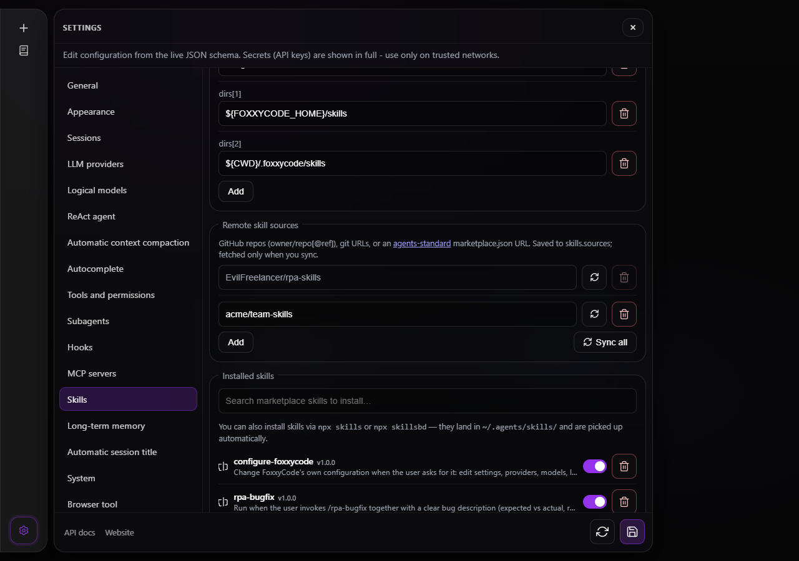

# Skills

Skills are reusable instruction packs that extend the agent with slash commands, domain knowledge, and specialized workflows. They power the **`{{.Skills}}`** block in the system prompt and the slash-command catalog surfaced to ACP clients and the HTTP UI.

> **Project rules** (`.foxxycode/rules`, `.cursor/rules`, etc.) are a separate mechanism injected as **`{{.Rules}}`**. Do not place rules in `skills.dirs`. See [rules.md](rules.md).

---

## The standard delivery

FoxxyCode carries a set of skills inside the binary and writes them into **`${FOXXYCODE_HOME}/skills`** the
first time it sees they are not there. Nothing is downloaded for this: a fresh install has them on
the first run, offline, and a skill that reads files beside its `SKILL.md` finds them on disk rather
than pointing at a directory that does not exist.

| Skill | What it does |
|-------|--------------|
| **`/configure-foxxycode`** | Changes FoxxyCode's own configuration when you ask: settings, providers, models, logging, permissions, MCP servers and skills. Verifies the upstream source, stages uci-style edits with the typed `config_get` / `config_set` tools, and commits only after you confirm, so `config_commit` applies and hot-reloads them in one step; `config_rollback` returns to the pre-commit snapshot. Never echoes secrets. |
| **`/rpa-init`** | Warms up context on a repository: reads the code, the documentation and the test code, sets up the dev environment the project documents, runs the tests, and writes a short report. Needs no brief. |
| **`/rpa-feat`** | Adds a feature strictly by BDD: plan, failing tests, implementation, green tests, the full suite, documentation and examples, the linter at the end. Needs a description of what to build. |
| **`/rpa-bugfix`** | Fixes a bug reproduction-test first, then the fix, then the full suite, then a short report. Needs the bug: expected against actual, and how to reproduce it. |
| **`/rpa-gen-rules`** | Writes or refreshes the project's agent rules for Cursor, Claude Code and Codex from what the repository actually contains. See [rules.md](rules.md#generating-rules). |

Once written they are ordinary skills in your home: edit them, `foxxycode skills disable <name>` them,
delete them, or update them from the marketplace. What the delivery will and will not do is
recorded in **`${FOXXYCODE_HOME}/skills/.bundled.json`** beside the skills it wrote:

- a skill it has never handed over is written;
- a skill you deleted stays deleted - it is not written again by the next start;
- a copy older than the one in the release is **replaced**, so `foxxycode update` brings the newer skill
  with it. A copy that declares no `version:` at all counts as older - it predates these skills
  carrying one - and is replaced too;
- a copy that is newer is left exactly as it is. That is also how you keep an edit: raise the
  `version:` of the copy in your home above the one the release carries, otherwise the next release
  that raises its own overwrites it;
- a copy FoxxyCode cannot read - a `SKILL.md` behind permissions it does not have - is left whole. It is
  neither absent nor unversioned, and the delivery does not judge what it cannot open.

If `.bundled.json` is there but unreadable, the delivery stops for that run and says so rather than
guessing: read as an empty record it would claim nothing had ever been handed over, and write back
every skill you had deleted. Replacing a skill renames the old copy aside and the new one into
place; a process killed between the two leaves a backup and no skill, and the next run puts it back.

A home FoxxyCode cannot write to - a read-only image, a locked-down account - is not an error: the
copies inside the binary answer instead, read-only, and only a skill whose `references/` it needs
notices the difference. A delivered skill you deleted is not among them: the receipt says it was
handed over, so the binary does not offer it again as one you cannot delete.

The `rpa-*` skills live in their own repositories and are vendored into `internal/skills/bundled/`
by **`make skills-vendor`**; `scripts/bundled-skills.json` says where each one comes from.

### The marketplace that comes with it

**`EvilFreelancer/rpa-skills`** - the catalogue the delivered `rpa-*` skills are published from - is a
**system source**: it is in effect the way the delivered skills are, without appearing in
`skills.sources` and without any file being written for it. So the rest of that collection is one
command away on a machine whose `config.yaml` has never been touched:

```bash
foxxycode skills sync                 # install everything the catalogue publishes
foxxycode plugin marketplace list     # every source in effect, and whether it resolves
```

It is an address and nothing more - FoxxyCode contacts it only when you ask it to. Because it is not in
the config file there is nothing to take out of one: `foxxycode plugin marketplace remove` refuses it
(unless your `skills.sources` happens to name it as well, in which case it takes that redundant
entry out of the file and tells you the marketplace itself stays),
`DELETE /foxxycode/skills/sources` answers 400, and **Settings → Skills → Remote skill sources** shows the
row greyed out with its delete button disabled. To be rid of a skill it publishes, disable or delete
that skill (`foxxycode skills disable <name>`) rather than the catalogue.

`GET /foxxycode/skills/sources` names them under `system`, which is how a client knows which rows carry
no remove control.



*Settings → Skills: the built-in `EvilFreelancer/rpa-skills` is listed and can be synced, but its
field and its delete button are disabled; a source you added yourself is editable as before.*

## Where to get skills

### skills.sh — community registry

The open agent skills ecosystem lives at **[https://skills.sh](https://skills.sh)**. Skills are plain GitHub repos with a `SKILL.md` file, compatible across agents that support the format (Cursor, Codex, Claude Code, FoxxyCode, etc.).

Install via **`npx skills`** (Node.js required):

```bash
# Search the registry
npx skills find [query]

# Install a skill globally into ~/.agents/skills/
npx skills add <owner/repo@skill>

# Update all installed skills
npx skills update

# Check for updates
npx skills check
```

Global skills land in **`~/.agents/skills/`** — shared with any agent that reads that directory.

### skillsbd — FoxxyCode-curated registry

**[https://neuraldeep.ru/skills](https://neuraldeep.ru/skills)** is the **skillsbd** registry, curated for FoxxyCode specifically. Install its CLI:

```bash
npm install -g skillsbd
```

Key commands:

```bash
# Search the registry
npx skillsbd search [query]

# Install a skill
npx skillsbd install <name>

# List installed skills
npx skillsbd list
```

Skills from skillsbd are also installed into **`~/.agents/skills/`** by default, so FoxxyCode picks them up automatically via the default `skills.dirs`.

FoxxyCode can also install skills on its own - from a GitHub repository, a git URL or a marketplace, without Node.js - see [Install from a repository or marketplace](#install-from-a-repository-or-marketplace-agents-standard).

---

## Install from a repository or marketplace (agents standard)

FoxxyCode can fetch skills itself, without Node.js or any external CLI, from a **GitHub repo**, a **git URL**, or an **http(s) URL** to an [agents-standard](https://agents.md) `marketplace.json`. The manifest is read from `.agents/plugins/marketplace.json` or from Claude Code's `.claude-plugin/marketplace.json`, so a Claude Code plugin marketplace works as a source as it is. List sources under `skills.sources` and install from them on demand: nothing is fetched automatically, and adding a source installs nothing by itself.

```yaml
skills:
  sources:
    - "EvilFreelancer/rpa-skills"                    # owner/repo shorthand (GitHub)
    - "artwist-polyakov/polyakov-claude-skills"      # a marketplace monorepo
    - "owner/repo@v1.2"                              # pin a branch or tag
    - "https://github.com/owner/single-skill.git"    # any git URL
    - "https://example.com/skills/marketplace.json"  # an API marketplace URL
    - "file:///srv/team-skills"                      # a local git repository (offline)
```

Installed skills are copied into **`${FOXXYCODE_HOME}/skills/<name>/`**. That directory is one of the default `skills.dirs`, so the loader picks the copies up like any other skill - keep it in the list when you override `skills.dirs`. Git sources need `git` on `PATH`.

### Three surfaces, one set of operations

- **Settings → Skills** in the web UI and in the IntelliJ and VS Code panels. **Remote skill sources** edits `skills.sources` (**Add**, remove, a **Sync** button per source and **Sync all**). The search field above the installed list shows the skills that the **saved** sources publish, with an install button on each row; with no source configured it points to **Remote skill sources** instead. Installed rows show the version, a *remote* badge with the source they came from, an **Update** button when a newer version is known, the enable switch and delete.
- **Chat** - the built-in **`/plugin`** command, deterministic like `/compact`: it runs without an LLM turn.
- **CLI** - `foxxycode plugin ...`, the same dispatcher as `/plugin`.

```bash
foxxycode plugin marketplace list                         # configured marketplaces + validity status
foxxycode plugin marketplace add <owner/repo | url>       # register a marketplace and fetch its skills
foxxycode plugin marketplace remove <owner/repo | url>    # drop a marketplace from config.yaml (installed skills stay)
foxxycode plugin marketplace sync [owner/repo | url]      # re-fetch all marketplaces, or just one
foxxycode plugin install <owner/repo | url>               # add the source if new, then sync
foxxycode plugin remove <name>                            # delete an installed skill (bundled = read-only)
foxxycode plugin enable <name>   |   plugin disable <name> # toggle a skill
foxxycode plugin list                                     # installed skills with versions and origin
```

In chat the same words follow `/plugin`, e.g. `/plugin marketplace add EvilFreelancer/rpa-skills`, `/plugin install owner/repo`, `/plugin marketplace list`. `marketplace list` probes each source and reports whether it is a **valid marketplace** (with its name, version and plugin count), a repository with **no marketplace.json** (skills discovered directly), or **unreachable**.

The lower-level `foxxycode skills` commands work on the same data:

```bash
foxxycode skills list                                      # all skills (with a VERSION column)
foxxycode skills enable <name>  |  disable <name>
foxxycode skills add <src>  |  sync  |  remove <name>      # add a source, sync all sources, remove a synced skill
```

The HTTP routes behind all three are listed under **`/foxxycode/skills*`** in [http-api.md](../reference/http-api.md).

### Versions and updates

A `marketplace.json` may declare a `version` per plugin (semantic version), and a skill's `SKILL.md` frontmatter may carry its own `version:`. FoxxyCode records the installed version in the **`${FOXXYCODE_HOME}/skills/.remote.json`** lockfile and shows it in `foxxycode skills list`, `foxxycode plugin list`, the HTTP skill rows and Settings → Skills.

A sync installs whatever version a source publishes at that moment, so `plugin marketplace sync` (and **Sync** / **Sync all** in Settings) is also the update. To look before installing, `GET /foxxycode/skills/updates` compares each installed remote skill with its source and reports `update_available`, and `POST /foxxycode/skills/{name}/update` re-syncs only the source that skill came from - the **Update** button in Settings. Plugins without a version are shown without one and are never flagged for an update.

### How a source is resolved

1. `owner/repo` shorthands and git URLs are cloned shallow (`git clone --depth 1`) into a temporary directory on every sync; an API URL is downloaded as JSON (at most 4 MiB).
2. If the repository (or API response) is a **marketplace** (`.agents/plugins/marketplace.json` or `.claude-plugin/marketplace.json`), each listed plugin is resolved:
   - an **external** source (`{"source":"github","repo":"owner/repo"}` / `{"source":"url","url":"…","ref":"…"}`) is cloned;
   - a **relative** source (`"./plugins/foo"`) is read from inside the marketplace repository.
3. If there is **no manifest**, the repository is scanned directly for `SKILL.md`.
4. Every discovered skill directory (root `SKILL.md`, `skills/<name>/`, `.claude/skills/<name>/`, or `plugins/<p>/skills/<s>/`) is copied - with its sibling `scripts/`, `references/`, `examples/` - into `${FOXXYCODE_HOME}/skills/<name>/`. The new copy is swapped in only once it is complete, so a failed sync never leaves a half-written skill.

Because synced skills live in a normal skills directory, `enable` / `disable` work on them like on any other skill; `remove` deletes the copy, and the next sync installs it again unless the source is also dropped from `skills.sources`.

Private repositories rely on your ambient `git` credentials. http(s) clone URLs - including the ones a marketplace manifest points at - and API URLs pass the same SSRF guard as the `webfetch` tool, so a manifest cannot make the server clone from loopback or private addresses; `file://` and `git@host:path` sources are the operator's own choice and are cloned as written.

---

## Install from a repository or marketplace API (agents standard)

FoxxyCode can fetch skills itself, without any external CLI, from a **GitHub repo**, a **git URL**, or an **http(s) URL** to an [agents-standard](https://agents.md) `marketplace.json`. Configure sources under `skills.sources` and install them on demand — nothing is fetched automatically.

```yaml
skills:
  sources:
    - "EvilFreelancer/rpa-skills"                    # owner/repo shorthand (GitHub)
    - "artwist-polyakov/polyakov-claude-skills"      # a marketplace monorepo
    - "owner/repo@v1.2"                              # pin a branch or tag
    - "https://github.com/owner/single-skill.git"    # any git URL
    - "https://example.com/skills/marketplace.json"  # an API marketplace URL
```

### The `plugin` command (CLI and `/plugin` in chat)

Plugin and marketplace management uses one command surface, available identically as the
`foxxycode plugin ...` CLI and the built-in `/plugin` chat command (a deterministic slash command that
runs without an LLM turn, like `/compact`):

```bash
foxxycode plugin marketplace list                         # configured marketplaces + validity status
foxxycode plugin marketplace add <owner/repo | url>       # register a marketplace and fetch its skills
foxxycode plugin marketplace remove <owner/repo | url>    # drop a marketplace from config.yaml
foxxycode plugin marketplace sync [owner/repo | url]      # refresh all marketplaces, or just one
foxxycode plugin install <owner/repo | url>               # install (and update) a marketplace's skills
foxxycode plugin remove <name>                             # delete an installed skill (bundled = read-only)
foxxycode plugin enable <name>   |   plugin disable <name> # toggle a skill
foxxycode plugin list                                      # installed skills with versions
```

In chat, the same words follow `/plugin`, e.g. `/plugin marketplace add EvilFreelancer/rpa-skills`,
`/plugin install owner/repo`, `/plugin marketplace list`. `marketplace add` accepts both a GitHub
`owner/repo` shorthand and a direct git or `marketplace.json` URL. `marketplace list` probes each
source and reports whether it is a **valid marketplace** (agents standard, with its name, version, and
plugin count), a repo with **no marketplace.json** (skills discovered directly), or **unreachable**.

The lower-level `foxxycode skills` commands remain for skill files themselves:

```bash
foxxycode skills list                                      # all skills (with a VERSION column)
foxxycode skills enable <name>  |  disable <name>
foxxycode skills add <src>  |  sync  |  remove <name>      # remote source install (see below)
```

Three surfaces stay in parity — pick whichever fits:

- **CLI** — `foxxycode plugin ...` (and `foxxycode skills ...`).
- **Chat** — the `/plugin ...` command.
- **Web UI** — **Settings → Skills → Remote skill sources** (add a source, **Sync**, remove a source,
  **Refresh** to check versions, and a per-skill **Update** button when a newer version exists).

### Versions and updates

A marketplace `marketplace.json` may declare a `version` per plugin (semantic version), and a skill's
`SKILL.md` frontmatter may carry its own `version:`. FoxxyCode records the installed version in the
`${FOXXYCODE_HOME}/skills/.remote.json` lockfile and shows it in `foxxycode skills list`, `foxxycode plugin list`,
the HTTP skill rows, and the Settings UI. `foxxycode plugin marketplace sync` (or the UI **Refresh**
button, backed by `GET /foxxycode/skills/updates`) re-reads each source's manifest and reports which skills
have a newer version upstream; the per-skill **Update** button (or `POST /foxxycode/skills/{name}/update`)
re-syncs just that skill's source to install it. Version-less plugins are shown without a version and
are never flagged for updates (no false positives).

### How a source is resolved

1. `owner/repo` shorthands and git URLs are cloned (`git clone --depth 1`, refreshed with `git pull --ff-only`); an API URL is downloaded as JSON.
2. If the repo (or API response) is an agents-standard **marketplace** (`.agents/plugins/marketplace.json` or `.claude-plugin/marketplace.json`), each listed plugin is resolved:
   - an **external** source (`{"source":"github","repo":"owner/repo"}` / `{"source":"url","url":"…","ref":"…"}`) is cloned;
   - a **relative** source (`"./plugins/foo"`) is read from inside the marketplace repo.
3. If there is **no manifest**, the repo is scanned directly for `SKILL.md`.
4. Every discovered skill directory (root `SKILL.md`, `skills/<name>/`, `.claude/skills/<name>/`, or `plugins/<p>/skills/<s>/`) is copied — with its sibling `scripts/`, `references/`, `examples/` — into `${FOXXYCODE_HOME}/skills/<name>/`, where the normal loader picks it up.

Provenance is tracked in `${FOXXYCODE_HOME}/skills/.remote.json`. Because synced skills live in a normal skills directory, `enable`/`disable` work on them like any other skill; `remove` deletes the copy (re-running `sync` re-installs it unless you also drop the source from `skills.sources`).

Private repositories rely on your ambient `git` credentials; API URLs are checked against the same SSRF guard used by the `webfetch` tool.

---

## Directory layout

FoxxyCode searches all directories in `skills.dirs` and deduplicates by skill name. **Later directories have higher priority** — if the same skill name appears in multiple directories, the version from the directory listed last wins.

Default directories (lowest → highest priority):

| Priority | Path | Purpose |
|----------|------|---------|
| lowest | `~/.agents/skills/` | Global skills installed by `npx skills` / `npx skillsbd` — shared with all agents |
| ↑ | `~/.foxxycode/skills/` | FoxxyCode-specific skills, including the ones installed from `skills.sources`; may contain symlinks into `~/.agents/skills/` |
| highest | `${CWD}/.foxxycode/skills/` | Project-local skills — override anything from global/user directories |

Override in `config.yaml`:

```yaml
skills:
  dirs:
    - "~/.agents/skills"
    - "${FOXXYCODE_HOME}/skills"
    - "${CWD}/.foxxycode/skills"
    - "~/my-team-skills"
```

`${FOXXYCODE_HOME}` expands when the config file is loaded; `${CWD}` stays in the entry and expands per session, against the workspace of the session that loads its skills.

`${CWD}` is resolved by the session, not by the process. A `foxxycode http` server started from any directory (a user service started from `$HOME`, say) serves project-local skills to every session whose workspace is that project: pick the folder when the session is created (the composer's workspace picker, `POST /foxxycode/sessions/{id}/workspace`, or ACP `session/new` with `cwd`). The workspace is fixed once the conversation has messages, so a running chat keeps the skills of the folder it started in. `GET /foxxycode/slash-commands` and `GET /foxxycode/skills` take the session through **`X-FoxxyCode-Session-ID`**; without the header they describe the server default workspace, which is also what `foxxycode skills list` prints for the directory it runs in.

---

## Supported file formats

### `subdir/SKILL.md` (recommended)

One skill per directory. Compatible with the standard agent skills layout and `npx skills`:

```
~/.agents/skills/
  code-review/
    SKILL.md
  docker-helper/
    SKILL.md
```

### Root `.md` / `.mdc` in a skill directory

Flat files at the root of a `skills.dirs` entry also register as skills (stem becomes the slash name).

### YAML frontmatter

Each skill file must have a frontmatter block with exactly two fields — both required and non-empty:

```markdown
---
name: code-review
description: One-line summary shown in the slash-command catalog and UI.
---

# Code Review

Full skill body here...
```

`name` sets the canonical slash-command identifier (e.g. `/code-review`). It overrides the filesystem-derived name when set. `description` is shown in the catalog and the Settings → Skills panel.

---

## Enable / disable without uninstalling

```bash
foxxycode skills list              # show all skills with enabled/disabled status
foxxycode skills disable <name>    # skip a skill without removing it
foxxycode skills enable <name>     # re-enable
```

Disabled state is stored in `~/.foxxycode/skills/.disabled` (plain text, one name per line).

---

## Writing your own skill

Create a directory anywhere and add `SKILL.md`:

```markdown
---
name: my-skill
description: Short description shown in the catalog.
---

# My skill

Instructions the agent will follow when this skill is active.
```

Then add the parent directory to `skills.dirs` in `config.yaml`, or drop the directory into `~/.foxxycode/skills/` or `${CWD}/.foxxycode/skills/`.

To share it with others, publish to GitHub and list it on [skills.sh](https://skills.sh) or submit to [neuraldeep.ru/skills](https://neuraldeep.ru/skills).

---

In a running agent session, committing a change to `skills.dirs`, `skills.sources`, or `skills.auto_discovery` through the staged config tools (`config_set` + `config_commit`) immediately rebuilds the skill catalog. An external installer such as `foxxycode plugin install` or `npx skills add` changes files on disk, so follow it with an idempotent commit of `set skills.dirs=[...]` to refresh the running loader. Adding an entry to `skills.sources` alone still does not fetch or install anything.

## How skills are applied

On each `session/prompt` the agent:

1. Scans `skills.dirs` for the session cwd and `FOXXYCODE_HOME`.
2. All loaded (and enabled) skills are always active — their bodies are available as slash commands and injected on demand.
3. Builds the **`{{.Skills}}`** system-prompt block: the slash-command catalog listing all skills, plus the full body of any always-active or glob-matched skill whose name is **not** already in the catalog.
4. At LLM call time, if the last user message contains `/name` invocations, each matched skill's body is **prepended to the user message** before it is sent to the model. This augmentation happens only inside the LLM request — it is **not stored in session history** and is **not visible in the chat transcript**.

ACP clients receive `available_commands_update` after `session/new` and `session/load`. The HTTP UI queries `GET /foxxycode/slash-commands` for autocomplete.

---

## References

- Implementation: `internal/skills/`, wiring in `internal/session/`, `internal/agent/system_prompt.go`, `internal/agent/react.go`
- Config reference: [config.md](../getting-started/configuration.md) → `skills`
- Rules (separate mechanism): [rules.md](rules.md)
- Settings UI: Settings → Skills (`foxxycode http` or `foxxycode serve`, and the IntelliJ and VS Code panels)
- HTTP routes: [http-api.md](../reference/http-api.md) → `/foxxycode/skills*`, `/foxxycode/commands`
