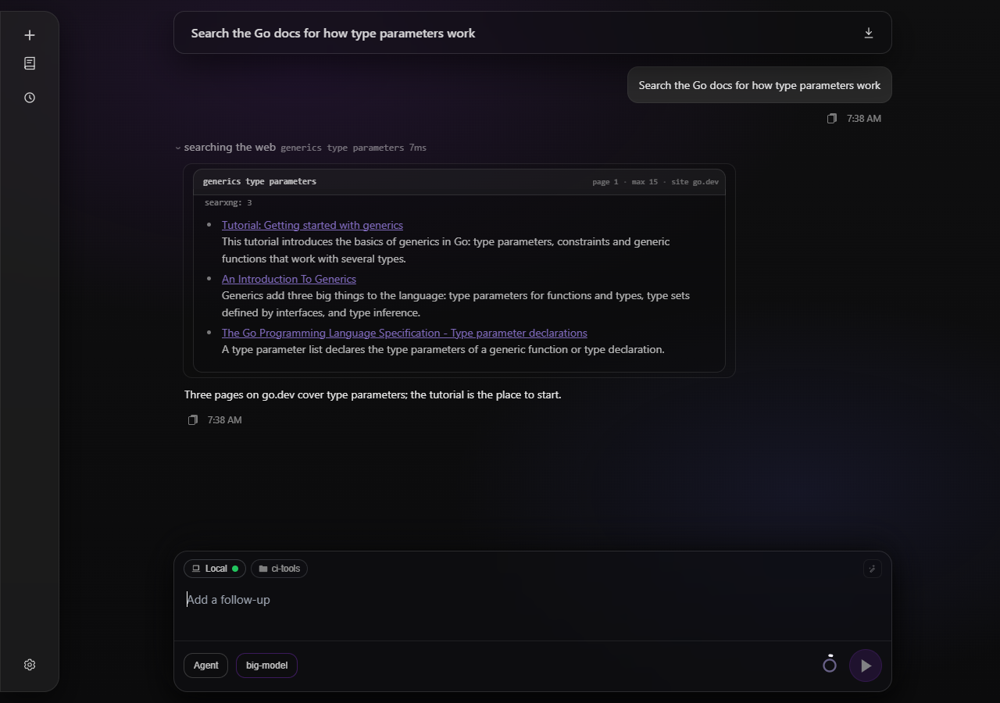

# Web search

The `websearch` tool asks several search engines at once and merges what comes back, and the `webfetch` tool downloads one page and returns it as Markdown. Together they are how the agent reads something that is not in the repository.

Search engines do not treat a program the way they treat a browser. One answers with a challenge page, one renders its results in the browser and serves a document with nothing in it, and one answers a query it dislikes with a full page of well-formed results about a different subject entirely. A merged answer that hides which of those happened is worse than no answer: the model reads an empty list as "the web has nothing on this" and stops looking. So every engine reports its own outcome next to the results.

## What comes back

```json
{
  "query": "golang context cancellation",
  "page": 1,
  "engines": [
    { "engine": "brave", "status": "ok", "results": 12, "took_ms": 620 },
    { "engine": "bing", "status": "blocked", "reason": "decoy: none of the results share a word with the query", "took_ms": 710 }
  ],
  "results": [
    {
      "title": "Canceling in-progress operations - The Go Programming Language",
      "url": "https://go.dev/doc/database/cancel-operations",
      "description": "You can manage in-progress operations by using Go context.Context...",
      "source": "brave"
    }
  ],
  "hint": "More results are available: call websearch again with page incremented, or narrow the query."
}
```

Every engine carries one of four outcomes.

`ok` - the engine answered and its rows were parsed. `results` counts what it contributed to the merged answer, so a page another engine had already supplied is not counted twice;
`empty` - the engine answered a result page the parser understood and there was nothing on it. This is the only outcome that honestly means the web has nothing under those words;
`blocked` - the engine answered something that is not a result page: a non-2xx status, a challenge, a layout the parser no longer recognises, or a batch of rows unrelated to the query. `reason` says which;
`error` - the engine could not be reached at all.

When **every** engine is blocked the call fails rather than returning an empty list, and the error names each engine and its reason. That is the difference the whole design turns on: a failure of the search is reported as a failure of the search, not as a fact about the world.

`cached: true` marks an answer reused from a recent identical search rather than asked again.

### In the web UI

A search row in the transcript reads as what it found, not as the JSON above. Its header names the query and every parameter the search ran with - the page, the number of rows asked for (15 when the call named none) and the site when there was one - and the first line under it says how each engine answered: a count for an engine that answered, the outcome and its reason for one that did not. The hits follow as links, each snippet on its own line. Opening the row loads the whole answer at once: the row only holds the first lines of the output, which the engine report fills, so there is no **More** control to press for the results.



*An opened search row: the query and its parameters in the header, how each engine answered, every hit as a link*

## Engines

| Engine | Key needed | Notes |
|--------|-----------|-------|
| `brave` | no (optional) | Default and first in the merge order. Reads the public result page; with an API key (`brave_api_key` or `BRAVE_API_KEY`) it uses the official Search API instead, which has no parser to break. |
| `bing` | no | Default, second. Serves an unrelated result set to a client it dislikes, which the relevance gate below catches. |
| `searxng` | no, but needs `searxng_url` | Your own instance, asked over its JSON API. The durable choice: not rate-limited against its owner, never served a decoy. |
| `ddg` | no | Not asked by default. From a server, both its endpoints answer every query with an HTTP 202 anti-bot page, which arrives as `blocked`; where DuckDuckGo still serves you, a query it has nothing for arrives as `empty`. |
| `google` | no | Not asked by default. The page served to an unapproved client carries no organic results for any user agent; the results are rendered in the browser. |

Results merge in the order the engines are listed, deduplicated by normalised URL - the same page reached through `www`, over `http`, with a campaign parameter (`utm_*`, `fbclid`, `gclid` and their kind) or a trailing slash is one row, and the URL handed to the model is the one its engine returned. Parameters that select content rather than name a referral are kept, so two revisions of one file are two results.

### The relevance gate

Bing answers a client it dislikes with a page whose title echoes the query and whose ten rows are about something else: pizza toppings for a question about Go, a tourism site for a question about a GitHub repository, and a different subject again on the next request. Nothing downstream can tell such a row from a real one.

So a batch is judged as a whole, and only when it is big enough to be a result page. When an engine returns at least five rows and not one of them has anything to do with the query, the engine did not answer it, and the whole batch is discarded with `status: blocked`, `reason: decoy`.

A query word counts as answered generously: as a word of the row, as part of one (a question about `OOM` is answered by a page about `OOMKilled`), and with endings folded so `cancellation` meets `cancel`. Everything about the test leans towards keeping results, because its mistake would be discarding a real answer - while the decoys it exists for share nothing with the query by any measure.

The judgement is batch-wide for the same reason. One row that misses every query word is ordinary: a page titled "Terminating programs" is a fine answer to a question about killing a process. A whole page of them is not.

## Configuring it

```yaml
tools:
  websearch:
    engines: [brave, bing]        # merge order; brave, bing, ddg, google, searxng
    engine_timeout_seconds: 8     # per-engine budget
    total_timeout_seconds: 20     # budget for the whole search
    max_concurrent_engines: 4     # how many engines are asked at once
    snippet_chars: 320            # per-result description cap
    cache_ttl_seconds: 300        # reuse an engine answer for this long; negative = off
    searxng_url: ""               # e.g. http://localhost:8080
    brave_api_key: ""             # official Brave Search API; or BRAVE_API_KEY
```

An engine name the loader does not know is a configuration error rather than a silently skipped backend, and `searxng` without `searxng_url` is refused the same way - `foxxycode -t` reports both with the line they are on.

### The Brave Search API key

The key does not have to live in `config.yaml`. When `brave_api_key` is empty, the engine reads the `BRAVE_API_KEY` environment variable, so the key can come from the shell, the container or `~/.foxxycode/.env`:

```bash
echo 'BRAVE_API_KEY=BSA...' >> ~/.foxxycode/.env
```

A key in the file wins over the variable, and `brave_api_key: ${BRAVE_API_KEY}` works as any other reference does. Neither way leaks the key: `config_get` and `foxxycode -t` print it as `<redacted>`, and a save from the Settings UI writes a `${BRAVE_API_KEY}` reference back as a reference and an empty field back as empty, never the key the environment supplied. The variable is read when a turn builds its tool settings; a key added to `.env` of a running `foxxycode serve` takes effect after a restart, since `.env` is read at startup.

### Your own SearXNG

A self-hosted [SearXNG](https://docs.searxng.org/) is the answer to every way a scraped engine fails. It aggregates the engines itself, it is not rate-limited against the machine that owns it, and it is never served a decoy.

```yaml
tools:
  websearch:
    engines: [searxng, brave]
    searxng_url: http://localhost:8080
```

The instance must serve the JSON API, which its default configuration does not: add `json` to `search.formats` in its `settings.yml`. A wrong setting there answers HTTP 403, which arrives as `blocked` with that reason rather than as an empty result list.

Unlike the URL `webfetch` is handed, this address comes from your own configuration rather than from the model, and a self-hosted instance normally listens on `localhost` or a LAN address - so private ranges are allowed on purpose: refusing them would refuse exactly the deployments this engine exists for.

What is refused is the link-local range, where no SearXNG listens and where the cloud metadata service does. A hostname is resolved before that check, because a name pointing there reaches it as well as the literal address would, and the engine never follows a redirect: you vet the address you configured, not wherever it forwards to.

### Caching

One engine's answer to one query is remembered for `cache_ttl_seconds` (300 by default), so a model that reaches for the same search twice does not make the engine answer twice.

Failures are remembered far more briefly, and the two kinds differently. A challenge page is sticky - the engine serves it to the next call as well - so it is kept for 30 seconds: long enough to stop a retry inside one turn, short enough that a recovering engine is noticed. An engine that could not be reached at all is kept for 5 seconds, which spares one turn's worth of repeats without hiding a host that has come back.

## Arguments

| Argument | Meaning |
|----------|---------|
| `query` | Required. The search terms, in the language the answer is likely written in. |
| `page` | Result page, from 1. Goes further down the same result list. |
| `max_results` | Rows to return for this page; 15 by default, 25 at most. |
| `site` | Restrict to one domain, e.g. `go.dev`. Folded into each engine's own syntax. |

## Reading a page

`websearch` returns snippets, and a snippet is not an answer. `webfetch` takes one URL and returns the article as Markdown through readability extraction, refusing private networks and localhost, and checks every redirect against the same rules before following it - see [Tools](../reference/tools.md). It sends its request through the client of [`http_request`](http-requests.md), the tool for calling an API or anything else that is not reading a page.

## Related

[Tools](../reference/tools.md) - every built-in tool and its arguments;
[Configuration](../getting-started/configuration.md) - where `config.yaml` lives and how to check it;
[Operating modes](modes.md) - `websearch` and `webfetch` are offered in every mode, including the read-only `ask`;
[HTTP requests](http-requests.md) - `http_request`, the agent's curl, and the client `webfetch` is built on.
