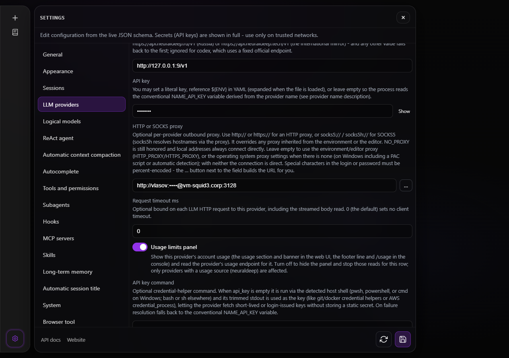
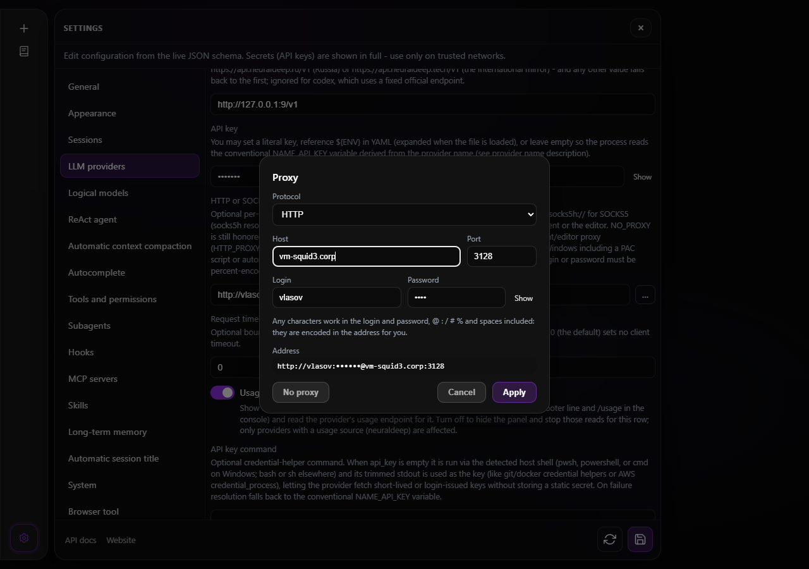

# Working behind a proxy

FoxxyCode reaches the model, the Telegram Bot API, MCP servers, skill sources and the web tools
over HTTP. On a network that only lets traffic out through a proxy, it can get the proxy from any
of three places. They apply in this order:

1. **A proxy set on the thing itself.** `providers[].proxy` for a model provider,
   `gateways.telegram.proxy` for the Telegram bot, `dial.proxy` for a swarm leg, the `proxy`
   argument of an `http_request` call.
2. **The environment.** `HTTP_PROXY`, `HTTPS_PROXY` and `NO_PROXY` (either case). The IntelliJ
   plugin passes the IDE's proxy this way. The VS Code extension does the same when `http.proxy`
   is set.
3. **The operating system's proxy settings**, when the environment names no proxy. On Windows
   this means what **Settings → Network & internet → Proxy** holds, whichever form it takes:
   - a manual proxy with its exception list;
   - a setup script (PAC);
   - automatic detection (WPAD).

   This is what the desktop app uses. It is also what VS Code uses with an empty `http.proxy`,
   and what a `foxxycode` started from a shortcut uses: nothing passes those a proxy in the
   environment.

Loopback addresses (`localhost`, `127.0.0.1`, `::1`) never go through a proxy. Provider and Telegram proxy fields also accept `inherit` (the default) and `none` (always direct). A local
`api_base` (Ollama, LM Studio) keeps working with any of the three.

## The proxy field in Settings

Both proxy fields in Settings (**LLM providers** and the Telegram gateway), and the proxy field of
the first-run provider dialog, hide the password. Everything between `login:` and the `@` in front
of the host shows as dots, while the field is being typed in and when it only displays a saved
value. The character you just typed stays readable for three seconds, then turns into a dot like
the rest. Copying from the field copies the real characters.



*The provider proxy field: the password is dots, with the `…` button at the end of the row.*

The **`…`** button at the end of the row opens the proxy editor. It has the protocol (HTTP, HTTPS,
SOCKS5, SOCKS5h), host, port, login and password as separate fields, and builds the URL from them.
The address it builds is shown with the password hidden. **No proxy** empties the field.



*The proxy editor opened from the field: separate fields, and the resulting address with the password hidden.*

Use the editor whenever the login or the password contains anything other than letters and
digits: the editor percent-encodes both. A proxy URL typed by hand has to be encoded by hand:

| Character in the password | In a typed URL |
|---|---|
| `@`, `:` | Accepted as typed: the URL is split at the last `@`, and the password at the first `:`. Encoding them (`%40`, `%3A`) works too. |
| `/`, `?`, `#` | Must be `%2F`, `%3F`, `%23`. Unencoded, they cut the address short. |
| `%` | Must be `%25`. Unencoded, `%41` would be read as `A`. |
| a space, Cyrillic or any other non-Latin letter | Must be percent-encoded (`%20`, `%D0%BF`...). |

A URL that a password character has cut short is refused when the configuration is saved or
loaded, with an error pointing at the `…` button. The error never quotes the password.

## The Windows system proxy

Nothing needs configuring: FoxxyCode reads the current user's setting when it starts. The log
says so at `info` level:

```text
msg="using the system proxy" system_proxy="pac http://wpad.corp.example/proxy.pac, bypass <local>;*.corp.example"
```

- **Manual proxy.** One `host:port` serves every scheme. The per-scheme form
  (`http=…;https=…;socks=…`) serves the schemes it names, and `socks=` serves the rest.
  The exception list works as Windows reads it:
  - `<local>` matches a plain name without a dot;
  - `*` is a wildcard (`*.corp.example`, `10.*`).
- **Setup script (PAC) and automatic detection (WPAD).** Windows evaluates the script itself
  through WinHTTP, the same service the operating system uses, so a script that routes the model's
  host through a proxy and everything else directly behaves the same way for FoxxyCode. The
  answer for a host is kept for five minutes.
- **A script that cannot be downloaded or run** does not fail the request. FoxxyCode falls back
  to the manual proxy if there is one, or to a direct connection, as a browser does, and asks
  again 30 seconds later.

A proxy named in the environment or on the provider still wins over the system setting. To turn
the system setting off for one process, set `FOXXYCODE_SYSTEM_PROXY=off`.

The desktop window itself (WebView2) always followed the system proxy for the pages it opens,
such as the Codex and NeuralDeep sign-in pages. The interface it shows is served from
`127.0.0.1`, which bypasses the proxy.

## Limits

- **Proxy authentication is Basic only** (a login and password in the URL). A proxy that asks
  for Windows sign-in (NTLM or Kerberos) needs a local forwarder in front of it, such as Px or
  cntlm. Point FoxxyCode at the forwarder's local address.
- **Other operating systems.** There FoxxyCode reads the system proxy only through the
  environment, which the desktop session normally sets.
- **Child processes** started by the agent (`git`, the `run_command` tool, MCP servers over
  stdio) get the environment FoxxyCode was started with. The Windows system proxy is not
  copied into it.

## When requests still do not get through

Turn on `debug.enable`. Every request to the model then logs its route in the connection trace
(see [Diagnostics](debugging.md#connection-trace)). The possible routes:

- `route="system-pac http://…"`: the PAC script chose that proxy.
- `route="system-proxy http://…"`: the manual system proxy.
- `route="env-proxy http://…"`: the proxy came from the environment.
- `route="proxy http://…"`: the proxy set on the provider.
- `route="direct (system proxy: bypass)"`: the exception list sent the request direct.
- `route="direct (system proxy: pac)"`: the script answered DIRECT.
- `route="system-proxy … (pac failed: …)"`: the script could not be evaluated, and FoxxyCode
  fell back to the manual proxy.

The same trace shows where a request that hangs is stuck: the tunnel through the proxy, TLS, or
the model's answer.
