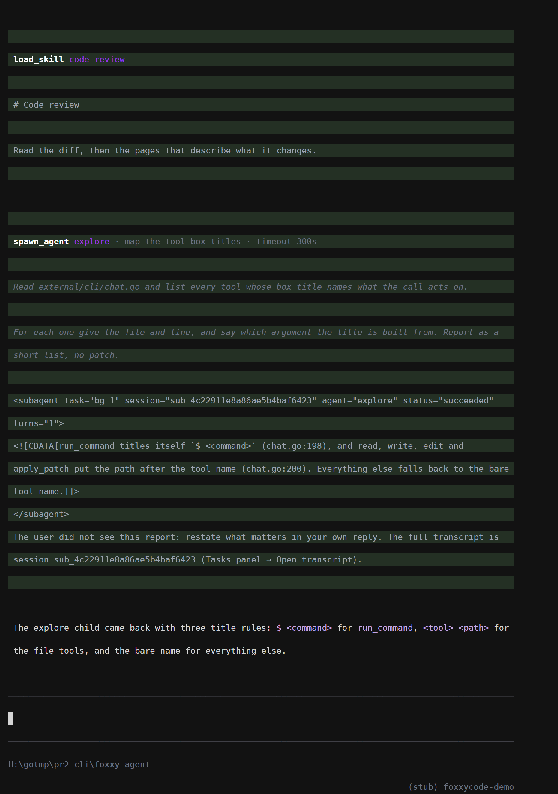
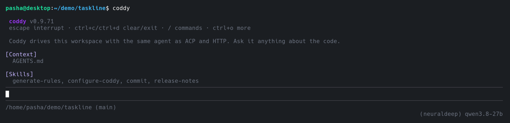
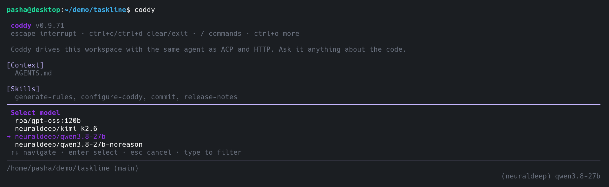
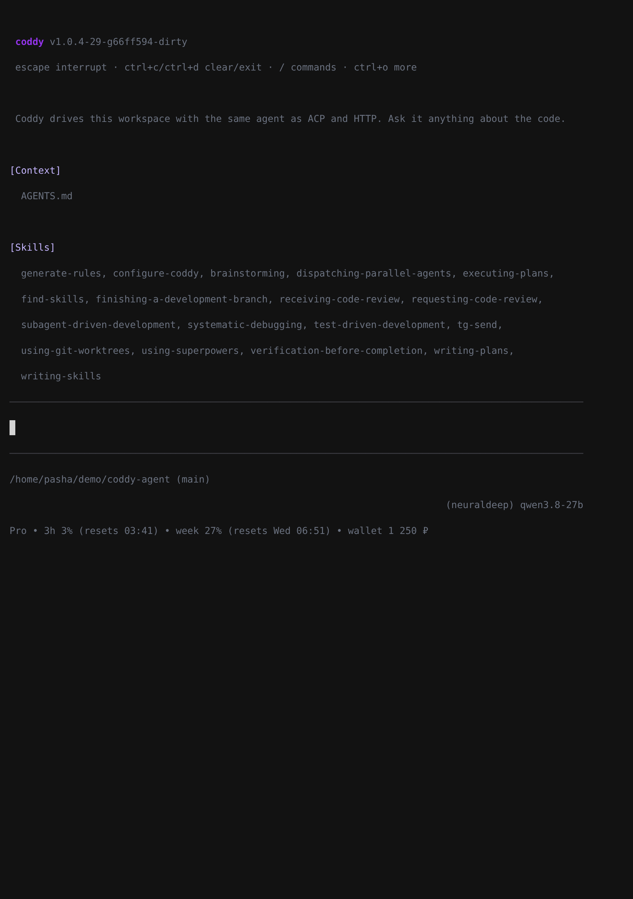
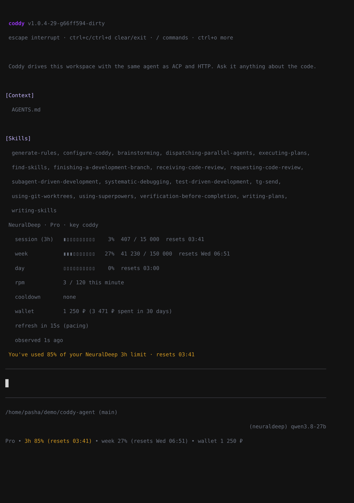
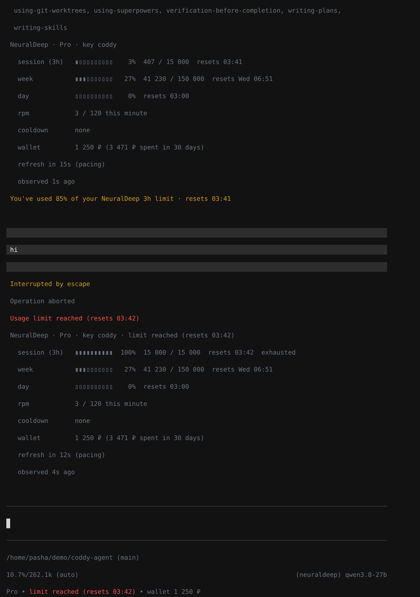
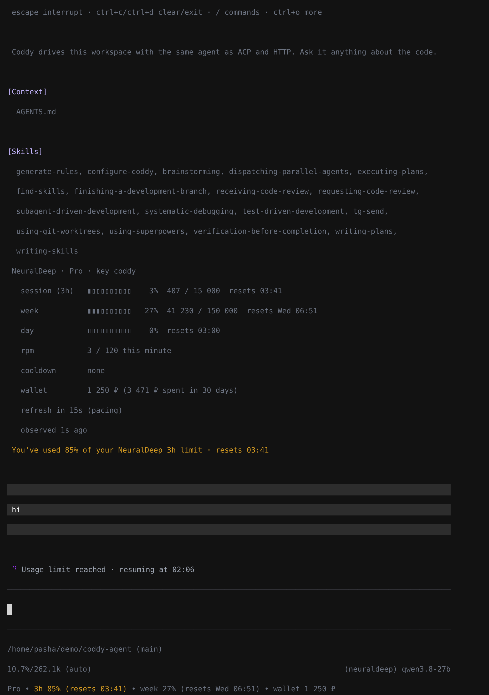
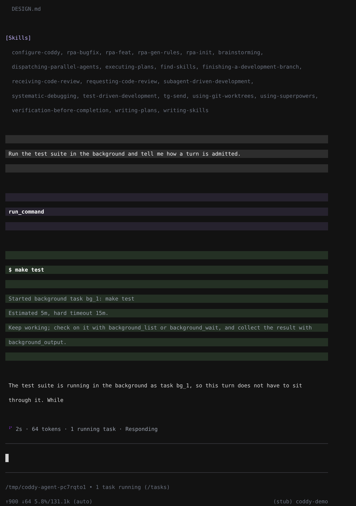

# Interactive console TUI (`foxxycode` / `foxxycode cli`)

The console surface is a terminal UI over the same machinery every other
surface uses: `session.Manager`, the agent runner, and ACP session updates.
Nothing agent-side is console-specific — the TUI is a fourth `UpdateSender`
next to ACP, HTTP, and the Telegram gateway.

Build: `make build TAGS=cli` (or any tag set including `cli`; the recommended
full binary is `make build TAGS="http ui scheduler memory cli browser"`). In builds
without the tag, `foxxycode cli` explains how to rebuild and bare `foxxycode` keeps
printing usage.

Launch: bare `foxxycode` on a terminal (both stdin and stdout must be ttys —
pipes and CI keep the usage contract), explicitly `foxxycode cli [flags]`, or with
flag-style shortcuts routed to the console: `foxxycode -c` continues the latest
session in this folder and `foxxycode -p "..."` runs one non-interactive prompt.
Quitting the console (double ctrl+c, ctrl+d, `/quit`) prints a resume hint
after the terminal is restored:

```
session: sess_1a2b3c4d
continue: foxxycode cli --session-id sess_1a2b3c4d  (or: foxxycode -c)
```

## Visual model

The layout replicates the pi coding agent's TUI (pi-mono `b1efcf7d7`,
v0.84.2, MIT, Mario Zechner — see the attribution note below) with colors
from the foxxycode SPA palette (`external/ui/src/styles.css`); this document is
the visual contract for the foxxycode console.

Top to bottom:

- **Header**: `foxxycode` (bold accent) + dim version; a dim hint line
  (`escape interrupt · ctrl+c/ctrl+d clear/exit · / commands · ctrl+o more`);
  `[Context]` (instruction files) and `[Skills]` (loaded skill names).
  `ctrl+o` expands the full hint list and adds `[Rules]` and `[MCP]` sections.
- **Transcript**: user messages in full-width background boxes; assistant
  markdown (headings, bold/italic, inline code, ``` fences with borders,
  `│ ` quotes, lists, box-drawing tables, OSC 8 links); italic gray thinking
  blocks (collapse with `ctrl+t`); tool calls as background-tinted boxes
  (pending → success green tint / error red tint) with a bold title naming
  what the call acts on (`read <path>`, `$ command`, `load_skill <skill>`,
  `Searching the docs <query>`, `Reading the docs <page>`,
  `spawn_agent <subagent> · <task> · background · timeout 300s`, where each
  part after the subagent appears only when the call passed it), preview
  capped at 10 lines, and `... (ctrl+o to expand)` reading the full result
  from `sessions/<id>/tool_calls/`. A `spawn_agent` box also carries the
  delegation itself: under the title, in dim italic, the prompt the child
  received, cut at the first of 10 written lines or 600 characters with
  `... (ctrl+o for the whole prompt)`. The child's report lands below it as
  the box body, so the task and the answer read as one block.
- **Status**: braille spinner `⠋⠙⠹...` at 80 ms with a live status line while a
  turn runs. The line leads with the turn's own numbers: how long the turn has
  been running, how many tokens the model has generated in it, how many
  background tasks run right now - `15m 08s · 13.5k tokens · 1 running task ·
  Thinking…`. Before the first token it is the clock and the phrase alone
  (`57s · Waiting for the model`), and the tasks appear only while something
  runs. The tokens are the agent's `turn_progress` update: the provider's
  figures for the calls that finished plus an estimate of the one in flight, so
  the count moves while the answer streams; a console attached over `--remote`
  receives the same update. Then comes the current step - verb plus target -
  and, for a step that runs something other than the model, a counter of its
  own (`2m 05s · 1.2k tokens · Running npm test · 45s`, `Running subagent
  reviewer · 40s` while a `spawn_agent` call is in flight); thinking, responding
  and waiting are covered by the turn clock. A plain wait escalates with time:
  `Waiting for the model` → `The model is taking longer than usual` (15 s) →
  `Still no response from the server` (60 s). While a permission or question
  modal is open the line shows `Waiting for your approval` / `Waiting for your
  answer` with **no** step counter (nothing is running), and after approval it
  returns to the gated tool with a restarted counter. Phrase table lives in
  `external/cli/status.go` (Go twin of the SPA's `liveStatus.ts`).
- **Plan widget**: current todo entries (`✓` done, `◐` active, `○` pending,
  `✗` failed) above the editor.
- **Editor**: multi-line input between full-width `─` rules (green while the
  buffer holds a `!!` command); wrap-aware
  cursor movement with sticky column; prompt history (up/down at edges, cap
  100); large pastes collapse into `[paste #N +K lines]` markers; scrolled
  content shows `─── ↑ N more ───` borders. Autocomplete: `/` commands on the
  first line and `@` mentions anywhere, `tab` forces path completion on a bare word.
  The `@` list asks the same search the web UI does (`GET /foxxycode/mentions`,
  in-process when local): the whole workspace ranked against what was typed, so a
  fragment of a name finds a file anywhere in the tree; the index is rebuilt when a
  mention starts, so a file written since the console started is offered and a
  deleted one is gone; a query starting with `/`, `~`, `./` or `../` browses that
  folder, anywhere on disk; `@session:`, `@rule:`, `@agent:` and `@foxxycode:` (the
  pages of the built-in documentation) list those kinds.
  A cut list says so on its scroll line, `(3/50 of 1204, type to narrow)`. A folder
  or a scheme row keeps the list open; a file ends the mention with a space, quoted
  when its path holds one (a quoted folder closes its quote ahead of the cursor, so
  the text names it even if no file follows). A mention may narrow a file to a line range,
  `@Dockerfile:21-31` or `@f.go#L21-31`, absolute paths included. In remote mode the
  list comes from the server that runs the session. The grammar, what each kind
  attaches and the limits are in [Mentions](../features/mentions.md).
- **Footer**: dim `cwd (git-branch) • title [• plan] [• N tasks running (/tasks)]`,
  then `↑in ↓out  N.N%/ctx (auto)` left and `(provider) model [• reasoning]`
  right. The running-task note stays after the turn that started the tasks has
  ended, which is when the status line that counted them is gone. When the
  line does not fit, the path and the title give way and the note stays.
  A third line appears while the active model's provider reports account
  usage (today: `neuraldeep`, read from the hub's `GET /v1/limits`):
  `Pro • 3h 3% (resets 20:59) • week 7% (resets Mon 03:00) • wallet -1 229 ₽`,
  the plan, each metered window as percent **used** with its reset time in
  your clock (time of day within 24 h, weekday within a week, date beyond),
  the day window only when it is above zero, and the account's own ruble
  balance for wallet keys. A window at 80 % or more turns to the warning
  colour and a transcript notice says `You've used 82% of your NeuralDeep 3h
  limit · resets 20:59`, once per window and period; a hit limit replaces the
  windows with `limit reached (resets 20:59)` in the error colour (`rate
  limited (retry in 42s)` for a per-minute block, `key blocked`, `wallet
  empty` or `account blocked` for the ones no clock lifts) and posts `Usage
  limit reached` once. With `agent.wait_for_limit_reset` on, a turn that
  hits a limit the retries could never cover (a `429` naming a reset far
  ahead) waits for it instead of failing: the live status row reads `Usage
  limit reached · resuming at 20:59` without a running counter, the footer
  keeps the hub's numbers, and the same call runs again when the limit
  lifts (Esc stops the wait like any turn). A model on the provider's unlimited option (Qwen ∞)
  reads `∞ volume`. A rejected key reads `neuraldeep: key rejected, run
  foxxycode providers login neuraldeep`; when the hub cannot be reached the last
  numbers stay with `(stale)`. On narrow terminals the wallet, the day, the
  week and the plan leave in that order. The numbers arrive from the session
  manager at session start and after every turn (`provider_usage` update,
  same on `--remote`); after `/model` the console asks its backend for the
  numbers of the new provider (from the cache when warm), once a window's
  reset passes it asks for a fresh read, and when the backend deferred a
  refresh by its pacing floor the console reads the cache again when the
  answer says so. Nothing polls otherwise. `usage_limits_panel: false` on
  the provider row switches the panel off: the line stays hidden, `/usage`
  says so, and no request goes to the hub for that row; a configuration
  reload re-reads the cache, so a switched panel follows without a restart.
  Design record: `docs/plans/neuraldeep-usage.md`.

Rendering is pi's inline main-screen model: line-diff against the previous
frame, synchronized output (`ESC[?2026h/l`), per-line SGR + OSC 8 reset, a
zero-width APC cursor marker for IME hardware-cursor placement, 16 ms render
throttle with immediate renders after keystrokes.

Startup runs before the terminal enters raw mode: the config, the session
store, the skills, the rule folders and the configured MCP servers, then the
first frame. Nothing reads the workspace tree: nested `AGENTS.md` files are
read on demand, from the folders a tool enters (see
[`docs/features/rules.md`](../features/rules.md)), so a console opened in a home directory (a macOS
`~/Library` alone runs to hundreds of thousands of entries) draws its frame at
once instead of looking hung. The git branch in the footer is read with a
three-second bound for the same reason. A first ctrl+c during startup cancels
it; a second one ends the process the default way instead of being swallowed.

## Commands and keys

Slash commands: client-side `/model`, `/reasoning [level]`, `/mode`, `/resume`,
`/new`, `/theme`, `/hotkeys`, `/queue`, `/usage`, `/tasks`, `/docs`, `/quit`; server-driven `/compact`, `/export`,
`/plugin`, and every loaded skill (from the ACP available-commands catalog).
Enter on a slash suggestion applies and submits in one stroke. `/export [md|html|json|jsonl]
[path]` writes the transcript into the workspace (`docs/features/session-export.md`);
under `--remote` the file lands on the server.

`/tasks` opens the background tasks of the session in the place of the editor
([Background tasks](../features/background-tasks.md#in-the-console)). The
agent has had `background_list`, `background_output` and `background_stop`
all along; this is the operator's side of the same pool. Every task is one
row: a status mark, a tag that says what stands behind it (`shell` for a
command, the agent's name for a subagent run, `memory` for the memory run of
a turn), the title - the command, or what the agent was asked to do - and how
it is going (`1m 08s · est. 5m 00s`, `1m 30s` once it has ended), with the
model and the tokens of an agent run (`44s · qwen3.8-27b · 88.7k tokens`),
newest first, the way the web UI's Tasks panel lists them. A running task that
will wake the agent when it ends says `wakes the agent` in its row, where the
web UI's card has its bell. How a task ended
is its mark (`✓`, `✗`, `■`); the open task says it in words. **enter** opens
the task under the cursor: how it ended with the exit code and the duration
(`failed · exit 2 · 1m 30s`), its command, the child session of an agent run,
the error it ended with unless that is only the exit code again, and the last
lines of its output, read again while the task
runs and once more when it ends, for what it printed last. One output read is
in flight at a time, like the list read, so a slow server does not collect a
queue of them. **s** stops the task under the cursor or the open one, process group
and all; **r** reads everything again; **escape** leaves an open task first,
then the overlay. Under `--remote` the rows, the output and the stop go
through the server's REST routes, so the overlay manages the processes of the
machine the agent runs on. The list refreshes every 2.5 s while the overlay is
open, a turn runs or a task runs, and every 15 s otherwise; between turns the
footer keeps saying how many tasks still run.

A task the agent started with `notify_on_finish` wakes it in this console
when it ends ([Background tasks](../features/background-tasks.md#waking-the-agent-when-a-task-finishes)).

**F1** opens FoxxyCode's own documentation in the place of the editor, read out of
the binary ([Built-in documentation](../features/built-in-docs.md#the-console-help)):
typing searches the sections, **enter** opens one at its section, **tab** moves
between sections, **n** and **p** turn the pages, **escape** goes back.
`/docs [words or page]` opens the same screen where the terminal keeps F1 for
itself (GNOME Terminal does), on a search or straight on a page:
`/docs features/mentions#completion`.


*F1, then `telegram proxy`: the sections found, the selected one with its address and snippet*
The woken turn runs like a typed one - the status line, the queue, a gated tool
asking in the permission modal - and shows nothing where the operator's message
would stand: the agent's answer follows the previous turn, as the work carrying
on, live and when `/resume` replays the session. `/tasks` is where the task
says it: `wakes the agent` while it runs, `woke the agent` once its end has
started the turn. A wake that lands while a turn, a `!!` command or a session
switch is in progress waits for it to end; one for a session the console has
left with `/new` or `/resume` waits until the operator comes back to that
session, and a dim line says once where it is waiting. `foxxycode -p` runs no
waker, so there the tool tells the model that nothing will wake it.

Submitting while a turn is running does not refuse the prompt: it joins the
session's message queue, which the running turn reads at its next step
(`docs/features/message-queue.md`). What is waiting shows directly above the
input, numbered in reading order:

```
queued for the next step (2) · /queue to manage
1. check the Windows path too
2. and skip the integration suite
```

`/queue` lists them, `/queue drop <n>` takes one back, `/queue clear` empties
the queue, and `escape` cancels the turn together with everything queued for
it. Under `--remote`, these controls also work for a turn another client
started on the same `foxxycode serve`: **Enter** queues text for that turn and
**Escape** requests cancellation. A successful cancel response acknowledges
the request; the server can still be releasing the turn.

The remote console reads the session's activity and queue on open and
reconnect, and receives changes through `GET /foxxycode/events`. Ordinary queue
deliveries keep the highest observed version. After a server restart, only
the latest fresh snapshot, with no intervening queue update, may lower that
version (including to zero). Recovery also fences delayed pre-restart replies
and notifications, so they cannot bring old rows back. This works even when
the restarted server is already running a turn. A failed read or crossed snapshot is re-read, with up to three attempts
and a short delay; a newer refresh or shutdown stops the old recovery. Queue reads have their own timeout budget, so a slow activity
read cannot use it up. Server activity stays separate
from the console's own prompt request: observing another client's turn does
not start or finish that request. These controls do not subscribe to the
other client's live transcript or transfer its permission/question dialogs.

If a turn ends between Enter and queue admission, the console restores the
submitted text alongside any newer draft rather than automatically starting
another prompt. Send it again once the session is idle.

This shared queue requires clients of the same server process. A bare local
console or local ACP process that shares only the sessions directory has its
own queue and answer channels; cross-process cancellation uses the bundle's
cancel marker. One-shot `-p/--prompt` callers retain their existing prompt
and non-interactive permission/question behavior.

`/reasoning` without an argument opens a selector with the active model's
available levels; selecting a value persists that level on the session.
`/reasoning <level>` immediately selects and persists that level instead.
`shift+tab` cycles through the same levels and persists its selection in the
same way. Models without reasoning levels report that reasoning is unavailable;
an unsupported direct value reports the levels that can be selected.

Agent self-configuration works as it does over ACP and HTTP: every turn
offers the staged config tools (`config_get`, `config_set`,
`config_changes`, `config_commit`, `config_revert`, `config_rollback`; see
**Agent self-configuration** in `docs/reference/config.md`), and a commit or
rollback hot-reloads the running console, so the model catalog (`ctrl+l`,
`ctrl+p`), the footer, and the header's `[Context]`, `[Skills]`, `[Rules]`,
and `[MCP]` sections follow the new file without a restart. `-p/--prompt`
offers the same tools; under `--remote` the server owns the reload.

| Key | Action |
|-----|--------|
| enter | send |
| shift+enter / ctrl+j | newline (backslash+enter also splits) |
| escape | interrupt the running turn (`HandleSessionCancel`), or stop a `!!` command |
| ctrl+c | clear editor; twice within 2 s exits |
| ctrl+d | exit when the editor is empty |
| ctrl+l | model selector |
| F1 | the built-in documentation: search, read, turn pages (`/docs` too) |
| ctrl+p / ctrl+shift+p | cycle configured models |
| shift+tab | cycle and persist the session reasoning level (models with `reasoning_levels`) |
| ctrl+o | expand header hints + last tool output + last `!!` block |
| ctrl+t | collapse/expand thinking blocks |
| up / down | history at the first/last line; cursor movement otherwise |

Modals replace the editor while open: permission requests (the option list
comes from the agent's `permission.Options`), the question tool (single or
multi-select via space, custom free-text answers), model/mode/theme/session
selectors (`→ ` cursor, type-to-filter, `(i/n)` scroll indicator).

The question modal spends every row on its option label and prints the
description of the highlighted option under the list, word-wrapped over the
whole width, so a sentence-long answer stays readable instead of being cut at
a column boundary. When the question is answered, its tool block shows the
questions with the chosen answers (`→ answer`, `→ (no answer)` for a dismissed
one) rather than the JSON the tool hands the model.

## Local shell (`!!`)

A submitted line that starts with `!!` is not a prompt. FoxxyCode runs the rest of
it in the workspace with the shell `run_command` uses, and neither the command
nor its output is shown to the model, persisted in the session bundle, or
counted against the context window. This is pi's bash-mode prefix; pi's other
half, `!`, which feeds the output back to the model, is still deferred.

- the prefix counts at the start of the submitted line only; while the buffer
  holds a command the editor rules turn green. To send a prompt that really
  starts with `!!`, escape it once: `\!!careful` reaches the model as
  `!!careful`;
- output streams into its own transcript block: the last 10 lines while
  collapsed, the whole capture on `ctrl+o`, and a closing `exit N` when the
  command failed. Output is decoded and stripped of control sequences exactly
  like tool output, and only the last 256 KiB is kept (the block says how much
  it dropped), so a `tail -f` neither grows the console nor slows it down;
- there is no permission modal, and `ask` / `accept_edits` / `bypass` do not
  apply: the operator who typed the command is the principal, not the model.
  Plan mode restricts the agent's tools, not the terminal in front of you;
- `escape` kills the running command and the process group it leads, and so
  does quitting the console, so nothing keeps printing into the terminal foxxycode
  just gave back. Work the command deliberately detaches (`cmd &`, `nohup`)
  outlives it exactly as in your own shell: once the command itself exits the
  console has nothing left to stop. A second `escape` gives the console back
  when a kill cannot reap its target at all. There is no timeout and no
  adoption into the background task pool - that pool is agent-visible on
  purpose;
- one at a time: a `!!` line is refused while a turn runs, and while a command
  runs the console refuses prompts, another `!!`, and every modal (`/new`,
  `/resume`, `/mode`, `/theme`, `ctrl+l`), each with a status line saying so -
  none of them queue. A modal would swallow `escape`, which is the only key
  that stops the command;
- the command reads from the null device, not from the terminal: an
  interactive program (`!!python`) sees EOF instead of stealing keystrokes
  from the editor;
- `--remote` refuses it. The session workspace lives on the server, so running
  the command on this machine would silently touch a different tree;
- `-p/--prompt` does not interpret the prefix: a one-shot prompt goes to the
  model verbatim.

The block belongs to the running console only. Reopening the session with
`-c`, `--session-id`, or `/resume` does not replay it, because nothing about a
`!!` command is written to disk.

Modals replace the editor while open: permission requests (the option list
comes from the agent's `permission.Options`), the question tool (single or
multi-select via space, custom free-text answers), model/mode/theme/session
selectors (`→ ` cursor, type-to-filter, `(i/n)` scroll indicator).

A background subagent keeps working after the turn that spawned it has ended,
and when it needs a permission it asks through the same modal, titled
`[subagent <name>] …`, between turns too. A permission or question that
arrives while another one is on screen waits for it instead of replacing it,
and a prompt whose asker gave up (the subagent was stopped or timed out) is
taken down. A subagent's prompt still open when the turn that spawned it ends
closes with that turn and reopens at once as the subagent's own, so it is
answered once. One-shot print mode exits with its turn, so a background
subagent there is refused with a reason instead.

The question modal spends every row on its option label and prints the
description of the highlighted option under the list, word-wrapped over the
whole width, so a sentence-long answer stays readable instead of being cut at
a column boundary. When the question is answered, its tool block shows the
questions with the chosen answers (`→ answer`, `→ (no answer)` for a dismissed
one) rather than the JSON the tool hands the model.

## Flags

`-t/--test-config` checks the config file the console would load against the
embedded JSON Schema and the loader's own rules, prints every problem as
`file:line:col` with a fix line, and exits without opening a terminal or a
session - so it also works in the lean build without the `cli` tag.
`--dry-run` runs that check and then probes what the file points at (paths,
model servers and their credentials, MCP commands, remotes); on its own it
prints only problems and a status line, with `--test-config` the full report.
Both exit 1 when something is wrong. See
[docs/getting-started/configuration.md](../getting-started/configuration.md#checking-the-file-from-the-command-line).

`--config --home --cwd --sessions-dir` mirror the other subcommands.
`--session-id <id>` reopens (or creates) that session and replays its
transcript. `-c/--continue` reopens the most recent session recorded for this
folder (errors when none exists; mutually exclusive with `--session-id` and
`--resume`). `--resume` opens the session picker first and creates nothing
until you choose (mutually exclusive with `--session-id`; `--model`,
`--mode`, and `--permission-mode` apply to whichever session the picker
selects). `--model`, `--mode agent|plan`, and
`--permission-mode ask|accept_edits|bypass` apply through the validated
manager config-option API before the UI starts, in every launch mode
(interactive, `--continue`, `--resume`, and `--prompt`). `--theme
dark|light|auto` (auto falls back COLORFGBG → dark). `--plain` disables
terminal queries, modifyOtherKeys, titles, and OSC 8 for deterministic
automation. Logging is forced away from the terminal into
`<home>/logs/cli.log` (`--log-file`, `--log-level`).

## One-shot print mode (`-p/--prompt`)

`foxxycode -p "..."` (or `foxxycode cli --prompt "..."`) runs a single agent turn
without a terminal: assistant text streams to stdout, diagnostics go to
stderr, and the process exits non-zero on errors or a cancelled turn. No tty
is required, so it fits scripts and cron. The turn persists as a normal
session, and `-c -p "..."` continues it — tokens, files, and tool state
carry over exactly like the interactive console. Permission requests resolve
non-interactively: `bypass` allows, anything else rejects the call with a
note on stderr. The question tool returns empty answers. `--model`, `--mode`,
`--permission-mode`, `--session-id`, and `--continue` all combine with
`--prompt`; `--resume` does not (it needs the interactive picker).

## Remote mode (`--remote`)

`--remote <target>` points the console (interactive and `-p` print runs) at a
remote `foxxycode http` server instead of running the agent in-process. The
target is a configured remote name (`httpserver.remotes`), a bare
`host:port` (scheme defaults to http), or a full http(s) URL. The bearer
token comes from `--remote-token` or `FOXXYCODE_REMOTE_TOKEN`; tokens are
deliberately never read from config.yaml. The same pair of flags works on
`foxxycode acp`, so an ACP editor can drive a remote foxxycode too.

Turns execute on the server in its workspace. For a turn this console starts,
the transcript, tool boxes, thinking, plan updates, token and context stats
stream back over SSE;
permission and question modals answer through the server's REST endpoints;
`ctrl+o` fetches full tool output from the server. The model selector lists
the remote catalog (`GET /v1/models`), `/mode` picks the agent or plan
profile per turn, and `/resume`, `-c`, and `--session-id` operate on the
server's session list (the local folder filter does not apply). The
permission mode is governed by the remote server's configuration:
`--permission-mode` and the `/permissions` option are rejected with a clear
error. `/reasoning` and `shift+tab` persist the selected reasoning level on
the server session. Sessions persist only on the server; the startup banner shows
`remote: <url>` and the exit hint prints a reconnect command with `--remote`
included.

Subagents run on the remote host: the definitions, the trust receipts and the
child sessions are the server's. Approve a project definition there (`foxxycode
agents trust` on the server, or `POST /foxxycode/subagents/{name}/trust`); the
local `foxxycode agents` subcommands do not take `--remote`. A child's permission
prompts reach the remote console like the parent's own, prefixed
`[subagent <name>]`, and the status line reads `Running subagent <name>` while
the child runs. A background child that asks after the turn ended reaches the
console too: the server announces the prompt on its events stream and the
console opens the modal for the sessions it opened, answering the child
session; answered first in a browser or a chat, the modal closes. After reconnecting, the console reconciles the complete pending-request snapshot: prompts answered while offline close, while requests still waiting remain open without duplicate modals. An interrupted snapshot does not dismiss a pending request. The footer shows the local folder; the trust receipt is keyed
by the server-side session workspace (the server's default cwd for a session
the console created). A dropped connection leaves the server turn and its
child running; `/resume` shows the outcome once it ends, and an answer to a
prompt the server has already withdrawn is ignored. A turn the server woke on
its own in a session the console has open - a finished `notify_on_finish` task -
is followed on the session's composer relay, announced by `background_wake` on
the events stream - or, for a console that opens the session (`/resume`,
`--session-id`) while that turn is already running, by the `backgroundWake` of
the session's activity, and after a reconnect by the events stream's snapshot,
which picks the same turn up after the last frame shown: the answer and a
permission prompt reach the console as for a turn it started, and a prompt answered first in a browser
closes again. The console's own waker stays off under `--remote`: the tasks run
in the server's pool, and the server wakes the agent. Quitting the console
mid-turn waits briefly for the remote cancel to reach the server. See
`docs/features/subagents.md`, Remote mode.

## Subagent definitions (`foxxycode agents`)

Three subcommands manage the subagent definitions the agent may delegate to
(`docs/features/subagents.md`). They need no build tag, like `foxxycode mcp` and
`foxxycode rules`:

```
foxxycode agents list [--cwd DIR]
foxxycode agents trust <name> [--cwd DIR]
foxxycode agents untrust <name> [--cwd DIR]
```

`list` prints the workspace and the effective `subagents.project_trust`, then
the catalog as a table with `NAME`, `SCOPE` (`builtin`, `user`, `project`),
`TRUST` (`trusted` or `needs_approval`), `FLAGS` (`hidden`, `model=…`,
`mode=…`), `DESCRIPTION` and `PATH` (`(embedded)` for built-ins), a `(total N)`
line, and a hint when project definitions await approval. `trust` prints the
effective declaration first (file, model, mode, permission mode, tool lists,
digest, receipt path) and then records a receipt for the file as it is on disk
right now, keyed by the canonical workspace, the name and the file digest, in
`<home>/subagents-trust.json`; a built-in or user-scope name needs no approval
and the command says so. `untrust` withdraws a receipt. `--cwd` defaults to the
process working directory, resolved like `foxxycode mcp`. Under
`subagents.project_trust: deny` project files are not listed at all, and under
`allow` they need no receipt.

In the console a `spawn_agent` call shows as a tool box whose title names the
subagent that took the task (`spawn_agent explore · find every caller`), with
the prompt the child received rendered under it and the child's report added as
the body when it comes back; the status line reads `Running subagent <name>`
with its elapsed counter for as long as the child runs.



*A loaded skill and a delegated run: the box titles name the skill, and the
subagent with the task and the timeout it was given; the dim italic block is
the prompt the child received, and the child's report follows it*

A child's permission request, while its spawning turn is
still alive, opens the usual modal in the parent chat with the title prefixed
`[subagent <name>]`. Child sessions are read-only transcripts:
`-c` never picks one, and a prompt sent to one is refused with a message naming
the parent session.

## Hook definition files (`foxxycode hooks`)

Three subcommands manage the hook definition files a session would load
(`docs/features/hooks.md`). They need no build tag, like `foxxycode agents`:

```
foxxycode hooks list [--cwd DIR]
foxxycode hooks trust <file> [--cwd DIR]
foxxycode hooks untrust <file> [--cwd DIR]
```

`list` prints the workspace and the effective `hooks.project_trust`, then a
table with `FILE` (the name receipts use: the workspace-relative path for a
project file, the absolute path for the operator's own), `SCOPE` (`user`,
`project`), `TRUST` (`trusted` or `needs_approval`) and `HOOKS` (a summary such
as `PreToolUse(run_command); PostToolUse(*)`, or `invalid: <error>` for a file
that does not parse), a `(total N)` line, and a hint when project files await
approval. `trust` prints the hooks it is about to approve (event, matcher,
command) and records a receipt for the file as it is on disk right now, keyed
by the canonical workspace, the file and its digest, in
`<home>/hooks-trust.json`; a user-scope file needs no approval and the command
says so, and an invalid file is refused. `untrust` withdraws a receipt. `--cwd`
defaults to the process working directory, resolved like `foxxycode mcp`. Under
`hooks.project_trust: deny` project files are not listed at all, and under
`allow` they need no receipt. A remote console (`--remote`) approves through
`POST /foxxycode/hooks/trust` on the server instead, because the receipt must live
on the machine running the hooks.

## Security

All text from outside the renderer — model output, tool previews, titles,
file names, skill and MCP names — is sanitized before display: ESC, C0
controls (except newline and tab), DEL, and C1 controls are stripped, so
model- or tool-supplied escape sequences can never reach the terminal. The
only control sequences in rendered lines are renderer-generated styling.

Permission mode `ask` renders every request as a modal; `bypass` short-circuits
exactly like the ACP `serverRef` path. The `!!` prefix has no permission gate
by design (see **Local shell**): it can only be reached from a submitted
editor buffer, never from model output, so nothing the model writes can start
a command through it. Project-local MCP servers still go
through the workspace trust gate; a server pending approval stays disconnected
and is visible via `foxxycode mcp list` (approve with `foxxycode mcp trust <name>`).

## Captures



*The launch line with the header, the `[Context]` and `[Skills]` sections, the editor and the footer*



*The ctrl+l model selector*



*The usage footer with the account windows*



*The footer warning as a window fills up*



*A limit hit: the turn waits for the reset*



*The turn resuming after the reset*



*The status line of a running turn leads with its clock, the tokens generated in it and the running background task; the footer names the task as well*


*`/tasks`: the background tasks of the session in the place of the editor*


*A task opened with enter: the command, the last lines of its output, and `s` to stop it*


*After a wake: the agent's answer follows its previous turn with nothing in between, and `/tasks` says which task woke it and which one will*


*`@ment`: the whole workspace ranked against the fragment, the kind of every row, and how many matched beyond the fifty the list holds*

Two capture sets exist, and they answer different questions.

`docs/assets/screenshot-console-*.png` are photographs of the running console
in a real **Konsole** window (1920 px wide, cropped to the used rows): the
launch line and header with `[Context]` / `[Skills]`
(`screenshot-console-start.png`), the `ctrl+l` model selector
(`screenshot-console-models.png`), and a finished turn with a tool box, a
thinking block, and the footer counters (`screenshot-console-chat.png`). Use
these in README and on the site: they show what a user actually sees in a
terminal emulator.

`docs/assets/cli-tui/` is the deterministic set produced by
`examples/cli/capture.py`, which drives the shared e2e driver and renders each
state from the pyte buffer as `.txt`, styled `.html`, and `.png`. Those are
regression references for colors and cell layout, not marketing images;
regenerate them when the transcript chrome changes. The four usage states
(`09-usage-footer`, `10-usage-warning`, `12-usage-resuming`,
`11-usage-blocked`) come from `examples/cli/capture_usage.py`, which stands
a fake hub `GET /limits` behind `FOXXYCODE_NEURALDEEP_BASE_URL`, plus one chat
completion that answers a `429` naming a reset far ahead for the waiting
turn, so no real key is needed; only their PNGs are kept.
`13-subagent-delegation` comes from `examples/cli/capture_subagent.py` the
same way: a local OpenAI-compatible endpoint scripts a `load_skill` call, a
`spawn_agent` call, the child's report and the parent's answer, so the shot
needs neither a provider nor a key. `18-mention-list` comes from
`examples/cli/capture_mentions.py`, which lays out the files of this
repository empty and under git in a temporary folder, with a temporary home,
and types `@ment` against a provider that is never asked anything.

`docs/assets/pi-tui-reference/` holds captures of the pi original for
comparison, as described under **Visual model**.

## Testing

- Unit + BDD: `go test -tags=cli ./...`; the happy-path spec is
  `features/cli_tui.feature` run by `external/cli/bdd_cli_tui_test.go`
  (stub runner, fake terminal — no LLM, no pty).
- Live e2e: `./examples/test_cli.sh` drives the real binary in a pty
  (pexpect + pyte, Linux-only) against `neuraldeep/qwen3.8-27b` by default —
  see `examples/README.md`.
- Startup on a real terminal: `examples/cli/cli_e2e_startup.py` opens the
  binary in a pty (pexpect + pyte), waits for the first frame, types into the
  editor, clears it with ctrl+c and exits with the second one, then checks the
  resume hint and the exit status. It contacts no model. CI runs it on
  `ubuntu-latest` (in the `cli` job of the test matrix) and on `macos-latest`
  (job `test-macos`, which also runs the platform packages and the console
  suite there), because the Go suite never opens a pty and the console's
  terminal path is exactly what differs between hosts.

Stop/queue regression checklist for the interactive `--remote` console:

- Open a session whose turn another client started: Enter queues the text
  instead of attempting a second prompt; Escape sends cancellation.
- Reconnect while follow-ups are waiting: the queue read restores them
  without another mutation, and older HTTP/SSE versions do not replace newer ones.
- Observe an external turn starting or ending: its activity does not complete
  the console's own prompt request or attach a foreign transcript reader.
- Confirm that one-shot `-p` calls and permission/question modals retain their
  existing ownership and handling.

## Known v1 divergences from pi

Undo/yank-pop and jump-mode in the editor, kitty keyboard protocol
negotiation, inline images, `!` bash mode (a local exec path would bypass
`run_command` permissions — deferred until it routes through the session tool
path), pi's `/settings` surface, and the session picker's scope/sort/rename
controls. Theme switching rebuilds chrome; already-rendered transcript rows
keep their colors until the next session.

## Attribution

The TUI rendering model and visual design are ported from
[`pi-mono`](https://github.com/badlogic/pi-mono) `packages/tui` and
`packages/coding-agent` interactive mode (MIT License, Copyright (c) 2025
Mario Zechner), commit `b1efcf7d7`. The Go implementation in
`external/cli/tui` is an independent rewrite of the documented behavior.
