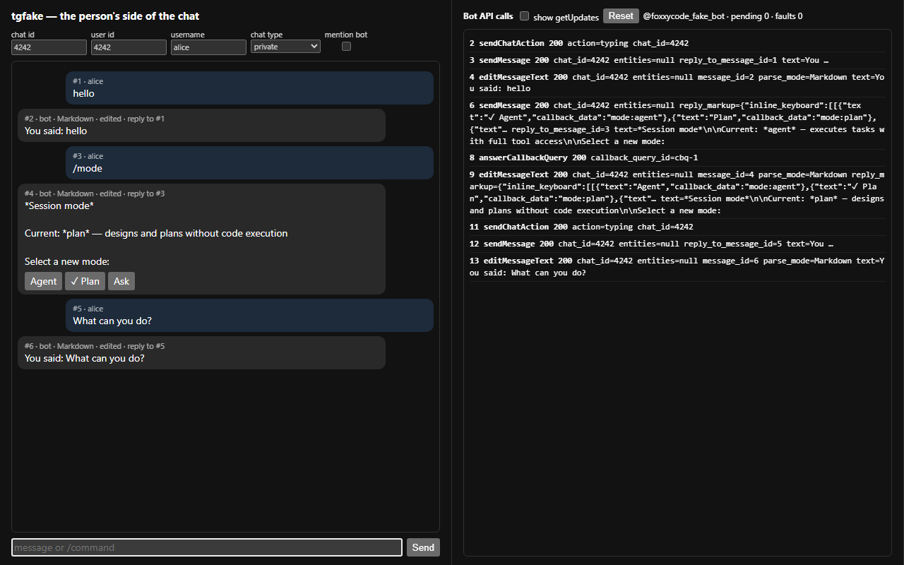

# Messenger Gateway

The messenger gateway lets you drive a FoxxyCode agent directly from a chat application such as Telegram. The agent runs the same ReAct loop, tools, and skills as in the HTTP UI or ACP mode — the gateway is only a transport layer.

## Contents

- [Overview](#overview)
- [Build tags](#build-tags)
- [Quick start (Telegram)](#quick-start-telegram)
- [Configuration reference](#configuration-reference)
  - [Access levels](#access-levels)
  - [Session isolation modes](#session-isolation-modes)
  - [Per-chat overrides](#per-chat-overrides)
  - [User groups](#user-groups)
- [Running the gateway](#running-the-gateway)
- [Bot interaction model](#bot-interaction-model)
  - [Private chats](#private-chats)
  - [Group chats](#group-chats)
  - [Commands](#commands)
- [What the messenger needs, and where it is said](#what-the-messenger-needs-and-where-it-is-said)
- [Writing a new adapter](#writing-a-new-adapter)
  - [1. Implement the Adapter interface](#1-implement-the-adapter-interface)
  - [2. Register in Start()](#2-register-in-start)
  - [3. Implement acp.UpdateSender](#3-implement-acpupdatesender)
  - [4. Add a build tag](#4-add-a-build-tag)
  - [5. Wire into hub.Start()](#5-wire-into-hubstart)
- [Session lifecycle](#session-lifecycle)
- [Security notes](#security-notes)

---

## Overview

```
Telegram / future messengers
         │  polling / webhooks
         ▼
  external/gateway/          ← build tag: gateway | gateway.telegram
    Hub (goroutine per adapter, auto-restart)
         │
         ▼
  sessionstore               ← maps chat+user context → FoxxyCode session ID
         │                     /clear command replaces the stored ID
         ▼
  session.Manager            ← shared with foxxycode acp / foxxycode http
    HandleSessionPromptWithSender(...)
         │
         ▼
  ReAct agent loop           ← identical to HTTP and ACP paths
  (tools, skills, MCP, LLM)
         │
         ▼
  Sender (per-message)       ← buffers agent output, sends back to chat
```

Multiple gateways (Telegram today, Discord/Slack tomorrow) run in the same process and share the same session store.

---

## Build tags

| Tag | Includes |
|-----|----------|
| `gateway.telegram` | Telegram adapter only |
| `gateway` | all adapters (currently Telegram; a superset for future integrations) |

The release CLI archives and the desktop app on [GitHub Releases](https://github.com/hijera/foxxy-agent/releases) are built with the `gateway` tag, so no self-build is needed there. The published GHCR Docker image is the exception — see the note in [Running the gateway](#running-the-gateway).

Build with one tag:

```bash
# Telegram only
make build TAGS="gateway.telegram"

# All gateways
make build TAGS="gateway"

# Combined with HTTP, UI, scheduler, memory
make build TAGS="http ui scheduler memory gateway"
```

Without either tag the `foxxycode gateway` subcommand is present in the binary but returns a "not compiled" error when invoked — all other subcommands are unaffected.

---

## Quick start (Telegram)

**Step 1 — create a bot**

Talk to [@BotFather](https://t.me/BotFather) on Telegram:

```
/newbot
```

Save the token it returns. **Never commit the token to version control.** Store it in an environment variable:

```bash
export TELEGRAM_BOT_TOKEN="<your-token>"
```

**Step 2 — find your Telegram user ID**

Send any message to [@userinfobot](https://t.me/userinfobot). It will reply with your user ID. That ID becomes the `admins` list entry.

**Step 3 — add the gateway config**

In `~/.foxxycode/config.yaml` (or wherever your `config.yaml` lives), add:

```yaml
gateways:
  telegram:
    enable: true
    token: "${TELEGRAM_BOT_TOKEN}"
    admins: [98874093]           # your Telegram user ID
    default_access: "all"
    default_isolation: "individual"
```

**Step 4 — build and run**

```bash
make build TAGS="gateway.telegram"
./build/foxxycode gateway --config ~/.foxxycode/config.yaml
```

Open Telegram, find your bot, send a message. The agent replies in the same chat.

---

## Configuration reference

All gateway config lives under the `gateways` key in `config.yaml`. When running `foxxycode http` with the bundled UI, the same fields are editable under **Settings → Messenger gateways → Telegram**; the `gateways` block round-trips through `GET`/`PUT /foxxycode/config`, so saving settings in the UI preserves it (the bot token is shown in full — use only on trusted networks).

```yaml
gateways:
  telegram:
    enable: false
    # Bot token. Optional: leave empty (or omit) to read it from the TELEGRAM_BOT_TOKEN
    # environment variable (e.g. via .env), the same way provider api_key falls back to
    # NAME_API_KEY. When telegram is enabled but no token can be resolved, the gateway
    # logs a warning and skips the bot instead of failing config validation.
    token: "${TELEGRAM_BOT_TOKEN}"

    # Optional outbound proxy for Telegram API requests.
    # Supported schemes: http, https, socks5, socks5h.
    # proxy: "socks5h://127.0.0.1:1080"
    # proxy: "http://proxy.example.com:3128"

    # Bot API 10.1 Rich Messages (see "Rich Messages" below). Default false.
    rich_messages: true

    # Telegram user IDs with elevated privileges.
    # Admins always pass every access check regardless of default_access.
    admins: []

    # Default access level for chats without a per-chat override.
    # Values: "all" | "admins" | "group:<name>"
    default_access: "all"

    # Default session isolation for group chats without a per-chat override.
    # Values: "individual" | "shared" | "admin"
    default_isolation: "individual"

    # Named user groups for group-level access control.
    user_groups:
      - name: "devs"
        user_ids: [111222333, 444555666]

    # Per-chat overrides (optional). chat_id is negative for groups/supergroups.
    chats:
      - chat_id: -1001234567890
        isolation: "individual"
        access: "all"
      - chat_id: -1009876543210
        isolation: "admin"
        access: "admins"
```

### Proxy

Set `proxy` to route outbound Telegram API requests through an HTTP or SOCKS5 proxy:

```yaml
gateways:
  telegram:
    proxy: "socks5h://127.0.0.1:1080"  # or "http://proxy.example.com:3128"
```

Supported schemes: `http`, `https`, `socks5`, `socks5h`. `socks5h` resolves hostnames on the proxy side. Leave the field empty (the default) for a direct connection.

### Rich Messages

Set `rich_messages: true` to use the [Bot API 10.1 Rich Messages](https://core.telegram.org/bots/api#rich-messages) transport instead of the legacy Telegram Markdown subset:

```yaml
gateways:
  telegram:
    rich_messages: true
```

| Aspect | Legacy (default) | `rich_messages: true` |
|--------|------------------|------------------------|
| Final message | `mdToTelegram` downgrades headings/tables to plain text | Agent's native Markdown sent verbatim via `sendRichMessage` — headings, tables, task lists, fenced code, footnotes, LaTeX all render |
| Streaming (private chats) | progressive `editMessageText` of a live message | ephemeral `sendRichMessageDraft` preview (30 s, animated) |
| Tool activity | `⚙️ toolname…` line, dropped from the final message | live `<tg-thinking>` placeholder during streaming **and** one collapsed `<details>` block per executed tool (name + output, `❌` on failure) in the final message |
| What the session sees | what the person typed | what the person typed |
| System prompt block | the legacy subset, spelled out for the turn | full GFM renders; keep it short for a phone |

**Behaviour notes:**

- **Group chats** don't get draft streaming (`sendRichMessageDraft` is private-chat only); the bot sends the final `sendRichMessage` after the turn, showing a typing indicator while it works.
- **Drafts are ephemeral** — they expire after ~30 s and are never persisted; the turn is finalized by a separate `sendRichMessage`. There is no `editRichMessage` in Bot API 10.1.
- **Graceful fallback** — if a rich send fails (e.g. the Bot API server doesn't support 10.1), the gateway automatically falls back to the legacy formatted send, so the bot never goes silent.
- Requires a Bot API server that implements Bot API 10.1.

### Access levels

| Value | Who can interact |
|-------|-----------------|
| `all` | Anyone who can write to the chat |
| `admins` | Only user IDs listed in `admins` |
| `group:<name>` | Members of the named `user_groups` entry (admins always pass) |

Access is checked on every incoming message. Denied messages are silently dropped.

### Session isolation modes

Applies to **group and supergroup chats only**. Private chats are always per-user regardless of this setting.

| Mode | Session scope |
|------|--------------|
| `individual` | Each group member gets their own private session |
| `shared` | All members of the group share one session |
| `admin` | Only admin users can interact; all admins share one session |

Example: a shared DevOps bot for a team chat uses `shared`. A personal assistant added to a group uses `individual`.

### Per-chat overrides

Use `chats` to override `isolation` and `access` for specific chats:

```yaml
gateways:
  telegram:
    default_access: "all"
    default_isolation: "individual"
    chats:
      - chat_id: -1001111111111   # team group: shared session, all members
        isolation: "shared"
        access: "all"
      - chat_id: -1002222222222   # private project: admins only
        isolation: "admin"
        access: "admins"
```

### User groups

Define named groups of Telegram user IDs and reference them in `access`:

```yaml
gateways:
  telegram:
    user_groups:
      - name: "devs"
        user_ids: [111, 222, 333]
      - name: "qa"
        user_ids: [444, 555]
    chats:
      - chat_id: -1001234567890
        access: "group:devs"    # only devs (+ admins) can use the bot here
```

---

## Running the gateway

```bash
foxxycode gateway [flags]
```

| Flag | Default | Description |
|------|---------|-------------|
| `--config` | `$FOXXYCODE_HOME/config.yaml` | Path to config file |
| `--home` | `~/.foxxycode` | Agent state directory (`FOXXYCODE_HOME`) |
| `--cwd` | process cwd | Default session working directory |
| `--sessions-dir` | `$FOXXYCODE_HOME/sessions` | Where session bundles are stored |
| `--log-level` | from config | `debug\|info\|warn\|error` |

Typical production invocation:

```bash
foxxycode gateway \
  --config /etc/foxxycode/config.yaml \
  --home /var/lib/foxxycode \
  --sessions-dir /var/lib/foxxycode/sessions
```

The process blocks until `SIGINT` or `SIGTERM`. Each adapter runs in its own goroutine with automatic restart on error (5-second backoff). Send `Ctrl+C` for a clean shutdown.

**With Docker Compose** — the repo's compose files run `foxxycode http` by default and expose a `FOXXYCODE_COMMAND` override so the same service can run the gateway instead. Build from source (the dev image includes the `gateway` tag by default) and override the command:

```bash
export TELEGRAM_BOT_TOKEN="<bot-token>"          # or leave it in $FOXXYCODE_HOME/.env
export FOXXYCODE_COMMAND="gateway --cwd /workspace"
docker compose -f docker-compose.dev.yml up -d --build
docker compose -f docker-compose.dev.yml logs -f foxxycode   # expect: "telegram bot connected"
```

To run a **dedicated** gateway service alongside the HTTP one, add a second service to a `docker-compose.override.yml` (the `ENTRYPOINT` is already `/bin/foxxycode`, so `command` holds only the subcommand):

```yaml
services:
  gateway:
    image: foxxycode-agent:dev        # built from Dockerfile with the gateway tag
    command: ["gateway", "--cwd", "/workspace"]
    working_dir: /workspace
    environment:
      FOXXYCODE_HOME: /home/user/.foxxycode
      FOXXYCODE_CONFIG: /home/user/.foxxycode.yaml
      TELEGRAM_BOT_TOKEN: ${TELEGRAM_BOT_TOKEN-}
    volumes:
      - ./config.yaml:/home/user/.foxxycode.yaml:ro
      - ./foxxycode_home:/home/user/.foxxycode
      - ./workspace:/workspace
    restart: unless-stopped
```

> The `Dockerfile` `BUILD_TAGS` default now includes `gateway`, so a from-source build (`docker-compose.dev.yml`) supports gateway mode out of the box. The **published GHCR image still ships without it** (CI sets `BUILD_TAGS=http,scheduler,ui,memory`), so with `docker-compose.yml` you must build a custom image (`BUILD_TAGS=http,ui,scheduler,memory,gateway`) and point `FOXXYCODE_IMAGE` at it. If `gateways.telegram.proxy` targets a host-local proxy, use `host.docker.internal` or `network_mode: host` — `127.0.0.1` inside the container is the container itself. See [docs/getting-started/docker.md](../getting-started/docker.md#run-another-mode-messenger-gateway).

---

## Debugging a chat

A command that appears to do nothing - a `/model` tap that leaves the model unchanged, a message the bot never answers - leaves no trace at `info`. That level carries what succeeded (connecting, sessions loaded and cleared, a model or mode applied) and what failed loudly enough to warn; an update that was quietly dropped, or a tap that never arrived, is in neither list. `gateway.telegram` at `debug` records the whole path instead: every update as it arrives, why one was dropped (access denied, an admin-only chat, a group message not addressed to the bot, a full worker queue), each recognised command, each menu the bot builds with the session it belongs to, and each callback with the model or mode it resolved to and whether it applied.

Raise that one component and leave the rest of the process alone:

```yaml
logger:
  level: "info"
  levels:
    - component: "gateway.telegram"
      level: "debug"
```

For a single restart under systemd, the flag carries the same spec and needs no edit to the config file:

```bash
foxxycode serve --log-level "info,gateway.telegram=debug"
```

Every record keeps its `component` attribute, so a file that mixes subsystems still filters:

```bash
grep '"component":"gateway.telegram"' /var/log/foxxycode/foxxycode.log
```

A switch that lands is reported at `info`, so the confirmation is in the log without raising anything: `telegram: model applied` and `telegram: mode applied` name the session and the new value. A tap that reaches the bot and fails logs why at `warn`, equally visible: `telegram: callback session` when the session cannot be loaded, `telegram: callback model unknown` when the button names a model that is no longer configured, and `telegram: set model` when the manager refuses the change. Silence at `warn` and nothing at `debug` means the update never arrived - check the bot token, the ACL, and whether another process is polling the same bot, since Telegram delivers each update to one long poll only.

### Debugging against a fake Bot API

The log tells what the bot did with an update; it does not let you send one
without a phone, a token and a model behind the answer. `cmd/tgfake` does: a
stand-in Bot API server that answers every method the gateway calls
(`getMe`, `getUpdates` with real long polling, `sendMessage`,
`editMessageText`, `answerCallbackQuery`, the Bot API 10.1 `sendRichMessage`
and `sendRichMessageDraft`, ...), keeps the chats it is sent, and serves a page
where you are the person in the chat - the bot's inline keyboards are buttons.
With `--llm` it also serves a scripted model, so the whole stand runs with no
network at all:

```bash
go run ./cmd/tgfake --llm --llm-delay 50ms      # Bot API + model on 127.0.0.1:18790
```

Point `foxxycode serve` at it with **`FOXXYCODE_TELEGRAM_API_BASE`**, the origin the
`--dry-run` probe honours as well, and give it the stub as its provider (the
command prints this snippet on start):

```yaml
providers:
  - name: stub
    type: openai
    api_base: "http://127.0.0.1:18790/v1"
    api_key: "sk-tgfake"
models:
  - model: stub/foxxycode-demo
agent:
  model: stub/foxxycode-demo
httpserver:
  enable: false                     # the stand is the bot alone; drop this to watch the chat in the web UI too
gateways:
  telegram:
    enable: true
    token: "123456:fake"            # any token; the fake accepts all of them
logger:
  levels:
    - component: gateway.telegram
      level: debug
```

```bash
export FOXXYCODE_TELEGRAM_API_BASE=http://127.0.0.1:18790   # PowerShell: $env:FOXXYCODE_TELEGRAM_API_BASE="http://127.0.0.1:18790"
foxxycode serve --dry-run --config stand.yaml               # ok  gateways.telegram: token accepted by the Bot API, bot @foxxycode_fake_bot
foxxycode serve --gateway --http=false --config stand.yaml  # telegram: api base override ... telegram bot connected
```

Then open `http://127.0.0.1:18790/`, type `hello`, tap a `/mode` button, and
read the Bot API calls on the right as the log fills on the left.



*The chat page of `cmd/tgfake`: a greeting answered by the scripted model, the `/mode` keyboard with the tap applied, and on the right every Bot API call the bot made, `getUpdates` polls hidden.*

The same page is an HTTP API, which is what a script or a coding agent drives:

| Route | Body / answer |
|-------|---------------|
| `POST /sim/message` | `{"chat_id": 4242, "user_id": 4242, "username": "alice", "text": "hello"}`; `chat_type: group`, `mention: true` and `reply_to_message_id` for the group paths. A leading `/word` becomes a `bot_command` entity. |
| `POST /sim/callback` | `{"chat_id": 4242, "label": "Plan"}` taps the button by its text (the `✓` prefix is ignored), or `{"message_id": 4, "data": "mode:plan"}`. |
| `GET /sim/chat/4242` | the transcript: messages, keyboards after every edit, drafts, `typing`; `?format=text` for `grep`. |
| `GET /sim/outbox?method=sendMessage&since=10` | every Bot API call with its parameters and the answer; `/sim/outbox/count?method=...` for a script. |
| `POST /sim/fault` | `{"method": "sendMessage", "code": 429, "retry_after": 2, "times": 1}` makes the next `sendMessage` fail like a flood; `"method": "*"` fails everything until `DELETE /sim/fault`; `"contains": "<details>"` narrows the fault to calls whose parameters carry that text, which is Telegram refusing one entity rather than the method. |
| `POST /sim/reset` | forgets chats, outbox and faults. Update ids keep growing, so a polling bot is not confused. |

The fake is strict where Telegram is. An edit that changes nothing, an edit
of a message that was never sent, a text over 4096 characters, a reply to a
message the chat does not hold (unless `allow_sending_without_reply` says to
send it anyway), an answer to a callback query the fake never issued, and a
keyboard whose `callback_data` is longer than 64 bytes (`BUTTON_DATA_INVALID`)
are refused with Telegram's own error, so a keyboard that works on the stand
works in a chat.

It also remembers `allowed_updates` the way Telegram does. A bot token that
once ran under another framework may be subscribed to messages alone, and a
poll that names no kinds inherits that: text arrives, keyboard taps are
dropped before anyone sees them. The gateway therefore asks for `message` and
`callback_query` on every poll. `GET /sim/state` shows the subscription in
force; `tgfake.Options.AllowedUpdates` starts a bot under a stale one, which
is how the polling feature reproduces the case. On a real bot,
`getWebhookInfo` reports the same field.
The subscription is applied when an update is created: changing it preserves
already queued updates and cannot recover events excluded at creation.

Rich-message previews expire 30 seconds after their last successful revision.
The chat page and `/sim/chat/{id}` stop showing expired drafts; reading the
chat or writing another draft also removes expired entries from its storage.
The outbox retains the calls for debugging, and persistent messages remain.

`--llm-answer` (repeatable) scripts the model's replies in turn, `--llm-script
rules.json` matches them by substring (`[{"match": "weather", "answer":
"Sunny."}]`), and without either the model echoes the prompt - the person's
message, not the `<turn_context>` block FoxxyCode appends to every request. Rules are the
reliable choice: the title a session derives from its first message is one more
model call, so a list of answers advances a step earlier than the chat shows.
The streamed answer arrives one word per `--llm-delay`, long enough for the
live `editMessageText` path, or the draft path with `rich_messages: true`, to
run.

**`examples/gateway/tg_e2e_offline.sh`** does all of the above in one go -
builds `tgfake`, writes a temporary home, boots `foxxycode serve` against it, sends
`hello` and checks the reply - and `TG_E2E_KEEP=1` leaves the stand running
with the page URL printed. It runs in Git Bash on Windows as well.

The variable is not only for the fake: a self-hosted Bot API server
(`telegram-bot-api` for large files or a local network) is pointed at the same
way, and `foxxycode serve --dry-run` confirms which server answered before the bot
starts.

---

## Bot interaction model

### Private chats

Every user who starts a private conversation with the bot gets their own isolated session. No configuration needed.

### Group chats

In a group the bot **only responds** when explicitly addressed. It will react to:

1. A message that **@mentions** the bot (`@foxxycode_agent_bot hello`)
2. A **direct reply** to a previous bot message
3. The `/clear` command

When `isolation` is `admin`, the bot additionally ignores everyone who is not in the `admins` list.

### Commands

| Command | Available to | Effect |
|---------|-------------|--------|
| `/start` | all users | Greeting and quick introduction. |
| `/help` | all users | Lists all available commands. |
| `/mode` | all permitted users | Opens an inline keyboard to switch the session mode between `agent`, `plan`, `docs`, `ask`, and `debug`. |
| `/model` | all permitted users | Opens an inline keyboard to switch the active LLM model (from the configured `models` list). |
| `/context` | all permitted users | Displays the current session's context window usage broken down by category (conversation, system prompt, tool definitions, rules, skills, MCP). |
| `/clear` | all permitted users | Starts a new session for the current user/chat context. The old session is removed from memory (persisted history remains on disk). |

---

## What the messenger needs, and where it is said

A messenger has its own dialect and its own shape of screen. FoxxyCode says both in
two places that belong to the gateway, and neither of them touches the
conversation the session keeps.

### The model is told, for that turn

Before a chat turn runs, the adapter hands the session a block of the **system
prompt** describing how to answer into this chat: the emphasis Telegram
renders, the headings it does not, that a table becomes a wall of pipes, that
identifiers belong in backticks because a bare `_` opens italics, and that a
chat is a narrow column on a phone. It lives in
`external/gateway/telegram/prompt.go`, and `rich_messages: true` sends a
different one - there the chat renders GitHub-flavoured Markdown in full, so
the only thing worth saying is how much of it a phone screen wants.

The block belongs to the **turn**, not to the session
(`session.PromptRunOpts.SurfaceSystemPrompt`). Nothing of it is persisted, so
the transcript holds the conversation and not the surface that ran it, and a
browser turn on the same session is built without it. That does mean the prompt
prefix differs between surfaces, so a turn that follows one from elsewhere does
not reuse its cached prefix. It is the deliberate price of letting each
integration speak for itself instead of teaching the core about messengers.

### The answer is rendered, on its way out

A model does not always comply, and a chat that shows a raw `##` is a worse
answer than one the gateway quietly fixed, so the reply is also converted as it
leaves, in `external/gateway/telegram/markdown.go`.

For the legacy send: ATX headings and `**bold**` become `*bold*`, `__x__`
becomes `_x_`, an asterisk bullet becomes `•`, a table is flattened to plain
rows and a horizontal rule to a separator line. Fenced blocks and inline code
spans are set aside before any rule runs and put back untouched, so a Go `**p`
or a `# comment` inside a block reaches the chat as the model wrote it. The live
streaming preview is sent with no parse mode - half a sentence is half a markup
- so it gets the same conversion with the emphasis markers dropped rather than
shown as punctuation. If Telegram still refuses to parse a message, the sender
resends it without a parse mode: a stray asterisk in prose costs formatting,
never the reply.

With `rich_messages: true` there is nothing to downgrade - the agent's Markdown
goes out verbatim - and the fallback path is the legacy rendering above.

### Adding an integration

Both halves are the new adapter's to write: a `prompt.go` saying what its
messenger needs, and a renderer for its syntax. Nothing in `internal/` learns
about it.

---

## Writing a new adapter

To add, for example, a Discord adapter alongside Telegram, follow this pattern.

### 1. Implement the Adapter interface

Create `external/gateway/discord/bot.go`:

```go
//go:build gateway || gateway.discord

package discord

import (
    "context"
    "fmt"

    "github.com/hijera/foxxycode-agent/external/gateway"
    "github.com/hijera/foxxycode-agent/external/gateway/access"
    "github.com/hijera/foxxycode-agent/external/gateway/sessionstore"
    "github.com/hijera/foxxycode-agent/internal/config"
)

type Bot struct {
    cfg   *config.DiscordGatewayConfig  // add to config.GatewayConfig
    store *sessionstore.Store
    // ... discord client, session runner, logger
}

func New(cfg *config.DiscordGatewayConfig, runner SessionRunner, cwd string, log *slog.Logger) *Bot {
    return &Bot{cfg: cfg, store: sessionstore.New()}
}

// Name satisfies gateway.Adapter.
func (b *Bot) Name() string { return "discord" }

// Start connects and polls. Must block until ctx is cancelled.
func (b *Bot) Start(ctx context.Context) error {
    // connect discord client
    // poll or use websocket events
    // for each message: call b.handleMessage(ctx, msg)
    return nil
}
```

The `SessionRunner` interface (`external/gateway/telegram/bot.go`) is what you need from the session manager:

```go
type SessionRunner interface {
    EnsureHTTPSession(ctx context.Context, sessionID string, defaultCWD string) (*session.State, error)
    HandleSessionPromptWithSender(ctx context.Context, params acp.SessionPromptParams, sender acp.UpdateSender, opts *session.PromptRunOpts) (*acp.SessionPromptResult, error)
    ForgetLiveSession(sessionID string)
    HandleSessionSetMode(ctx context.Context, params acp.SessionSetModeParams) error
    HandleSessionSetConfigOption(ctx context.Context, params acp.SessionSetConfigOptionParams) (*acp.SessionSetConfigOptionResult, error)
    Cfg() *config.Config
}
```

`session.Manager` already satisfies this interface — pass it directly. `HandleSessionSetMode` and `HandleSessionSetConfigOption` are needed for `/mode` and `/model` inline keyboard commands; `Cfg()` returns the loaded config (used by `/model` to list available models).

### 2. Register in Start()

In `external/gateway/start.go`, add a block for the new adapter next to the Telegram block:

```go
//go:build gateway || gateway.discord

if cfg.Gateways.Discord.Enabled {
    bot := discord.New(&cfg.Gateways.Discord, mgr, defaultCWD, log)
    adapters = append(adapters, bot)
}
```

Because the Telegram file uses `//go:build gateway || gateway.telegram` and the Discord file uses `//go:build gateway || gateway.discord`, adding the Discord code to `start.go` requires updating the build constraint on that file to include `|| gateway.discord` as well. The cleanest approach is to split `start.go` per-adapter and give each its own constraint file, then have a `start_base.go` (tagged `gateway || gateway.telegram || gateway.discord`) that defines the `Start` function skeleton.

For a simpler one-adapter project, a single `start.go` with `//go:build gateway || gateway.telegram` is sufficient.

### 3. Implement acp.UpdateSender

Each message dispatch needs a `Sender` that implements three methods:

```go
type UpdateSender interface {
    SendSessionUpdate(sessionID string, update interface{}) error
    RequestPermission(ctx context.Context, params acp.PermissionRequestParams) (*acp.PermissionResult, error)
    RequestQuestion(ctx context.Context, params acp.QuestionRequestParams) (*acp.QuestionResult, error)
}
```

- `SendSessionUpdate` receives streaming events: `acp.MessageChunkUpdate` carries a text delta in `update.Content.Text`; `acp.ToolCallUpdate` is a tool start notification. Buffer text chunks and send them as a single message in `Flush()` after the agent turn.
- `RequestPermission` should auto-approve in a gateway context (the admin configured the bot deliberately). Return `&acp.PermissionResult{Outcome: "allow", OptionID: "allow"}`.
- `RequestQuestion` can send the question text to the chat and return an empty answer, or implement a proper reply-based flow.

See `external/gateway/telegram/sender.go` for a working reference.

### 4. Add a build tag

Follow the existing pattern:

- `external/gateway/discord/*.go` → `//go:build gateway || gateway.discord`
- `external/gateway/discord/*_test.go` → same constraint
- Stub (if needed) → `//go:build !(gateway || gateway.discord)`

Update the `start.go` / `start_stub.go` constraint to include the new tag.

### 5. Wire into hub.Start()

`hub.Start()` accepts any `[]gateway.Adapter`. No changes to Hub itself are needed — just `append` your adapter before calling `hub.Start(ctx)`.

---

## The same session in the chat and in the browser

With `httpserver.enable` and `gateways.telegram.enable` both on, a Telegram
conversation and the web UI are two views of one session.

- **The chat session appears in the browser.** A chat conversation is an
  ordinary session with an ordinary `sess_` id - where a person is sitting
  decides nothing about the session behind the conversation - so
  `GET /foxxycode/sessions` lists it beside the sessions started in a terminal or
  a browser tab, and opening one loads the same transcript.
- **A chat turn streams into the browser while it runs.** The gateway publishes
  its turn into the session's composer relay - the same mechanism a background
  task's wake turn uses - so a tab watching that session sees the tokens as
  they arrive, not after the fact.
- **The browser watches; the chat answers.** Session updates fan out to both
  surfaces, but permission requests and questions go only to the chat, because
  it is the only one with somebody reading. A watcher is a spectator.
- **Continuing works in either direction.** Reply in the browser and the next
  `/context` in Telegram shows it; reply in Telegram and the browser has it on
  the next load. Only one turn runs at a time: the session's turn lock is a
  file lock, so a message that arrives while a browser turn is in flight is
  answered with a busy notice instead of interleaving.
- **A turn already being watched is left alone.** If a browser turn is running
  on the session, an arriving chat message does not take over its stream - the
  chat message gets the busy answer a moment later anyway.

If a session is deleted from the browser, the chat's mapping in
`gateway_sessions.json` still points at that id; the next message finds no
bundle and starts a fresh transcript under it. The conversation resets, which
is what deleting it meant.

## Session lifecycle

```
User message arrives
        │
        ▼
sessionstore.SessionKey(gateway, chatID, userID, isolationMode, isGroup)
        │  returns a string key like "tg:chat:-100:user:42"
        ▼
store.Get(key)
        │  returns existing session ID (from gateway_sessions.json),
        │  or mints a new one on first use
        ▼
manager.EnsureHTTPSession(ctx, sessionID, cwd)
        │  loads from disk if persisted, creates fresh otherwise
        ▼
manager.HandleSessionPromptWithSender(ctx, params, sender, nil)
        │  runs the ReAct loop; sends stream events to Sender
        │  Sender streams tokens: first chunk → new Telegram message;
        │  subsequent chunks → progressive editMessageText (throttled);
        │  tool executions → shows "⚙️ toolname…" indicator in the live message.
        ▼
sender.Flush()
        │  replaces the live streaming message with the final formatted text
        │  (markdown.go renders the answer for Telegram: headings, double-star
        │   bold and tables into the legacy subset, fenced code untouched)
        ▼
Session bundle written to disk ($FOXXYCODE_HOME/sessions/<id>/)
```

**Session store persistence** — The key→session-ID mapping is persisted in `gateway_sessions.json` inside `$FOXXYCODE_HOME/sessions/` (same directory as session bundles). On restart the bot reloads this file and continues existing conversations seamlessly.

**`/clear` flow:**

```
store.Reset(key)   → replaces stored session ID in gateway_sessions.json
manager.ForgetLiveSession(oldID)   → drops the in-memory session (disk persists)
Next message → EnsureHTTPSession creates a fresh session for the new ID
```

The old session files remain on disk under the old ID. Use `foxxycode sessions list` to inspect them.

---

## Security notes

- **Token exposure** — never commit the bot token to version control. Use `"${TELEGRAM_BOT_TOKEN}"` in YAML and export the variable before starting.
- **Permissions** — the gateway auto-approves all tool permission requests so the agent can work unattended. Restrict `tools.command_allowlist` in `config.yaml` if you want to limit which shell commands the agent can run.
- **Access control** — set `default_access: "admins"` for bots that should only respond to a specific set of users. Open bots (`default_access: "all"`) will respond to any Telegram user who can write to the chat.
- **Network** — the gateway uses Telegram long-polling (not webhooks). No inbound port needs to be open.
