# FoxxyCode embedded UI specification

This page captures the original UI requirements and the intended end state. It is a functional spec and a design contract, with a screenshot of each surface next to the section that specifies it. The visual tokens and component contracts are in [DESIGN.md](../../DESIGN.md).

## SVN tool cards

Subversion calls have localized operation headings, an explicit execution state and labeled arguments in both transcript and permission previews. Status lists retain SVN's seven columns, including property and tree conflicts; diffs highlight added/deleted lines without removing binary or property output; working copy info uses label/value rows. Commit previews show the message and affected scope before approval. Logs and other command output stay verbatim and copyable.

An `error:` result is presented as failed even when the transport completed. Cancelled calls keep their partial output. Truncated argument previews recover through the existing full-call fetch, and truncated results carry a partial-output note and the existing load-more control. Long output has a bounded viewport; narrow screens wrap paths and stack field labels. The implementation uses the existing permission flow and does not change SVN tools or HTTP contracts.

## Constraints

- UI ships as static assets embedded into the `foxxycode` binary (build tag `http`).
- Runtime has no auth and no API key checks for the UI.
- UI must work over the same origin as `foxxycode http`.
- UI copy is English.
- Favicon is the fox mark, the same one the [website](https://hijera.github.io/foxxy-agent/) and the desktop application carry (**`/foxxycode-favicon.svg`**, plus PNG/ICO fallbacks embedded with the SPA). Its plate follows **`prefers-color-scheme`** through a media query inside the SVG, because the browser tab strip is light or dark by the reader's setting and the app theme never reaches it. All of it is generated by **`make brand`** — see [Brand assets](../contributing/brand.md).
- **Every asset the bundle imports is inlined** (**`build.assetsInlineLimit`** in **`external/ui/vite.config.ts`**). **`scripts-sync-to-go.mjs`** copies **`index.html`**, **`styles.css`**, **`app.js`** and the favicons into the **`go:embed`** set and nothing else, so a file Vite emits on its own ships nowhere and 404s; the sync script fails the build when it finds one. This is why the sign-in wordmark is a data URI rather than a request.
- **Browser baseline: Chromium 104** (JCEF in PhpStorm/IntelliJ 2022.3.3 — see [`docs/contributing/intellij-embedding.md`](../contributing/intellij-embedding.md)). Shipped CSS/JS must not use features newer than Chromium 104: no **`:has()`**, **`oklch()`**/**`oklab()`**, **`@container`**, or native CSS nesting; **`dvh`**/**`svh`** only with a preceding **`vh`** fallback for the same property; no **`Array.prototype.toSorted`**, **`Promise.withResolvers`**, **`URL.canParse`** and similar post-104 JS APIs.
- **`color-mix()`** is allowed in `styles.css` **sources** only in the build-resolvable form (**`in srgb`**, arguments statically resolvable per theme — hex/rgb()/`transparent`/`var()` chains). `external/ui/postcss-resolve-color-mix.mjs` compiles every occurrence to Chromium-104-safe literals or per-theme **`--cmix-*`** variables; the build fails on unresolvable expressions.
- **`npm --prefix external/ui run check:compat`** (part of **`build:go`**) scans the built bundle and fails on baseline regressions.

## Composer context row

- **Wrapping**: the workspace chips share one **`flex-wrap`** row (**`.composer-context-row`**) with the environment chip and the improve-prompt control; **`.composer-context-chips`** is **`display: contents`** so each chip wraps on its own. On a narrow viewport only the overflow moves down (e.g. environment+folder, then branch+worktree), and the worktree checkbox stays beside the branch until the branch name is long enough to push it.
- **Improve prompt**: the compact **24×24px** wand button (**`data-testid="composer-enhance-btn"`**) lives at the **right edge** of that row, next to the environment / folder / branch / worktree controls — not in the textarea or the lower composer bar. At **≤520px** it is pinned to the row's **top-right corner** above the wrapped chips. Its label is translated (**`composer.enhance`**), it is disabled for a blank draft and while a request or generation is active, calls **`POST /foxxycode/enhance-prompt`**, and replaces the draft only on success. **Ctrl+Z** / **⌘Z** restores the pre-improvement draft; a failure leaves it unchanged and shows an inline error.

## Settings sections: General & Appearance

The Settings screen leads with two synthetic client-side tabs before the
schema-derived config tabs:

- **General** — composer **send mode** and the live **status line** toggle.
  The default tab.
- **Appearance** — theme, the app-wide **Language** picker (see below), the
  **Animations and translucency** switch, and the "Restart onboarding" button.

The raw `ui` config key is hidden from the schema-driven tabs (`HIDDEN_KEYS` in
`settingsSections.ts`) so the curated controls are not duplicated; the key still
round-trips through the footer Save because the whole config doc is PUT back.

## Appearance (theme + language)

- **Default:** dark theme on first visit.
- **Cookie:** **`foxxycode_ui_theme`** with values **`dark`** or **`light`** (path **`/`**, **`SameSite=Lax`**).
- **`?theme=<id>` query parameter** (IDE embeddings): accepted values are all 7 theme ids; precedence **query > cookie > default**. Applied by the inline bootstrap script in **`index.html`** before first paint and persisted to the cookie. Contract-tested in **`themeCssContract.test.ts`** (the inline **`VALID`** map must stay in sync with **`UI_THEME_IDS`**).
- **`window.foxxycodeUi`** global API (**`external/ui/src/ui/theme/foxxycodeUiApi.ts`**, installed in **`main.tsx`**): **`setTheme`** / **`getTheme`** / **`getThemes`** / **`onThemeChange`** — lets a host (IntelliJ plugin via JCEF `executeJavaScript`) switch themes live. See [`docs/contributing/intellij-embedding.md`](../contributing/intellij-embedding.md).
- **Toggle:** **Settings** (**`#/settings`**) → **Appearance** → **Dark** / **Light** (**`data-testid="theme-toggle-dark"`**, **`theme-toggle-light`**).
- **Settings sub-panels (Appearance / Skills) are mutually exclusive** — opening one closes the other. Only one sub-panel may be expanded at a time.
- **Persistence:** switching theme writes the cookie and sets **`document.documentElement.dataset.theme`**; reload must keep the chosen theme.
- **CSS contract:** **`--text`** and **`--bg`** on **`[data-theme="light"]`** are **`#18181b`** and **`#f8f8fa`**; glass panels use **`rgba(255, 255, 255, 0.9)`** (not dark tint). Dark defaults remain on **`:root`** / **`[data-theme="dark"]`**.

### Language picker

- **Where:** one native **`<select>`** directly under the theme grid
  (**`data-testid="appearance-language-select"`**, labelled by
  **`appearance.languageLabel`**), rendered by **`AppearanceLanguagePicker`** in
  **`external/ui/src/ui/theme/AppearanceModal.tsx`**. Options are **Auto**
  followed by every locale registered in **`ui/i18n/locales.ts`** — the list is
  derived, not hardcoded.
- **Persistence:** unlike the theme picker beside it, this one writes the backend
  config (**`ui.locale`**, values **`""`** = Auto, **`en`**, **`ru`**) through
  **`persistUiLocalePreference`**. It is the only language switcher across
  browser, desktop, and the VS Code / IntelliJ plugins (see
  [`docs/contributing/intellij-embedding.md`](../contributing/intellij-embedding.md)), which read that key.
  With the Settings config doc loaded the pick is mirrored back via **`setDoc`**,
  so a later footer **Save all** cannot restore a stale value.
- **Auto** clears the **`foxxycode_ui_lang`** cookie so the next bootstrap
  follows **`navigator.language`** again instead of the previously picked
  language.
- **Bootstrap precedence:** **`?lang=`** > config **`ui.locale`** >
  **`foxxycode_ui_lang`** cookie > **`navigator.language`**.
- **i18n engine:** **`external/ui/src/ui/i18n/`**. **`locales.ts`** is the single
  registry (dictionary, label key, id); **`i18n.ts`** resolves keys against it and
  falls back to the default locale, then to the key itself.
- **Adding a language:** add **`messages/<id>.ts`** and one entry in
  **`locales.ts`**. The picker, cookie validation, **`?lang=`** parsing and
  **`messagesParity.test.ts`** all follow automatically.

### Animations and translucency

- **Where:** a switch under the language picker
  (**`data-testid="appearance-effects-switch"`**, **`appearance.effects.label`**), in
  every client.
- **What it does:** off sets **`<html data-effects="reduced">`**:
  the long-lived infinite animations stand still (the typing dots only glow in turn,
  in slow steps) and the frosted-glass panels lose their backdrop blur and turn opaque
  in the colour they showed (each theme's tint composited over its canvas; in the light
  theme the composer's soft grey instead of plain white); the canvas
  keeps its gradient and glow. On restores all of it.
- **Default:** on in the browser, the desktop app and VS Code; **off in the IntelliJ
  panel**, which is rendered off-screen and copies every frame into the IDE, so these
  effects slow the IDE down; see
  [`docs/contributing/intellij-embedding.md`](../contributing/intellij-embedding.md#reduced-effects-in-the-jcef-panel).
- **Persistence:** the backend config, **`ui.effects`** (**`true`** = on, **`false`** =
  off, unset = the client's default), shared by every client, written through
  **`PUT /foxxycode/config`** and mirrored into the
  loaded Settings document so a footer **Save all** cannot restore the old value. The
  **`foxxycode_ui_effects`** cookie (**`full`** / **`reduced`**) caches it for the inline
  bootstrap in **`index.html`**, which paints before any request; **`App.tsx`** re-applies
  the config value at startup (**`applyUiEffectsFromConfigDoc`** in
  **`ui/theme/uiEffects.ts`**).

## Composer attachments

- **Paste** — an image on the clipboard is attached instead of pasted as text
  (**`onPaste`** in **`Composer.tsx`**). Browsers name every clipboard image the
  same, so pasted files are renamed **`pasted-<n>.<ext>`**. Plain-text pastes are
  left to the browser — except in an editor embed, where **paste-to-chip** runs
  first (below).
- **Paste-to-chip** (editor embeds only, Cursor-style) — a text paste is sent to
  **`POST /foxxycode/ide/paste-classify`** (**`chat/pasteChip.ts`**, ~300 ms
  budget). If the backend recognizes it as a fragment recently copied in the IDE
  (the IDE reports copies via **`/foxxycode/ide/copy-buffer`** and selections via
  editor-state), the composer inserts a mention token instead of the raw text:
  **`@path:start-end`** for a file fragment (1-based inclusive lines) or
  **`@terminal[:name]`** for a terminal fragment. The masked mirror renders the
  token as a chip (**`listAtPathSpans`** absorbs the `:N-M` suffix and marks
  terminal tokens). The pasted literal is captured in an App-held side-map
  (`path:start-end` → text) and attached verbatim at send time as
  **`attachments: [{path, source: {literal, startLine, endLine}}]`**; when the
  map is gone (draft restored after reload) the backend reads the line range
  from the file instead. Any non-match, error, or timeout degrades to a plain
  text paste. Short single-line pastes (<16 chars) are never classified.
- **Drop** — a file dropped anywhere on the page still inserts an **`@path`**
  mention (see the file-drop rule in **`.claude/rules/ui-spa.md`**); it does not
  attach the file. Use the paste path or the attach button for image uploads.
- **Multimodal gate** — chips are always shown, but for a model without
  **`multimodal: true`** they render disabled (dashed, greyed) and are excluded
  from the request; a paste is refused with a transient
  **`composer-attach-hint`** notice. The backend fails closed too: **`inline_files`**
  for a non-multimodal model are dropped before the provider call.
- **Attachment-only send** — an attachment with no text is a valid message.
- **Lifetime** — the list lives in **`ChatScreen`** (**`attachedFiles`** /
  **`onAttachedFilesChange`**), because hero and docked are two branches of one
  ternary and the composer unmounts on the transition.
- **Thumbnails** — image chips preview the file through an object URL. The sent
  bubble shows the same preview optimistically (**`optimisticUserFiles`**), then
  swaps to the durable **`files[].preview_url`** from
  **`GET /foxxycode/sessions/{id}/messages`** once it arrives; the superseded
  blob URL is revoked (**`revokeSupersededUserMessagePreviews`**). The backend
  writes bounded PNG previews to **`assets/thumbnails/`** and serves them from
  **`GET /foxxycode/sessions/{id}/assets/{name}/thumbnail`**.

## Settings: Codex OAuth

- The first-run provider picker includes **Codex**. Selecting it replaces the API-key field with the same **Sign In with ChatGPT** device-flow card, keeps the optional proxy and model controls, and saves `type: codex` without credentials in the config document.
- After sign-in, **Fetch models** probes the Codex catalog using the server-side credential for the unsaved `codex` provider name; the browser never receives or resubmits the OAuth token.
- In **Settings → LLM Providers**, a row with **`type: codex`** hides the generic **API base URL**, **API key**, and **API key command** fields and renders **Sign In with ChatGPT**.
- The button starts **`POST /foxxycode/providers/{name}/codex-auth/device`**, opens the returned official verification page, displays the one-time code, and polls **`GET .../device/{loginID}`** until completion or failure. The displayed link remains available if the browser blocks the automatic tab.
- Connected state comes from **`GET /foxxycode/providers/{name}/codex-auth`**. **Sign Out** deletes only the FoxxyCode-managed credential; a server-side Codex CLI login may still appear as a compatibility connection.
- OAuth tokens never enter the settings document or browser. The server stores them under **`$FOXXYCODE_HOME/providers/<name>/codex-auth.json`**.


## Settings: NeuralDeep sign-in

- In **Settings → LLM Providers**, a row with **`type: neuraldeep`** replaces the free-text **API base URL** with a dropdown of the two official deployments - **`https://api.neuraldeep.ru/v1`** (Russia) and **`https://api.neuraldeep.tech/v1`** (the international mirror) - written to **`providers[].api_base`**; the pick also decides which hub the sign-in below talks to, and the sign-in follows the dropdown as it stands in the form (the device start carries the picked endpoint), so Save is not required first. A stored **`api_base`** that is not one of the two is flagged under the field and ignored by the server. The row keeps the manual **API key** field and renders **Sign In with NeuralDeep** below the endpoint picker (**`NeuralDeepAuthField`**). Signing in is the no-paste alternative; an explicit key always wins and the widget says so instead of pretending the login is active (**`source`** from the status endpoint).
- The button starts **`POST /foxxycode/providers/{name}/neuraldeep-auth/device`** (the hub's RFC 8628 device flow for client **`foxxycode`** — the browser and the FoxxyCode server may be different machines), opens the returned portal page with the pre-filled code, displays the one-time code, and polls **`GET .../device/{loginID}`** until completion or failure.
- Connected state comes from **`GET /foxxycode/providers/{name}/neuraldeep-auth`** (masked key only), read for the endpoint currently picked (**`?api_base=`**). When the stored login was issued by the other deployment's hub (**`hub`** differs from **`endpoint_hub`**), a note under the status says requests with it are rejected and asks to sign in again for this endpoint; the note is suppressed while an explicit key shadows the login. A login already in progress keeps polling if the endpoint is changed meanwhile (the key comes from the hub the flow started with), and the status read afterwards flags the mismatch. **Sign Out** best-effort revokes the key on the hub, then deletes the local credential through **`DELETE`**.
- The key never enters the settings document or browser; it is stored by the server under **`$FOXXYCODE_HOME/providers/<name>/neuraldeep-auth.json`**. Tier models are added under **Logical models** (the model picker fetches the provider catalog using this login); the CLI flow (**`foxxycode providers login neuraldeep`**) appends them to the config automatically.
## Settings: boolean switch fields

- Every on/off option in the settings forms renders through the shared **`SwitchField`** (**`external/ui/src/ui/settings/SwitchField.tsx`**): the **`Switch`** control, its label, and the optional description on one two-column grid (**`.settings-switch-field`**). This covers the schema-driven booleans of **`SchemaForm`** (for example **Logical models → Multimodal** and **Stream responses**, **Tools and permissions → Background tasks → Enabled**, **System** gateway flags) and the **Skills → Skill auto-discovery** row.
- The label sits level with the switch (vertical centres match within 1px, 8px gap) and the description starts at the label's left edge, under the label, never under the switch. The indent comes from the grid column, not from padding, so it stays correct at every viewport and if the switch is ever resized.
- The label is a real **`<label for>`**: clicking the text toggles the switch. The switch is named by that label (**`aria-labelledby`**); when the visible text is state copy (**Enabled** / **Disabled**) the row passes an explicit **`ariaLabel`**, which takes precedence.
- Automated checks: **`SwitchField.test.tsx`** (structure and CSS rules), **`SchemaForm.switch.test.tsx`**, **`SkillsSection.autoDiscovery.test.tsx`**. Live check: open a model form at **1280px** and **390px**, and for each **`[role=switch]`** compare **`getBoundingClientRect()`** of the switch, **`.settings-switch-field-label`**, and **`.settings-switch-field-desc`** (centre delta ≤ 1px, description left equals label left).

## Live configuration reloads

- FoxxyCode hot-reloads its own configuration, and not only from this page: the agent's **`config_commit`** / **`config_rollback`** tools rewrite it mid-turn, installing a skill rewrites it, another browser tab may be saving the settings form. Anything the SPA derives from the configuration - the composer **Model** picker, the **`multimodal`** attachment button, the slash-command names - was read once at boot and would otherwise stay stale until a page reload (issue **#161**).
- **`GET /foxxycode/events`** carries **`event: config_reloaded`** after every swap of the live configuration. **`chat/serverEvents.ts`** turns it into the optional **`onConfigReloaded`** callback, delivered over the stream the tab shares with the other tabs (see [Server events shared across tabs](#server-events-shared-across-tabs)), and **`App.tsx`** bumps **`configEpoch`**. Both config-derived fetches - **`GET /v1/models`** and **`GET /foxxycode/slash-commands`** - depend on that counter, so they re-read together. The Settings **Save** button bumps the same counter through **`onConfigSaved`**, which is why a local save and a remote swap behave identically.
- The event carries no model list: what changed is already behind those two endpoints, and the server publishes it only after the new configuration is live, so the re-read cannot catch the outgoing one.
- When the events stream itself is unavailable (an older server, a proxy that eats SSE), nothing else re-reads the model list: the page falls back to exactly the behaviour it had before, stale until a reload. The stream is an optimisation here, not a guarantee, and no extra poll was added for it.
- The **Settings form itself is not reloaded** by the event. It holds the operator's unsaved edits, and refetching under them would discard work; the **Reload** control in the form is the deliberate way to pick up an outside change.
- Automated checks: **`serverEvents.test.ts`** (the event reaches the callback, and is harmless without one), **`features/config_reload_broadcast.feature`** with **`external/httpserver/bdd_config_reload_test.go`** (the announcement reaches every open client, and the model list read on it already carries the new model), and **`external/httpserver/events_http_test.go`** (the frame shape, the guard against announcing a swap that did not happen, and the slash-command list being fresh at the moment of the announcement).

## Sign-in (`httpserver.login`)

Off unless the server has an account, and a server without one renders exactly as it always did.

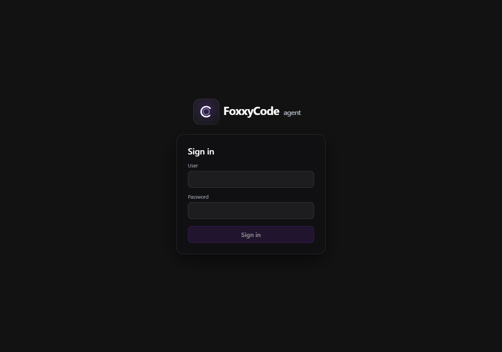

*The sign-in screen an anonymous browser gets when `httpserver.login` is configured.*

- **What decides:** **`AuthGate`** (**`external/ui/src/ui/auth/AuthGate.tsx`**, wrapping **`<App/>`** in **`main.tsx`**) calls **`GET /foxxycode/auth/me`** once on boot. **`login_required`** without **`authenticated`** renders **`SignInScreen`** instead of the app; anything else renders the app. While the answer is outstanding it renders a bare **`.auth-boot`** ground rather than the app, so the transcript is never shown and then yanked away.
- **A server that cannot answer** - a network error, or a **404** from a `foxxycode serve` built before this existed - is read as "no sign-in here", so an older server keeps working with a newer page.
- **The screen** (**`SignInScreen.tsx`**, **`.auth-screen`** / **`.auth-shell`** / **`.auth-card`**) is the whole page, not a dialog over a blurred transcript: there is nothing behind it to look at. The wordmark sits above the card, centred and outside it; the card holds the title, user, password, one error line (**`role="alert"`**), and a submit button disabled until both fields are filled, with no explanatory line under the title. Every string is a dictionary key (**`auth.signIn.*`**), and the card uses theme tokens only, so all seven themes and both languages carry it.
- **The wordmark** is the rectangular logo (**`docs/assets/foxxycode-logo-wordmark.svg`**, and **`-light.svg`** on the light theme, imported from there rather than through the **`src/assets`** symlinks), inlined into the bundle rather than fetched, so the screen paints in one request. Its alt text is localized (**`auth.signIn.logoAlt`**).
- **After a successful sign-in** the page reloads: every list, stream and cached response on it was fetched by a browser with no session.
- **A session that ends while the page is open** - expired, rotated, signed out in another tab - brings the screen back: the local-origin **`fetch`** shim reports a **401** from any **`/v1/*`** or **`/foxxycode/*`** call (the **`/foxxycode/auth/*`** routes excepted) and the gate re-reads the state.
- **Signing out** is the last entry of the nav rail (**`data-testid="nav-sign-out"`**), shown only while a form is configured and this browser has passed it; its tooltip names the account. It posts **`/foxxycode/auth/logout`** and reloads **only when the server actually dropped the session** - the cookie is HttpOnly, so a page that cleared its own state after a refusal would be signed straight back in by the reload and the button would look broken rather than refused.
- **Editor panels and the desktop window never see it.** They run **`foxxycode http`**, which answers a direct loopback client **`login_required: false`**, **`authenticated: true`**, so the gate renders the app and the rail shows no sign-out entry.
- **Remote environments are not gated here.** A remote is reached cross-origin with the bearer token from the environment selector, and a cookie of this origin would not travel with those calls; **`AuthGate`** passes straight through in remote mode.

Server behaviour, the cookie and the CSRF rule: [HTTP API](../reference/http-api.md#web-ui-sign-in-optional). Visual contract: [DESIGN.md](../../DESIGN.md).

## Environment (local / remote server)

- **Workspace-row chip:** an environment selector sits in the composer workspace-context row above the input, next to the folder / branch / worktree chips (**`EnvironmentChip.tsx`**, rendered inside **`.composer-context-row`**, styled as a **`.workspace-chip--env`**, **`data-testid="composer-env-btn"`**), Claude-Code style — **not** in Settings. The chip shows **`Local`** or the remote's name. It opens a portal menu (**`data-testid="composer-env-menu"`**, mode-menu family; bottom sheet on mobile) with an **Environment** section (**Local**) and a **Remote** section (configured remotes + **`+ Add remote…`**).
- **Select = connect:** choosing **Local** or a remote connects **immediately** (no confirm step) and reloads; there is no per-select token prompt. A **bearer token** is entered only in **`+ Add remote…`** (name / URL / token) and remembered per-remote.
- **Reachability dots:** each remote shows a status dot probed on menu open — **green** reachable+authorized (a cross-origin **`GET /v1/models`**), **red** unreachable / CORS-blocked / unauthorized, **amber** while probing. **Local** is always green.
- **Purpose:** point the UI at a remote, already-running **`foxxycode serve`** server, or use the local one. Offered remotes come from the local server's **`httpserver.remotes`** (**`[{name, url}]`**); **`+ Add remote…`** takes an ad-hoc name/URL/token.
- **Client-side state:** the active env lives in **`localStorage`** key **`foxxycode_env`**; per-remote tokens in **`foxxycode_env_tokens`**. Never persisted to server config; leave empty for a remote without auth. Workspace **folder recents** are namespaced per environment (**`envStorageSuffix()`**) so each remote remembers its own last paths; **models** and defaults come from the remote's **`GET /v1/models`** after the reload.
- **Mechanism:** a global **`fetch`** shim (**`external/ui/src/ui/env/remoteEnv.ts`**, installed in **`main.tsx`**) rewrites same-origin API requests (**`/v1/*`**, **`/foxxycode/*`**, **`/openapi*`**) to the selected remote base URL and adds **`Authorization: Bearer <token>`**. Local mode is a transparent pass-through. Selecting an entry persists the choice and reloads so all state re-fetches from the chosen backend; the SPA shell always loads from the local origin, so you can always switch back to **Local** from the chip even if the remote is down.
- **CORS:** the remote must allow the UI's origin via **`httpserver.cors`** (see [http-api.md](../reference/http-api.md)). SSE re-attach (**`GET /foxxycode/sessions/{id}/composer-stream`**) is fetched (not `EventSource`), so the bearer header applies; that route also accepts **`?access_token=`** for external `EventSource` clients.
- **Failure surfacing (issue #60):** a `fetch()` to a remote that is unreachable / refused / TLS-or-DNS-failed / CORS-blocked rejects with a `TypeError` (no `Response`); the send flow's final `catch` now distinguishes that from the user's own `AbortError` and emits an error `system_notice` (**`remoteSendErrorMessage`**), and a readable `401/403` gets an auth-specific message (**`remoteHttpErrorMessage`**) instead of a bare status. Pure helpers live in **`external/ui/src/ui/env/remoteErrors.ts`**.
- **Active-env health (issue #60):** a shared monitor (**`external/ui/src/ui/env/activeHealth.ts`**, started in **`main.tsx`**) probes the *selected* environment's **`GET /v1/models`** on load, on a 30 s interval, and on window focus. The composer chip dot is driven by that health (green up / red down / amber checking, **`.env-status`**), and **`EnvHealthBanner`** shows a persistent alert with a **Switch to Local** action when the active remote is down or unauthorized, so the app never silently renders empty against a dead backend.

## Layout

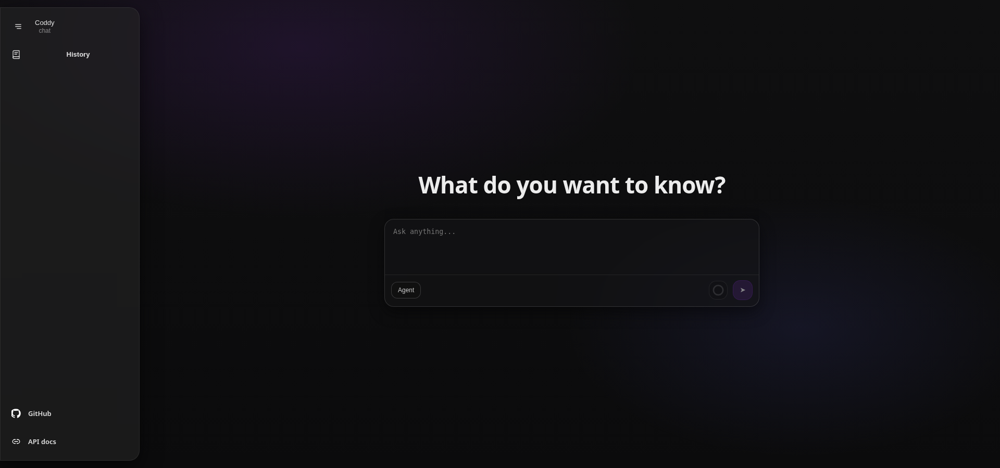

*The wide rail with labels at 1920 px*

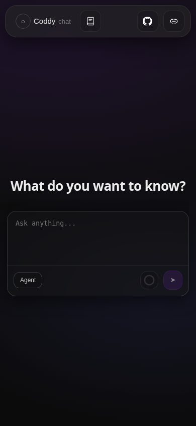

*The same shell at 390 px: the rail becomes a top bar*

Desktop layout

- **Brand** is **typography only** (**FoxxyCode** and **agent**). **No** circular logo or icon before the brand text, regardless of older reference images that include a circle.
- Desktop nav is a **vertical panel** with rounding on the **right** edge (not a full-height center-pill). On **`min-width: 1920px`**, the wide rail header includes an icon with **horizontal lines** used **only** to **collapse** to narrow rail, not as a global navigation drawer.
- Left rail opens **chat history** from **History** under the brand; brand click goes to the **start screen** (**new chat**).
- **Brand**, **History**, **Scheduler** (when linked), **Settings**, and each row in the **History** list use real fragment **`href`** values (**`#/`**, **`#/history`**, **`#/scheduler`**, **`#/scheduler/new`** (new job editor), **`#/settings`**, **`#/s/<sessionId>`**) so **middle-click** or **Ctrl/Cmd-click** opens a **new browser tab** on the same origin while another tab can keep streaming.
- Sessions list is **always** a **drawer overlay** with backdrop at **all** breakpoints and rail widths (**no** inline column beside the rail that would shrink the chat area). The panel heading and related chrome use the copy **History**.
- **Picking a session closes the drawer only inside an editor plugin** (**`isEditorEmbed()`**, decided by **`shouldCloseHistoryOnSessionPick`** in **`sessions/pickSessionGuard.ts`**): an IDE tool window is narrow enough that the drawer covers the whole chat, so leaving it open reads as "nothing happened". Browser and desktop shells keep it open so several conversations can be browsed in a row. While the transcript loads, the skeleton shows a named **`chat-skeleton-label`** row (**`sessions.loadingSession`**) rather than bare shimmer bars.
- **Project scope toggle** (**`sessions-project-only`**) renders in the drawer only when the caller passes a host project root — the folder the server was launched with, read once from **`GET /foxxycode/workspace/context`** **without** a session header (do **not** reuse **`workspaceCtx`**, which follows the *viewed session* and would flip the scope when a foreign session is opened). When on, the list request carries **`cwd=<root>`** and shows only sessions in that folder or beneath it. Default is **on** inside an editor plugin and **off** in the browser, persisted per root in **`localStorage`** (**`sessions/sessionsProjectFilter.ts`**). A session running in a linked worktree **outside** the project root is only visible with the toggle off.
- Optional rail **narrow versus wide** (icons plus labels) only when **`min-width: 1920px`**, persisted in **`foxxycode_nav_rail`** cookie (**`narrow`** default)
- Main chat area with streamed assistant output
- Right rail is out of scope for the current milestone

Wide screens

- **`min-width: 1920px`** may enable the rail widen control and cookie-backed layout (**see DESIGN.md**). **History** remains a **floating drawer** next to the measured nav column (**`--rail-shell-track-width`**); do not fix **`left`** with a static pixel constant for wide rails.

Mobile layout

- On mobile the left rail becomes a top bar to preserve horizontal space; the top bar is **`position: fixed`** at the viewport top (**`shell-main`** is padded with **`--foxxycode-mobile-top-inset`**) while **`body`** scrolls the chat.
- On mobile the brand stays on a single line.
- On **`max-width: 1199px`** (phones and tablets alike) the **Settings** drawer keeps one inline inset, **14px**, for every band it stacks: the **SETTINGS** head, the lead paragraph, the section tiles, the opened section and the reload / save footer all start and end on the same edge. Check it by measuring `getBoundingClientRect().left` of `.settings-lead`, `.settings-tile` and `.settings-body` against `.settings.drawer` - the three must agree.

Footer links

- The Settings footer carries **API docs** (`/docs/`) and **Website** (`https://hijera.github.io/foxxy-agent/`), both in a **new tab** (`rel=noopener`).
- In the editor plugins a new tab is not an option: the IntelliJ panel hands the link to the system browser, and in VS Code the SPA posts it to the extension, which opens it with `vscode.env.openExternal` (`external/ui/src/ui/embedExternalLinks.ts`).

Narrow-rail tooltips (desktop)

- When the rail has **no** wide labels, **hover tooltips** reinforce icon meaning (example **New Chat** on the brand, **History** on history). **Wide labeled rail** hides those tooltips; labels are the affordance.
- After opening **History**, the history trigger's tooltip must **not** stay visible if the pointer still hovers the rail (see **DESIGN.md**).

## Sessions

- Session id is generated client side only after the first message is sent from a new chat.
- Session id is persisted in the URL fragment.
  - Recommended format `#/s/<sessionId>`
- Unsent composer text may be kept as a client-only draft session.
  - Draft sessions use `#/draft/<draftId>` and are stored in `localStorage` under `foxxycode_draft_sessions_v1`.
  - History rows show a `Draft:` title prefix.
- Session id is sent in the `X-FoxxyCode-Session-ID` header for chat transport.
- **Editor embeds reopen the project's last session.** Inside a plugin webview (`?embed=…`, `isEditorEmbed()`), an empty hash on load means *continue where the user left off*, not *new chat*: the SPA reads `GET /foxxycode/project/last-session` and routes to `#/s/<sessionId>`. Any explicit hash (`#/s/…`, `#/draft/…`, `#/history`, `#/settings`, `#/scheduler`) wins over the restore, and the desktop app and plain browser tabs are unaffected. The viewed session is recorded back with `PUT /foxxycode/project/last-session`; going back to a new chat records an empty id so that sticks too. Logic lives in `external/ui/src/ui/sessions/lastProjectSession.ts`; the record is per project in `~/.foxxycode/projects.json`, because plugins bind a fresh random port on every IDE launch and browser storage is keyed by origin.
- Session id validation matches `internal/session/ValidateFolderSessionID`.
- Session persisted files live under the session directory and are deleted together when the session is deleted.
  - `tool_calls/` tool call history
  - `stats.json` token usage totals

### Parallel sessions and generation cancel

- Several sessions may **stream at once**, each with its own **`POST /v1/responses`** and **`X-FoxxyCode-Session-ID`**. The app keeps a **per-session shadow** transcript so rapid hash switches do not mis-route SSE updates; see **`pickStreamMutationBase`** in **`external/ui/src/ui/chat/streamMutationBase.ts`**.
- Shadow transcripts are **bounded**: an LRU of **3** non-pinned sessions (**`ShadowTranscriptCache`** in **`external/ui/src/ui/chat/sessionTranscriptCache.ts`**). The viewed session and any session with a live stream are never evicted; an evicted session is re-fetched on the next visit with no extra request compared to today. Message rows and **`Markdown`** are memoized (**`React.memo`**, **`useStableHandler`**), so unchanged rows skip re-rendering while a token streams (**`MessageList`** still maps the transcript; branch, plan, permission and question rows are not memoized). Transcript rows carry no **`content-visibility`**: letting off-screen rows skip layout sized every row above the opening screen from a fallback guess, so the scrollport was short by about a sixth on a long session and scrolling up pushed the position down as the real heights arrived. See **`DESIGN.md`** (**Multi-session streaming and Stop**).
- **Stop** calls **`POST /foxxycode/sessions/{id}/cancel`** and aborts this tab's streaming **`fetch`** of the turn right after sending it, not after the answer. A browser keeps six HTTP/1.1 connections per host across all of its tabs; with a few tabs of FoxxyCode open, event and turn streams can hold every one of them, and the cancel request would wait for the connection this reader holds. The turn keeps running on the server without the reader, and a failed request shows an error and rejoins the turn through the composer relay. The server persists **partial** assistant **`content`** for that turn when tokens had already arrived. **`GET /foxxycode/sessions/{id}/messages`** may return an older snapshot briefly; the UI **merges** with local shadow or visible rows when the response is only a prefix (**`mergeTranscriptPreferLocalSuffix`**, **`keepLocalTranscriptIfServerEmpty`** in **`external/ui/src/ui/chat/transcriptServerSnapshot.ts`**). The transcript is cleared on fetch failure **only** when the failed load targets the **currently viewed** session so Stop does not wipe the chat.

Session title

- UI shows the session title in the chat header.
- When the title is missing, UI shows `New chat`.
- Title is editable inline. On blur the UI saves via `PATCH /foxxycode/sessions/{id}`.

### Settings: reasoning levels for a logical model

Functional checklist for **Settings -> Logical models -> Reasoning levels**
(**`ReasoningLevelsField.tsx`**, **`useReasoningLevels.ts`**):

- The field owns the three states of **`models[].reasoning_levels`** and names the current one in a status line: **key absent** (auto-detected from the model id), **`[]`** (the composer **Reasoning** selector is hidden for this model), and a **non-empty list** (exactly these levels are offered). The generic array editor cannot express the first state, so a model added through Settings could otherwise never go back to auto-detection.
- **Fetch reasoning levels** calls **`GET /foxxycode/config/reasoning-levels?model=<id>&provider_type=<type>`** with the id currently in the form - the entry does not have to be saved yet - and fills the list with what the gateway detects, under the same Codex remap the composer applies (**`minimal`** becomes **`none`**). **`provider_type`** is the type of the provider row the id points at, taken from the settings document being edited rather than from the saved config, so a provider that is not saved yet or whose type was just changed resolves the way it will after **Save**. The button is disabled until a model id is present.
- A model id with **no** reasoning family leaves the field untouched and says so. Writing **`[]`** there would read as the explicit opt-out and hide the selector, which is the opposite of what the button was asked for. A failed request reports the error inline and also leaves the field alone.
- The status line describes the list the operator is looking at before it repeats fetch feedback: once a level is present (fetched or added by hand) it reads as the override, and the "nothing detected" / error messages only apply while the key is still absent. Retyping the model id, or editing the list by hand (add, change, remove a level), clears that feedback and abandons any answer still in flight; an answer that arrives after the id changed, after a manual edit, or after the row was deleted from the list, is dropped rather than written over the operator's newer choice, and an answer that does land is written through the field's newest `onChange`, so a sibling field edited while the request was pending (for example the **Stream responses** switch) keeps its new value (**`useReasoningLevels`** tickets every request, so one that answers after the field moved on resolves to **`null`**).
- **Use auto-detected** appears whenever the key is present and removes it, so the next save omits **`reasoning_levels`** and detection resumes. Removing the last level by hand is the way to reach the **`[]`** opt-out on purpose.
- The **`[]`** opt-out and the auto-detect default survive a Settings save in both directions: **`ModelEntry.ReasoningLevels`** and **`ModelJSON.ReasoningLevels`** are **`*[]string`**, so an omitted key stays omitted in the written **`config.yaml`** instead of being serialized as **`reasoning_levels: []`**.
### Per-session model

- **New chat** defaults **Model** from cookie **`foxxycode_llm_model`**, then **`default_agent_model`** from **`GET /v1/models`**, then the first YAML row.
- **Opening a session** restores **Model** from **`GET /foxxycode/sessions/{id}/messages`** field **`model`** (session override on disk), not from the cookie.
- Changing **Model** writes the cookie (default for the next **New chat**) and **`PATCH`** **`selectedModelId`** on the active session. ReAct turns still send **`metadata.model`** on **`POST /v1/responses`**.
- **Many models / long names** — backend ids are **`vendor/model`**. When more than one vendor is configured the menu groups rows under an uppercase vendor header and each row shows only the model name (full id stays in the row tooltip). On desktop the list scrolls with a ~5-row cap. When there are **more than 5** backends a **filter input** appears at the top (auto-focused) that matches the vendor, model name, or full id (case-insensitive); **Enter** picks the first match, **Escape** closes, and an empty result shows a “No models match …” notice. Filter/group/threshold logic is in **`chat/llmModelMenu.ts`** (unit-tested in **`llmModelMenu.test.ts`**; menu wiring covered by **`ComposerModelMenu.test.tsx`**).
- **Mobile sheet** — on narrow/mobile shells (the **`max-width: 1199px`** shell-stack breakpoint) the **Mode** / **Model** / **Reasoning** menus open as a **full-width bottom sheet** over a dimmed scrim — the same pattern as the slash (**`/`**) and **`@`** pickers — instead of a cramped anchored dropdown. The filter and grouping still apply inside the sheet. Desktop keeps the anchored dropdown.

### Per-session reasoning level

- A **Reasoning** selector appears in the composer next to **Model** **only** when the active model exposes **`reasoning_levels`** from **`GET /v1/models`** (reasoning models such as gpt-5 / o-series / gpt-oss / qwen3 / Claude thinking models). Levels are derived from **`models[].reasoning_levels`** (auto-detected from the model id when unset) and propagated through **`ModelInfo.reasoningLevels`** → **`llmReasoningLevels`** in **`App.tsx`** → **`Composer`**.
- The pill and its menu show each level in the UI language (**`chat/reasoningLevelLabel.ts`**: `none`, `minimal`, `low`, `medium`, `high`, `xhigh`, `max`); the id itself is what goes over the wire. A level the UI has no name for, typed by hand into **`reasoning_levels`**, is shown as its capitalized id.
- **New chat** defaults the level from cookie **`foxxycode_llm_reasoning`**, then the model's **`reasoning_default`**, then **`medium`** (or the first offered level). **Opening a session** restores it from **`GET /foxxycode/sessions/{id}/messages`** field **`selectedReasoning`**. Switching to a model that does not offer the current level clamps it to a valid one (see **`pickReasoningLevel`** in **`chat/reasoningSelection.ts`**).
- Changing the level writes the cookie and **`PATCH`** **`selectedReasoning`** on the active session; ReAct turns also send **`metadata.reasoning`** on **`POST /v1/responses`** so a brand-new session applies it on the first turn.

### Per-session workspace (folder / branch / worktree / svn chips)

- A chip row renders at the top of the composer card (**`WorkspaceChips.tsx`**, helpers in **`chat/workspaceContext.ts`**): **folder chip** (workspace basename, full path in tooltip), **branch chip** (current git branch; only when the workspace is a git repository), a **worktree checkbox**, and — when an svn working copy is detected — an **SVN chip** plus its **branch-folder checkbox**.
- Context loads from **`GET /foxxycode/workspace/context`** with **`X-FoxxyCode-Session-ID`** whenever the viewed session changes; without a session the server default cwd is shown.
- **Chosen once**: folder + branch + worktree are set before the conversation starts. Once the transcript has messages the chips lock (**`workspaceLocked`** — controls disabled, menus closed) and the server answers **409** to **`POST .../workspace`**.
- **Folder chip** opens the **Recent** menu (Claude Desktop style): MRU folders from **`localStorage`** **`foxxycode_workspace_recents_v1`** (**`chat/workspaceRecents.ts`**), current workspace marked with **✓**, then **`Open folder…`** at the bottom which opens the **folder browser modal** (**`WorkspaceFolderModal.tsx`**) fed by **`GET /foxxycode/workspace/folders?path=`**: rows navigate into folders, **`..`** goes up, **Open** picks the currently browsed folder, **Cancel** dismisses.
- **New folder** (footer, left of **Cancel** / **Open**) opens an inline name row **between the path field and the list** - a sibling of the list, not a row inside it, so it never scrolls away under you and it stays whole on a short window where the list itself has shrunk to nothing. **Enter** or **Create folder** posts **`POST /foxxycode/workspace/folders`** **`{"path": <browsed folder>, "name"}`**; the dialog then shows the listing the server answers with, which is the **new folder**, so **Open** picks it straight away. **Escape** or the row's **×** abandons it. The button is disabled on the drive level (there is no directory to create in) and while the row is already open; **Create folder** stays disabled until a name is typed. A name that is already taken (**409**) keeps the row open with the typed text and says so, and so does any other failure - nothing is created and the browsed folder does not change.
- **Leaving the drive (Windows)** — **`..`** from a drive root opens the **drive level** (**`?path=:drives:`**, **`drives:true`** in the response): one row per volume (**`C:`**, **`D:`**, …), no **`..`** above it, and **Open** disabled because it is a place to navigate, not a workspace. The **path row is an editable field** (**`workspace-modal-path`**): typing or pasting a path and pressing **Enter** jumps there, surrounding quotes from Explorer's *Copy as path* are stripped (**`cleanPathInput`**), and while the field holds an unvisited path the primary button reads **Go** instead of **Open**, so a pasted path is never mistaken for the folder being opened. The browser starts at **`pathParent(ctx.path)`**, which keeps the current drive (it used to collapse Windows paths to **`/`**). Picking calls **`POST /foxxycode/sessions/{id}/workspace`** **`{"path"}`** — the session cwd switches and persists; skills, project rules, and slash commands re-derive from the new cwd.
- **Branch chip** opens the branch list (current first, marked selected). Picking one posts **`{"branch", "worktree": <checkbox>}`**: in-place checkout by default, a dedicated worktree under **`<repo>/.foxxycode/worktrees/<branch>/`** when the checkbox is on, or a jump to the worktree that already has the branch checked out (including back to the main checkout).
- **Worktree checkbox** (**`composer-worktree-checkbox`**, real **`input[type=checkbox]`**) is the worktree preference; when the session already runs inside a linked worktree it shows checked and disabled.
- **SVN chip** (**`composer-svn-chip`**) renders next to the git chip whenever **`is_svn_repo`** is true. Git and Subversion are detected independently, so a branch folder checked out from SVN that also holds a git repository shows both chips and each switches only its own VCS. The chip label is the svn branch (**`trunk`**, **`branches/<name>`**), with URL and revision in the tooltip; the menu lists the current branch first, then **`trunk`**, then the rest. Picking one posts **`{"branch", "worktree": <checkbox>, "vcs": "svn"}`**.
- **SVN branch-folder checkbox** (**`composer-svn-folder-checkbox`**) replaces the worktree idea for Subversion, which has none: off switches the working copy in place (**`svn switch`**), on checks the branch out into its own folder under **`<home>/worktrees/<wc>/`** (reusing an existing checkout) and moves the session there — the branch-folder workflow.
- With **`vcs.svn.enable: false`** or no svn client installed, **`is_svn_repo`** is false and neither svn chip renders.
- **Pre-session (draft/home)**: picks are stored client-side, previewed via **`GET /foxxycode/workspace/context?path=`**, and applied to the new session id on first send before **`POST /v1/responses`**. Switching to another session drops pending picks.
- Errors (missing folder **400**, git conflicts / locked workspace **409**) keep the current chips; the context is re-fetched to stay truthful.
- Automated checks: **`chat/workspaceContext.test.ts`**, **`chat/workspaceRecents.test.ts`** (helpers), **`chat/WorkspaceChips.test.tsx`** (chips, menus, modal, lock); backend behavior is specified executable in **`features/workspace_switching.feature`** and **`features/svn_workspace.feature`** (godog).
## Session list

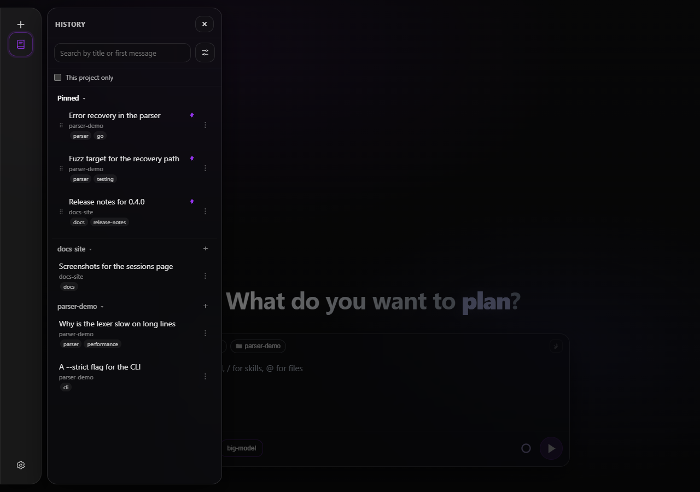

*Grouped by folder: the heading is the folder name, and the plus on it opens a new chat already pointed at that workspace. Pinned conversations lead the list as their own group, each row carrying its folder and its tags*

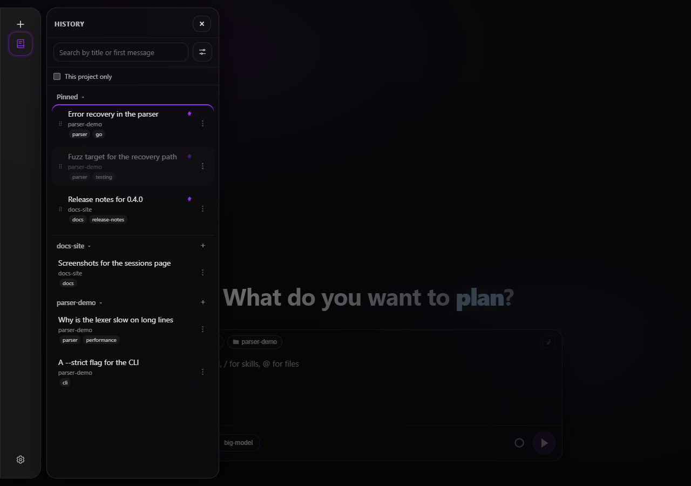

*Pinned conversations lead every mode as one group, dragged into order by the grip on the left; the row being moved fades and the one it would land on is picked out*

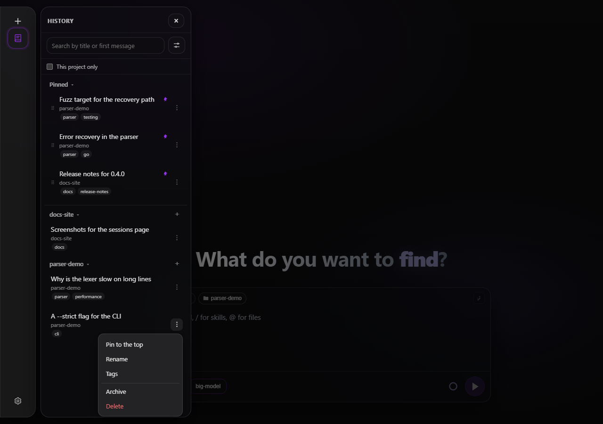

*One control per row: pin, rename and tags, then a rule and the two that take the conversation out of the list, with delete in the destructive colour*

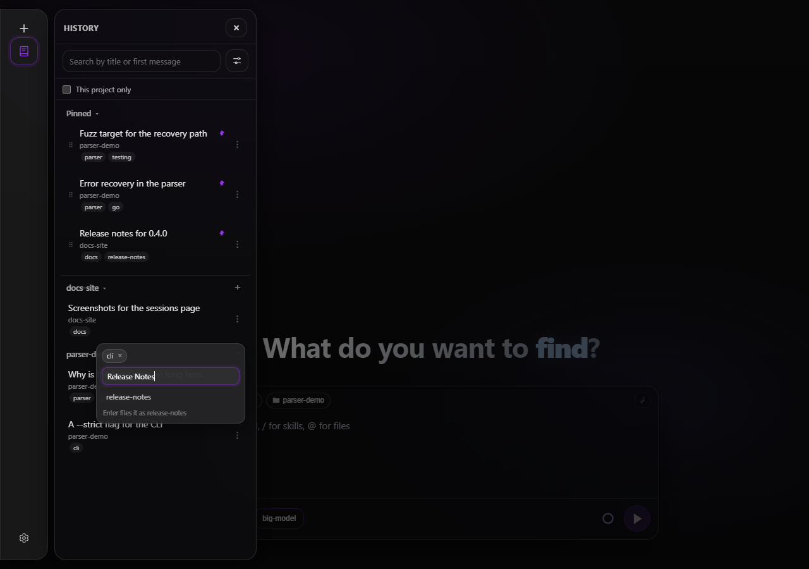

*The labels of one conversation: a cross on each chip, a box that offers the words this history already files under, and the folded spelling the typed one will be stored as*

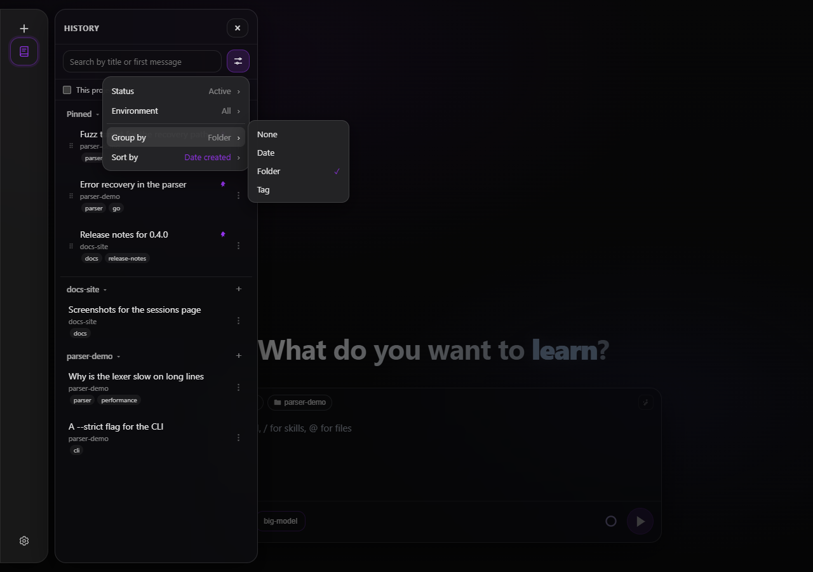

*Four rows, each naming its question and the answer in force; only a value moved off its default is coloured, and the choices open beside the row*


*The shared confirmation dialog before a chat is deleted*

- **History** panel lists sessions via `GET /foxxycode/sessions` (still a **drawer**, not a persistent second column).
- Pagination uses `limit` and `cursor`, with **infinite scroll** for older rows.
- Optional **`q`** query string (**title, workspace path, a tag, or the first **`user`** message content**, case insensitive substring; **not** full-chat search). Search input updates use client debouncing.
- **Everything that decides what the list shows is one control**: the sliders button at the right end of the search row opens a menu of four rows (**`SessionsFilterMenu.tsx`**). It sits with the search because both narrow the list below; the drawer head keeps only its close button. Each row names its question and the answer in force, and its choices open beside it - hover or click a row, and the one before it folds. The menu is rendered into the document rather than into the drawer, which clips what overflows it, so a submenu reaches past the drawer's edge (and flips to the other side near the window's).
  - **Status** - **Active** (the default), **Archived**, **All**: the **`archived`** query parameter. It leads, because it is the question asked most often.
  - **Environment** - **All**, **Local**, **Gateway**, then one row per configured remote. The first three narrow the listing of whichever server is being read (**`origin`**): every conversation, the ones opened on this host, or the chats a messenger gateway is holding. They are a **filter**, so they reload nothing. A remote row is a **switch**: it points the whole app at that server, the same one the composer's environment chip makes, and that does reload - the origin filter goes with everything else. The section is left out entirely when there is only one row to choose from.
  - **Group by** - **None**, **Date**, **Folder** (the default - a conversation is remembered by which checkout it was about far more often than by which day it happened on), **Tag**.
  - **Sort by** - **Last activity** (the default), **Date created**, **Name**: the **`sort`** parameter, each with the direction that reads naturally for its kind of value.

  A rule separates the first two rows from the last two: the first pair decides *what is listed*, the second *how it is arranged*. A row's value is drawn in the **accent** colour only when it is **not** the default - a menu where every row is coloured says nothing about what has been narrowed - and every one of the four is remembered across reloads in its own cookie (**`foxxycode_sessions_group`**, **`_status`**, **`_origin`**, **`_sort`**): a filter the next page load forgets is not a setting.
- **Grouping** is a client concern - the server answers a flat ordered page and the drawer decides where the headings fall - so switching costs no request and never reorders what the server sorted inside a group. A heading is the bucket's own name with a caret after it, and folding it is what clicking the name does; a bucket nothing falls into is not drawn, and a session with three tags is listed under all three.
  - **Date** buckets by local calendar day: **Today**, **Yesterday**, **Previous 7 days**, **Previous 30 days**, **Older**, and **No date** last for a bundle with no timestamp.
  Only a **Folder** heading carries the **+**; a date or a tag is not a place to put a session.

  - **Folder** keys on the full path and shows the folder name, so two checkouts called `one` stay apart - and when a name really is carried by more than one heading, each of them spells out its full path underneath, because the name alone cannot tell them apart. Sessions with no workspace go last. A folder heading also carries a **+** that starts a new chat already pointed at that workspace - the pick goes through the same pre-session path as the composer's folder chip, so the server resolves the folder's current git branch for the new conversation.
  - **Tag** puts untagged sessions last.
- **What can be done to one conversation is behind its ⋮**: **Pin to the top**, **Rename** and **Tags** - the three that change where the row sits or what it says about itself - then below a rule **Archive** and **Delete**, the two that take the conversation out of the list, with delete in the destructive colour. An icon per action cost the title a button's width each and put a delete one mis-click away; inside the menu the actions have room for their words. One menu is open at a time, **Escape** closes it, and it is portaled out of the drawer so it is not cut off at the edge (it flips above the row near the foot of the window).
- **Pinned conversations are one group at the top**, headed **Pinned** and set apart by a rule, in every grouping mode: they are a single list the operator keeps by hand, not a stripe running through every group - the same conversation at the top *and* inside its folder would raise the question of which one dragging moves. A pinned row carries a small accent mark beside its title and a **grip** on the left.
- **The pins are reordered by dragging** that grip, with a mouse or a finger: the drag is driven by **pointer events** (HTML5 drag-and-drop never starts from touch) and the list shows where the drop would land rather than a row following the pointer, which survives a scroll and costs no compositing layer. The dropped order is written with **`POST /foxxycode/sessions/pins/reorder`**, which takes the **whole** order, and a new pin goes **above** the ones already there. The row does not move on the client - the order is the server's answer - so the list is re-read after the change.
- **An archived conversation is dimmed in the list and cannot be written to**: its row is muted, and opening it replaces the composer with a notice saying it is archived and one button that takes it back out. Nothing is refused on the server - the archive is a shelf, not a lock - but leaving the composer there would invite a prompt that silently undoes the operator's own *not now*. The composer learns this from **`GET /foxxycode/sessions/{id}/messages`**, which carries **`archived`**: the session listing skips the archive, so the conversation on screen may be in no page the client holds.
- **Archiving** takes a conversation out of the working list without deleting it (**`PATCH`** with **`archived`**). The row moves only once the server has agreed: a refused request would otherwise leave the drawer showing a state that is not on disk. An archived row carries the archive **mark** beside its title - the state a conversation is in, not a label among its tags - and the same menu item puts it back. The **Status** filter remembers what it was set to, so a session put aside stays out of the way until the operator asks for it.
- **Tags** of a row render under its title as small chips (the title keeps the first line to itself). They are proposed by the title generation, edited by hand in the **Tags** editor of the row menu, and written by the model's own `session_describe` tool ([Sessions](../features/sessions.md#tags-and-the-archive)).
- **The tag editor is one component in both places that show tags** (**`SessionTagEditor.tsx`**): a cross on every chip, a box that offers the labels this history already uses (most used first, its own excluded, prefix matches leading), **Enter** to file what was typed, arrow keys and **Enter** to take a suggestion, **Backspace** on an empty box to drop the last chip, **Escape** to close. There is no Save: every change is a **`PATCH`** at once. The row takes the new set **before** the request, so a second gesture made while the first is still in flight builds on it instead of undoing it; the set the server answers with - folded to lower case, whitespace as hyphens, at most eight - then replaces it, so a chip never changes spelling one refresh later, and a refused write puts back what the row carried. The folded form of what is being typed is shown under the box only when it differs from what was typed.
- Indicators
  - A pulsing dot - the violet unread dot, a third darker - appears on every row whose turn is still running, the open conversation included. A turn waiting on a permission or a question shows that mark instead.
  - A violet dot appears only when a background session completed while it was not the active chat.
  - A question mark icon appears when a session is waiting for user permission.
- CRUD
  - Rename via `PATCH /foxxycode/sessions/{id}` setting `title`.
  - Delete via `DELETE /foxxycode/sessions/{id}`.
  - Create new chat starts on the home screen. Session id is created only on first send.

Session rename UX

- Title rename is done in the chat header, or from **Rename** in the row's **⋮** menu, which turns the row's title into a box with the name selected.
- On blur the UI saves via `PATCH /foxxycode/sessions/{id}`; **Enter** saves, **Escape** leaves the title alone.

Session delete UX

- Delete is a line of the row's **⋮** menu, set apart and in the destructive colour.
- Clicking delete shows one confirm dialog and then calls `DELETE /foxxycode/sessions/{id}`. The dialog opens with **Delete** focused here, so **Enter** finishes what the click started: the row's trash does one thing and the dialog asks about that one thing. Everywhere else the shared dialog still opens on **Cancel**, where a stray Enter must not confirm something nobody meant (**`initialFocus`** on **`confirm({...})`**).
- If the deleted session is **not** the one currently shown in the main chat, remove it from the list (and refresh from the server) and **keep the History drawer open**. Do not change the URL or clear the transcript for the session that stayed on screen.
- If the deleted session **is** the one currently shown, navigate to **new chat** (empty start screen, session hash cleared), **close** the History drawer, and clear composer-related state as for a normal home transition.
- For a short interval after the user confirms delete, **ignore** shell **backdrop** pointer-driven close so a stray event from the native confirm does not dismiss History or alter the route.
- Deleting more than one conversation at a time, and reading what each one cost, is **Settings -> Sessions** (below). History stays the place to *open* a session.

## Settings: session management

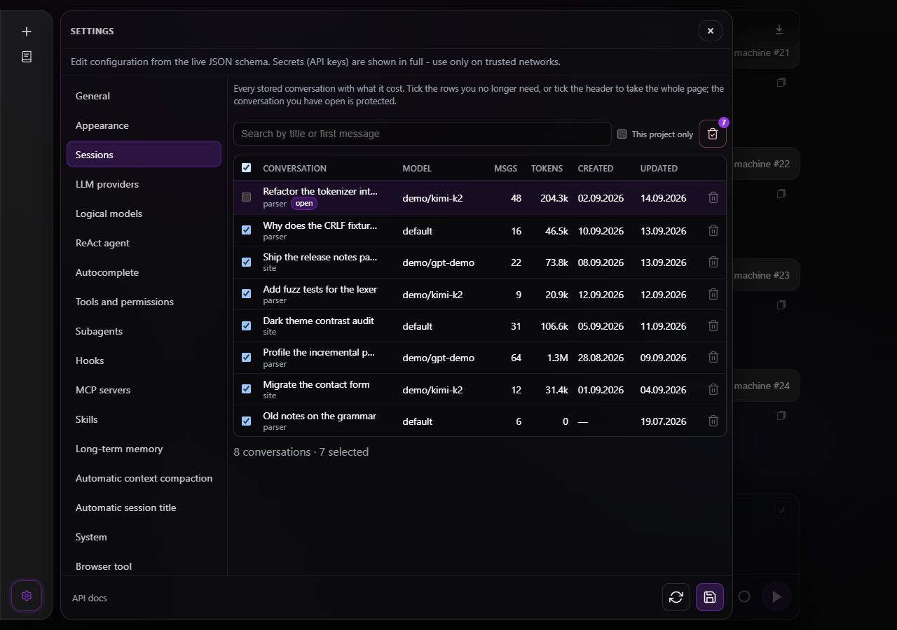

*Everything stored, the archive included: a row says where it sits and what it is filed under, the **+** after its tags opens the same editor History uses, the columns sort the whole listing, and the two icons beside the search are the only destructive controls*

**Settings -> Sessions** (**`#/settings/sessions_manager`**, **`SessionsManager.tsx`**, pure helpers in **`sessions/sessionManagerRows.ts`**) is the stored history as a table rather than a list to scroll. It is a client-side tab like Appearance: it reads and removes session bundles over **`/foxxycode/sessions`** and edits no config key, so it renders before the config schema has loaded. Its id is **`sessions_manager`** because **`sessions`** is already a config key - the storage directory, which stays in the **System** tab.

- **Rows** come from **`GET /foxxycode/sessions?include_stats=true`**, 50 at a time with a **Load more** button. Each one shows the title with its **workspace** underneath, the **model** the session overrode (**`default`** when it never did, meaning whatever **`agent.model`** was at the time), the **message count**, the **total tokens** (input and output in the cell tooltip), and **created** / **updated** dates (the exact instant in the tooltip). A bundle stored before FoxxyCode recorded a creation stamp shows **—** rather than a date invented from a later save.
- **Search** is the same **`q`** filter the History drawer uses - title, workspace, a tag or the first user message, case insensitive - debounced as you type.
- **Sorting** is the column headers: **Conversation** (title), **Msgs**, **Tokens**, **Created** and **Updated** are buttons, the sorted one carries a caret and an **`aria-sort`**. Clicking the column that is already sorted flips it; a different one starts where its kind of value reads naturally, a date or a count at its largest and a title at its first letter. The order goes to the server (**`sort`** and **`order`**) and applies to the **whole filtered listing before paging**, so **Load more** continues the sorted result rather than re-sorting a page.
- **The archive** is a select beside the search: **Working list** (the default), **Archive**, **Everything**. An archived row carries a neutral **archived** badge whose tooltip says when it was put aside. Conversations are archived from **History**, not here; this tab is where you look at what the archive holds and empty it.
- **Deleting is two scopes, never more**: a trash icon beside the search field removes the **ticked** rows (**`POST /foxxycode/sessions/bulk-delete`** with their ids), and an archive-box icon beside it empties the **archive** (**`scope: "archived"`**, with the open conversation named in **`except`** so the protection below holds even for a scope the server resolves), both behind the shared confirmation dialog. What each does is its **tooltip** and its accessible name, not a label on its face; the only text drawn is the **selection count** badge on the first, which a tooltip cannot show at a glance. The ticked rows are what the operator can see; the archive is a scope the server resolves, because the archive may hold more than the page does - which the confirmation says in words. There is no third button that reaches further than either.
- **Tags** render under the title as chips. Clicking one narrows the table to the conversations filed under it (**`tags`**), and a line under the toolbar says which tag is showing with a link that clears it.
- A row has **no delete of its own**: the tick and the one button are the whole per-row surface, so the scope of a destructive click is never ambiguous.
- **In an editor panel the table lists the project History lists.** The toolbar carries the drawer's **This project only** toggle (**`sessions-manager-project-only`**, the same preference, so flipping it in either place flips both); while it is on, the list request and every delete carry the project root as **`cwd`**, and the server refuses to remove a stored session outside that folder. In a browser the toggle starts off, as it does in History, so the table lists every workspace until it is switched on.
- **Deleting is one action**: a single trash icon beside the search field, at every width, which removes the **ticked** rows (**`POST /foxxycode/sessions/bulk-delete`** with their ids) behind the shared confirmation dialog. What it does is its **tooltip** and its accessible name, not a label on its face; the only text drawn on it is the **selection count** badge, which a tooltip cannot show at a glance. The scope of a delete is therefore always what the operator can see ticked - there is no second button that reaches further than the ticks.
- **Emptying the page** is the header checkbox plus that one button. With more rows than a page holds, **Load more** first; the summary line under the table says how many are listed and how many are ticked.
- The **conversation you have open is protected** from every delete here, the archive scope included: its row is highlighted and marked **open**, its tick box is disabled with a tooltip saying why, the header checkbox passes over it, and emptying the archive spares it by name even when it is the one that was archived. The table cannot take the chat out from under you; close it or switch to another conversation first, then delete it from **History**.
- The **selection follows what the table shows**: the header checkbox ticks and unticks the rendered rows, and a search that hides a ticked row takes its tick with it (clearing the search brings the row back unticked). A destructive action never reaches a row that is off screen, and a tick cannot reappear later because it survived out of sight.
- A session that could not be removed - a turn of its tree was still running - is **reported** under the toolbar with its reason, and its row stays. The others are still gone: the request answers with **`deleted`** and **`failed`** separately.
- The list **re-reads after every delete**; nothing is reloaded. If the conversation on screen behind the panel was one of the deleted ones, the chat resets to a new one and Settings stays open on this tab.
- The table is the one horizontally scrollable element of the tab, so a narrow shell scrolls the columns instead of the page.

## Server events shared across tabs

Every tab needs **`GET /foxxycode/events`**: turn starts and ends, queue changes, account usage and configuration reloads arrive there. Over plain HTTP/1.1 a browser keeps six connections to one host for all of its tabs, so when each tab held a stream of its own, six open tabs took every connection and no request from any tab could be sent - not a prompt, not a Stop, not a history read. The tabs of one environment now share a single connection.

- **SharedWorker** - where the browser has one (desktop Chrome, Edge, Firefox and Safari 16+, on plain http as well as https), **`events-worker.js`** holds the connection. Each tab connects a port and says hello; the first hello opens the stream, the last tab leaving closes it. A remote environment passes its address and bearer token with the hello, because the page's fetch shim does not reach into a worker.
- **Web Locks and BroadcastChannel** - where there is no SharedWorker, the tabs elect one of their own through **`navigator.locks`**; the tab holding the lock holds the stream and relays it on a **`BroadcastChannel`**. When that tab closes, the next one in line takes the lock and reports the stream down until its own connection is up. Web Locks exist only in secure contexts (https, **`localhost`**, **`127.0.0.1`**).
- **Editor panels** - the IntelliJ panel (JCEF, Chromium 104) and the VS Code webview are one page in a webview of their own (**`html[data-embed]`**): there is no other tab to share with, and those engines give workers and Web Locks quirks of their own, so a panel takes a stream of its own at once, without starting a worker or asking for a lock.
- **A stream per tab** - with neither, or when the worker fails to load or does not answer within five seconds, a tab keeps a connection of its own, as every tab did before. This is the only case in which many open tabs can still take all six connections: plain http on a network address in a browser without SharedWorker.
- **Scope** - tabs share only within one environment: the worker, the lock and the channel are named after the local server, or after a remote's address and a fingerprint of its token (never the token itself), plus a protocol number so tabs of different builds never meet.
- **What a tab hears** is what a connection of its own would give it: the connected state, one **`turn_started`** per running turn, **`ready`**, then live events. A tab that joins a stream already up gets the running turns and **`ready`** addressed to it alone, because **`ready`** makes a tab reconcile its sessions and give up any pending Stop, and the other tabs have nothing to reconcile. A 401 the worker or the elected tab received is passed on, so every tab returns to the sign-in screen.
- **Code** - **`chat/sharedServerEvents.ts`** picks the transport, **`chat/serverEventsHub.ts`** is the owner of the connection and the receiver in each tab, **`chat/eventsWorker.ts`** with **`chat/eventsWorkerHost.ts`** is the worker, and **`chat/serverEvents.ts`** parses the stream. Vite emits the worker as **`events-worker.js`** next to **`app.js`**, and the binary embeds it with the rest of the shell. Tests: **`chat/sharedServerEvents.test.ts`**, and the three-tab scenario in **`App.stopQueue.test.tsx`**.

## Chat transport

- Primary transport is `POST /v1/responses`.
- `stream: true` uses SSE.

Mode selection

- UI lets the user select the FoxxyCode profiles `agent`, `plan`, `docs`, `ask`, and `debug` from `GET /v1/models`.
- Selected mode is sent as `model` field in `POST /v1/responses`.
- **Mode is session state, both ways.** Changing it `PATCH`es `mode` on `/foxxycode/sessions/{id}` right away, so a profile picked without sending a turn is not lost on reload; **opening a session** restores it from `GET /foxxycode/sessions/{id}/messages` field `mode`. A **new chat** always starts in `agent` (New chat and picking a local draft both reset it — there is no mode cookie).
- **A switch the backend makes itself** — running a plan, or the model calling `plan_exit` — arrives as the named SSE event `mode` (payload `currentModeId`) and repaints the composer. Without it the pill kept saying `plan` while the session had moved to `agent`, and the next turn's top-level `model` wrote `plan` straight back onto the session. The post-turn transcript read adopts the session's mode as a fallback for a stream that was cut, but never over a mode the user switched while that turn was running.
- The selection a session carries (mode, model, reasoning) is applied **once per session open**, not on every transcript reconcile: `loadMessages` also runs after each turn and on reconnect, and re-applying its snapshot reverted a pick the user had just made (see `shouldApplySessionSelection` in `chat/sessionSelectionApply.ts`).
- Ask uses the green mode outline and remains non-mutating: the model is offered only repository read/search/tree, web research, question, and skill tools, and any other tool call is refused at execution time. No settings knob.
- Debug uses the red mode outline and has the same full tool surface as Agent; only its system prompt differs (diagnose, validate, confirm, then fix minimally). No settings knob.

SSE payloads

- Default SSE lines stream OpenAI like deltas.
- Named SSE events
  - `tool_call`
  - `tool_call_update`
  - `plan`
  - `mode` (`currentModeId`; the backend switched the session profile itself — a plan run, or `plan_exit`)
  - `token_usage`
  - `usage_update` (`used` / `size` for the current model context; emitted again after compaction)
  - `memory_phase`, `memory_chunk`, `compaction`, `mcp_phase`, `debug`, `available_commands`
  - `permission`, `question`, and the terminal `foxxycode_meta` before `data: [DONE]`
  - Default (no `event:`): chat completion chunk deltas, including `delta.content` and optional `delta.reasoning_content`

## Transcript scroll-to-bottom

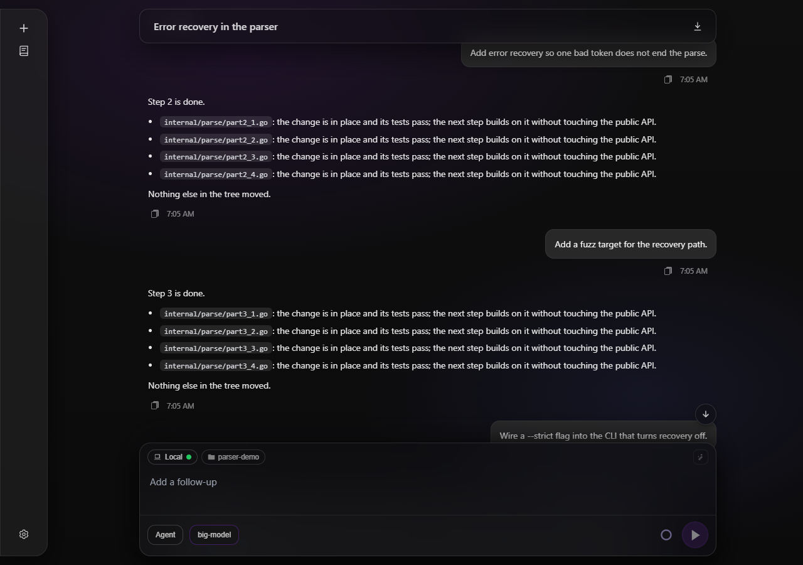

*The scroll-to-bottom button above the composer, dark theme at 1280 px*

Scrolling up in a long chat leaves the newest messages off screen, and dragging the scrollbar back is the only way down. A round control above the composer does it in one press.

- **When it is there** - the transcript follows new output while the scrollport sits within `TRANSCRIPT_BOTTOM_THRESHOLD_PX` (**80px**) of the end. The button appears exactly when that stops being true and goes away when it starts again, so seeing it means the transcript has something below the fold. It fades in and out on one mounted node (**~0.14s** in, **0.12s** out); hidden, it is `inert` and out of the tab order.
- **Where it sits** - inside the composer's own column (`.chat-bottom-inner`), against its right edge, `10px` above the docked block. That is one set of coordinates for every shell: the absolute desktop dock, the `position: fixed` composer below `1200px`, and the inset the background tasks panel reserves.
- **The jump** takes **220-460ms** by distance, on an ease-out curve: away at speed, settling into the last pixels rather than stopping dead. It is driven frame by frame (`transcriptJumpDurationMs` / `easeTranscriptJump` in `chat/transcriptScrollPosition.ts`), not handed to `scrollTo({ behavior: "smooth" })`, so the feel is the same in every engine. Arriving re-arms the follow, and the rest of the turn scrolls by itself again.
- **Streaming under a reader who scrolled away** - the position does not move and the button stays, because the distance to the end only grows. A jump started mid-turn re-reads the end on every frame, so it lands on the newest message rather than where the transcript ended when the button was pressed.
- **The reader always wins** - a wheel, a finger or a press on the scrollbar stops the travel where it is and brings the button straight back if they stopped short of the end.
- **Both scroll surfaces** - the wide shell scrolls `.chat-scroll`, the narrow one scrolls the document; the same module reads the distance and the end position for both, and one reading drives the follow flag, the button and the jump.
- **`prefers-reduced-motion: reduce`** puts the transcript at the end in one step and drops the button's fade.
- **Accessible name and tooltip** are both `chat.scrollToBottom`; the empty hero never renders it.

## Composer primary action (`#btn-send`)

Context ring and breakdown popover

- **Hover** on **`.composer-context-tip-host`**: compact tooltip (percent, input/output/total, max context) unchanged.
- **Click** opens **`ContextBreakdownPopover`** beside the ring on wide viewports (**`context-breakdown-menu--portal`**); on stacked shell (**`max-width: 1199px`**) it uses the same bottom sheet + scrim as slash / **`@`** pickers (**`context-breakdown-menu--sheet`**, **`slash-sheet-backdrop`**). **Escape** or **Close** dismisses; hover tooltip returns when closed.
- Legend keys map to **`contextBreakdown`** on **`GET /foxxycode/sessions/{id}/stats`** (`systemPrompt`, `toolDefinitions`, `rules`, `skills`, `mcp`, `subagents`, `conversation`, `summary`). Live **`usage_update`** SSE replaces the displayed total immediately (including after `/compact` or automatic compaction), then the UI refreshes the detailed stats. Vitest: **`Composer.test.tsx`** (`click context ring opens breakdown popover`) and **`consumeComposerSseOrder.test.ts`** (`usage_update replaces the displayed current context after compaction`).

Shape and glyphs

- The control sits to the **right** of the context ring (**`.composer-icon`** on **`Composer.tsx`**).
- The hit target is a **perfect circle**: equal **width** and **height**, **`border-radius: 50%`**, **`box-sizing: border-box`** (currently **42×42px** in **`styles.css`**). Do **not** ship a rounded square or squircle for this control unless the visual spec explicitly changes again.
- **Play** (**idle**, draft non-empty): Unicode triangle **`▶`**, enlarged vs body text (**`~22px`** glyph via **`composer-send-glyph`**), slight horizontal nudge for optical centering.
- **Stop** (**while the session has an active turn, draft empty**): filled square **`.composer-stop-square`** (**14x14px**, centered in the **42px** circle). Stays in **`composer-bar-actions`** on the right, next to the context ring, even when this tab has no stream reader.
- **Queue** (**while the session has an active turn, draft non-empty**): the **play** glyph returns on an accent fill (**`.composer-run-icon--queue`**, **`data-queue="true"`**), because a draft written during a turn is a follow-up rather than a Stop. Emptying the field brings **Stop** back, which is how a turn is still cancelled. See **Composer message queue** below.
- **Disabled** idle state when textarea is whitespace-only (**`:disabled`** on **`composer-send-play`**).

Behavior (unchanged summary)

- **Enter** submits when idle; **`Shift+Enter`** newline. While **`generating`** the same key queues the draft for the running turn instead of being swallowed (**Composer message queue**); under **`ui.send_mode: ctrl_enter`** that key is **Ctrl/Cmd+Enter**, and with **`off`** only the control queues.
- **Stop** sends **`POST /foxxycode/sessions/{id}/cancel`** and aborts the tab's own reader at once, so the request does not wait for a connection that reader holds. Failure remains visible and retryable, and the tab rejoins the running turn; acknowledgement alone does not mark the turn idle. Partial assistant persistence and transcript merging follow [Parallel sessions and generation cancel](#parallel-sessions-and-generation-cancel).

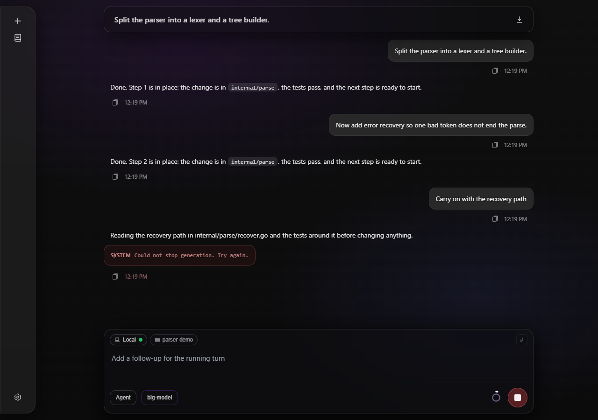

*The cancel request was refused: the notice says so, the turn still runs and Stop remains available for another attempt.*

Regression

- Automated UI checks (**Playwright MCP** or **`@playwright/test`**) MAY assert **`#btn-send`** **`offsetWidth`** **≈** **`offsetHeight`** and computed **`border-radius`** **≥ half** **`min(width,height)`** (within sub-pixel tolerance).

## Composer message queue

The composer stays live while the agent works: what is typed during a turn is queued for that turn to read at its next step, rather than refused by the turn lock. Full behaviour: [Message queue](../features/message-queue.md).

- **Queueing** — the send key of **`ui.send_mode`** (through **`handleSend`**) or the primary control (see above) calls **`POST /foxxycode/sessions/{id}/queue`** with **`{"text": ...}`** and clears the field. A **409** with code **`no_active_turn`** means the turn ended between the keystroke and the request: the SPA sends the same text through **`POST /v1/responses`** instead, so nothing typed is lost. Any other refusal puts the text back in the field and adds a system notice (**`composer.queueFull`**, **`composer.queueBusyElsewhere`** for a **409** **`session_busy`** when the turn runs in another FoxxyCode window, **`composer.queueFailed`**).
- **The list** — queued rows render as **`.composer-queue-item`** (**`data-testid="composer-queue-item"`**) stacked **above** the composer card in reading order, text clamped to 3 lines, on the frosted glass of the composer card, each with the app's framed **×** in its top-right corner (**`data-testid="composer-queue-remove-<id>"`**, accessible name **`Remove from the queue`**) that calls **`DELETE /foxxycode/sessions/{id}/queue/{message_id}`**. When the call succeeds the message was still waiting, and its text goes back into the field, ahead of anything typed since; a **404** means the agent read it first and nothing returns. Nothing waiting renders no list.
- **Open and reconnect** - the UI reads **`GET /foxxycode/sessions/{id}/queue`** for the selected session alongside its activity snapshot. Existing waiting messages appear without another queue mutation, a live turn reader, or a matching row in **History**.
- **Staying in step** — the list is server-owned and a session is shared. Every change arrives as **`event: message_queue`** carrying the whole queue and a **`version`**, down **two** paths: the turn's own stream (**`consumeComposerSse`**) and the server-wide **`GET /foxxycode/events`** (**`serverEvents.ts`**, **`onMessageQueue`**), so a tab that is not reading any turn stream still sees what someone else queued. They are separate connections: **`App.tsx`** keeps the highest version per session (**`queueVersionBySidRef`**) and drops older frames. A message the agent reads leaves the list as **`event: user_message`** puts it into the transcript where it was read, as a **`user_message`** row with **`queued: true`** (**`appendQueuedUserMessage`**: pending tool rows and an open thinking row land first, and the answer starts a bubble of its own). The queue is emptied when generation ends.
- **Re-attaching** — a tab that attaches to a running turn (**`rejoinComposerLiveStream`**) reads **`GET /foxxycode/sessions/{id}/queue`**, since no stream it attaches to brings the list back, and trims the transcript to the last user message **without** **`queued`** (**`trimTranscriptForTurnReplay`**): the relay replays the follow-ups where the turn read them. Rows from **`GET .../messages`** carry the same **`queued`** flag.
- **Scope** - these are Stop and queue controls, not a shared session bus. Existing transcript relay and permission/question ownership stay unchanged. Separate local console or ACP processes sharing a sessions directory share the cancel marker, not their in-memory queues or answer channels.
- **Placeholder** — while generating, the field reads **`composer.placeholderQueue`** instead of the idle placeholder.
- **Attachments are not queued.** A queued follow-up is text; files attached to the composer stay there for the next prompt.
- Vitest: **`composerQueue.test.tsx`**, **`messageQueueFork.test.tsx`** (send mode, the re-attach trim, where a read follow-up lands).

## Composer file attachments (multimodal)

- The paperclip button (**`data-testid="composer-file-input"`** hidden `<input type="file">` triggered by a visible icon button) appears in the composer **only** when the active model has **`multimodal: true`** from **`GET /v1/models`**. The flag is derived from **`models[].multimodal`** in YAML config and propagated through **`ModelInfo.multimodal`** → **`llmModelMultimodal`** in **`App.tsx`** → **`Composer`** prop.
- Attached files are held in **`attachedFiles: File[]`** state on **`Composer`**. Preview chips appear above the composer input showing file name and type icon.
- On send, **`App.tsx`** reads each file as a data URL via **`FileReader`** and includes **`inline_files: [{name, data_url}]`** in the **`POST /v1/responses`** body.
- **Agent / plan turns**: the server writes each file to **`~/.foxxycode/sessions/<id>/assets/`** (permissions **`0o444`**) and injects a **`<foxxycode_session_assets>`** XML block into the user message so the agent can **`read`** or **`cp`** those paths. Duplicate asset names get **`_1`**, **`_2`** suffixes (see `internal/session/assets.go` **`SavePartsToAssets`**).
- **Direct YAML model turns**: each file becomes an **`image_url`** content part sent inline to the provider.
- The user bubble strips the XML annotation via **`stripFoxxyCodeAttachmentsForUserDisplay`** in **`stripFoxxyCodeAttachments.ts`** and shows file chips (**`msg-user-files`** / **`msg-user-file-chip`** CSS classes). **`parseSessionAssetFiles`** re-derives chip metadata on page reload.
- After a **`PUT /foxxycode/config`** save in Settings, **`App.tsx`** bumps **`configEpoch`** → re-fetches **`/v1/models`** so the attachment button appears or disappears without a page reload. The onboarding probe (**`GET /foxxycode/onboarding/status`**) is deliberately *not* on that epoch: it runs once per page load, so a save never reopens a provider picker the user dismissed. The picker is gated on **`has_agent_credentials`** (the provider behind **`agent.model`** has a key, a key command, its **`NAME_API_KEY`** variable, or a stored login), not on the informational **`missing_api_keys`** list — a second, keyless provider row is fine. Re-entry is **Settings → Appearance → Restart onboarding**.
- **`GET /foxxycode/events`** carries **`event: config_reloaded`** after every swap of the live configuration - a settings save, the agent's own **`config_commit`**, a skill install, an edit on disk that **`foxxycode serve`** picked up. **`subscribeServerEvents`** (**`chat/serverEvents.ts`**) turns it into the optional **`onConfigReloaded`** callback, and **`App.tsx`** bumps **`configEpoch`** on it, so every config-derived list re-reads without a page reload. Automated checks: **`serverEvents.test.ts`** (the event reaches the callback, and is harmless without one) and **`features/config_reload_broadcast.feature`** with **`external/httpserver/bdd_config_reload_test.go`** (the announcement reaches every open client).
- **Setting `models[].multimodal` from the provider catalog** — in **Settings → Logical models**, **Fetch models** returns an advisory **`vision`** flag per entry (see `docs/reference/http-api.md`). Options that carry it are suffixed **`· vision`** in the dropdown, and picking a listed model writes **`multimodal`** from that flag in the same document update as the id (**`ModelField`** reports the catalog entry through **`onChange`**; **`SettingsSection`** applies both keys via the **`FieldOverride`** **`patchParent`** seam, because **`multimodal`** is a sibling field rendered from the Go schema). A note under the field says where the value came from. Hub catalogs under-report vision (**`gpt-oss-120b`** advertises **`vision: false`** and still reads images), so the flag is a **default, never a gate** — the switch stays editable, and an id typed by hand leaves it alone.
- **Same flag in onboarding** — the provider picker probes the catalog through **`POST /foxxycode/providers/models-probe`**, badges its vision entries the same way, and writes **`models[].multimodal`** from the picked entry instead of the per-provider **`preset.multimodal`** constant (**`catalogEntry`** in **`ProviderPickerDialog.tsx`** matches both the bare id the combobox writes and the prefixed id the fixed-endpoint presets pre-fill). The preset value is the fallback for a model the catalog does not list. A hint under the field says which way the flag will be saved.

| Case | Expected | Automated check |
|------|----------|-----------------|
| FA1 | Paperclip visible only when `llmModelMultimodal` is true | `Composer.test.tsx` |
| FA2 | File chips render in user bubble after send | `stripFoxxyCodeAttachments.test.ts` |
| FA3 | Chips persist on reload via `parseSessionAssetFiles` | `stripFoxxyCodeAttachments.test.ts` |

## Composer slash skills and mirror caret

Authoritative narrative and visual tokens live in **`DESIGN.md`** (slash picker, mirror contract, verification table). This section is the functional contract for regression.

Wire and draft

- **`textarea#composer`** holds **plain text** only. Invoked skills appear as **`/<name>`** tokens (space after picker selection). The UI **must not** persist **`[/<name>](foxxycode-skill:<name>)`** in the draft.
- First user turn on **`POST /v1/responses`** carries the same plain slash tokens as the composer value (no client-side markdown injection for skills in the request body).

Picker and segmentation

- Menu visibility and **`prefix`** derive from **`slashMenuDraftAtCaret`** in **`external/ui/src/ui/skills/draftSlash.ts`** (line-start or whitespace before **`/`**, optional suffix, not inside fences or blockquotes).
- Mirror highlighting uses **`segmentComposerSlashSpans`** in **`external/ui/src/ui/skills/segmentComposerSlashSpans.ts`** (mid-line **`/`** supported; **`x/foo`** is not a command token).

Mirror and caret alignment

- Non-empty drafts: textarea text is drawn **transparent**; **`.composer-mirror-inner`** shows the visible line including **`.composer-skill-chip-inline`** (**`data-testid="composer-skill-chip"`**).
- Composer chips **must not** use horizontal **padding**, **margin**, or a **border** that changes inline width. Use **`box-shadow`** for outline. **`font-family`**, **`font-size`**, **`line-height`**, **`font-weight`**, **`letter-spacing`** on chip and **`#composer`** must match so the caret lines up (**`ResizeObserver`** syncs scrollbar gutter).

Transcript vs composer

- **`user_message`** bubbles render **plain text** only (**`msg-user-body`**, **`white-space: pre-wrap`**). No Markdown pipeline, no transcript skill chips (**`foxxycode-skill-span`**). Slash tokens such as **`/path/to`** and YAML blocks stay exactly as persisted, with line breaks preserved.
- Composer mirror chips (**`composer-skill-chip`**) apply **only** while editing **`#composer`**, not in the transcript.
- Persisted user turns may carry hydrated attachments as **`foxxycode_attachment`** XML with **`path`**, **`name`**, optional **`lines`** ("N-M" for a paste-to-chip fragment), and CDATA file bodies (**`internal/agent`**). **`stripFoxxyCodeAttachmentsForUserDisplay`** replaces each XML block with a compact **`@path`** (or **`@path:N-M`** when ranged) **only when** that path **with the same range** is **not** already present as an **`@`** mention in the surrounding text (**avoids duplication** because the persisted turn already repeats the **`@`** in the user text plus the hydrated block).

Verification use cases

| ID | Expectation | Primary automated check |
| --- | --- | --- |
| UC1 | One chip for **`asdfasf /find-skills asdfasdf`**, plain **`textarea.value`** | **`external/ui/src/ui/chat/Composer.test.tsx`** (`composer highlights plain slash token as chip while editing`) |
| UC2 | Mid-line menu open after whitespace | **`draftSlash.test.ts`** (`slashMenuDraftAtCaret works after whitespace mid-line`) |
| UC3 | **`x/foo`** no chip for **`/foo`** | **`segmentComposerSlashSpans.test.ts`** (`segmentComposerSlashSpans skips letter before slash`) |
| UC4 | Line-leading **`/foo`** chip | **`segmentComposerSlashSpans.test.ts`** (`segmentComposerSlashSpans line start slash`) |
| UC5 | **`stripFoxxyCodeSkillMarkdownLinks`** on legacy paste | **`segmentComposerSlashSpans.test.ts`** (`stripFoxxyCodeSkillMarkdownLinks restores plain slash token`) |
| UC6 | User bubble keeps **`hi /demo there`** plain (no **`foxxycode-skill-span`**) | **`UserMessage.test.tsx`** |
| UC7 | Multiline YAML / paths keep **`\\n`** layout in **`user-message-body`** | **`UserMessage.test.tsx`** |
| UC7b | Display-only **`slugSlashes`** (plain **`/`** and legacy mix) | **`segmentComposerSlashSpans.test.ts`** (`slugSlashesForUserBubbleMarkdown …`; composer / legacy only, not transcript) |
| UC8 | Live **`foxxycode http`**: **`fontFamily`** parity chip vs **`#composer`**, caret **`selectionStart === value.length`** at EOL after fill | **Playwright MCP** **`browser_evaluate`** after **`make build TAGS="http ui"`** |
| UC9 | User bubble hides **`foxxycode_attachment`** bodies, shows **`@path`** only | **`UserMessage.test.tsx`**, **`stripFoxxyCodeAttachments.test.ts`** |

## Composer **`@`** workspace files

- **`textarea#composer`** keeps plain **`input`** including literal **`@path`** text. **`POST /v1/responses`** adds **`attachments`** (**`path`** only) parsed by **`extractAtFileAttachments`** in **`external/ui/src/ui/skills/draftAt.ts`** for **`agent`** / **`plan`** / **`docs`** / **`ask`** / **`debug`**. Server-side **`HydratePromptContentBlocks`** uses **`ExtractAtFileRefsFromText`** (**`internal/session/at_paths_extract.go`**; **`ExtractAtFilePathsFromText`** keeps the range-free contract for **`@plans/...`** mentions) after filling empty **`resource`** bodies so **`@path`** literals inside **`type: text`** blocks become extra **`resource`** rows when that path is not already hydrated (**matches HTTP **`attachments`** without duplicating**).
- **`@`** menu uses **`GET /foxxycode/workspace/files`** with **`dirs=true`** so **`kind`** **`dir`** rows drill down. Choosing a **`dir`** inserts **`@`** + **`path_rel`** (often ending in **`/`**) without hydrating file body. Choosing a **`file`** inserts **`@`** + **`path_rel`** plus a trailing ASCII space where appropriate. **`Composer`** defers two **`updatePickerMenus`** ticks after a row choice so the workspace dropdown does not immediately reopen (trailing space and **`MENU_PATH_CHAR`** still satisfy **`atMenuDraftAtCaret`** until the user edits again).
- Empty **`@`** prefix (caret right after **`@`**) loads recent rows from **`localStorage`** (**`workspaceAtRecents`**), keyed by **`sessionId`** (or **`__no_session__`** before the first assigned id), with no extra banner line (**`Type after @ to search`** only when the list is empty). Entries come from **`@`** row picks and **`extractAtFileAttachments`** on successful profile sends (**`migrateWorkspaceAtRecents`** merges when the client generates or the server rotates **`X-FoxxyCode-Session-ID`**).
- Fenced code blocks and Markdown blockquote lines suppress **`@`** menu parity with **`draftSlash`** ( **`inMarkdownFenceBeforeCaret`**, **`blockquoteLine`** ).
- Mirror **`@`** styling uses **`segmentComposerMirrorSpans`** (**`composer-at-chip-inline`**, **`data-testid="composer-at-chip"`**). **`listAtPathSpans`** (**`draftAt.ts`**) chips every completed **`@path`** atom even when prose follows (**`draftAt`** parity with **`extractAtFileAttachments`**), while text after the caret that is still inside **`MENU_PATH`** stays on the active token until the **`atMenuDraftAtCaret`** lexer breaks out.
- **`@`** search with zero matches keeps the picker open (**`No files`**) instead of collapsing the menu (**`composer-at-chip-inline`** hides for **`atNoMatch`**, same **`atIdx`**, **`prefix`** as the stale filter).
- Stacked-shell viewports (**`(max-width: 1199px)`**) render workspace and slash pickers as a **`slash-menu--sheet`** with **`slash-sheet-backdrop`** so the panel is usable on phones.
- Picker subtitle uses **`workspacePickRowSubtitle`** - second column shows **`parent/`** only when **`path_rel`** is nested, root entries omit it (empty string).

### Line ranges (**`@path:N-M`**)

- A mention may narrow a file to a **1-based inclusive** line range: **`@Dockerfile:21-31`**. **`listAtPathSpans`** absorbs the suffix, so the mirror chips the whole token as one **`composer-at-chip-inline`**; the range must end the token (**`:21-31x`** stays prose) and **`1 <= start <= end`**. **`internal/session/at_paths_extract.go`** carries the same grammar for prompts hydrated server-side (**`ExtractAtFileRefsFromText`**), and the two test suites share their literals.
- Only those lines reach the model. The range rides **`acp.Resource.URI`** as a **`#L<start>-<end>`** fragment (**`lineRangeURI`** / **`sliceLines`** in **`internal/session/promptfiles.go`**) and **`resourceBlockToXMLAttachment`** turns it into **`<foxxycode_attachment path="..." name="..." lines="21-31">`**. An end past the last line clamps. A range the file cannot honour (zero, inverted, or starting past the last line) is never widened into the whole file: an explicit **`attachments[]`** range or a client **`resource`** with such a **`#L`** fragment is refused (**`ErrLineRange`**, HTTP **400**), and a range typed into the prompt text stays prose and attaches nothing, like any other unresolvable **`@`** token. The **`lines`** label is written only for a body that really is the slice; a **`source.literal`** or byte-offset (**`source.start`** / **`end`**) body travels without it. The picker preview is a snapshot taken when the panel opened; the lines that reach the model are read from disk at send time, and a session switch drops the preview. **`stripFoxxyCodeAttachmentsForUserDisplay`** collapses such a block back to **`@path:N-M`**; a plain mention never covers a ranged one of the same path, nor the other way round.
- Typing the **`:`** closes the file picker on its own (**`:`** is no **`MENU_PATH_CHAR`**) and opens the **line-range picker** in its place: **`atRangeDraftAtCaret`** / **`replaceAtRangeSuffix`** / **`highlightedRange`** in **`external/ui/src/ui/skills/draftAtRange.ts`**, panel **`data-testid="at-range-picker"`** rendered through the same portal / **`slash-menu--sheet`** chrome as the **`@`** menu. It previews the file (**`GET /foxxycode/workspace/file`**, one fetch per path) and highlights **`at-range-line--sel`** as the digits are typed; a start without an end highlights that one line.
- The composer text stays the only input - there are no number fields. On desktop the rows are buttons: **`mousedown`** anchors the range, dragging over rows extends it, and each step rewrites the suffix through **`replaceAtRangeSuffix`** (**`preventDefault`** keeps focus in the textarea). On **`isMobileShell`** the rows render as plain **`div`**s with no pointer handlers - a phone has no mouse to drag with, so the range is typed.
- A path that does not resolve leaves the panel closed, so **`@user:1-2`** in prose never opens an empty panel; the settled path is remembered so the next digit refetches nothing. **`Escape`** dismisses the panel and suppresses it for that mention until the draft moves on; **`Enter`** is left alone and still sends.

| Case | Expected | Automated check |
| --- | --- | --- |
| AR1 | **`@f.go:21-31`** chips as one token and attaches only those lines | **`draftAt.test.ts`**, **`at_line_range_test.go`**, **`features/at_line_range_mention.feature`** |
| AR2 | **`:21`**, **`:21-31x`**, **`:31-21`**, **`:0-5`** are not ranges | **`draftAt.test.ts`**, **`at_line_range_test.go`** |
| AR3 | Colon opens the picker; digits move the highlight | **`Composer.test.tsx`**, **`draftAtRange.test.ts`** |
| AR4 | Desktop drag writes the range; mobile rows are not buttons | **`Composer.test.tsx`** |
| AR5 | Unresolvable path keeps the panel closed | **`Composer.test.tsx`** |
| AR6 | User bubble shows **`@path:N-M`** instead of the attachment body | **`stripFoxxyCodeAttachments.test.ts`** |

| Case | Expected | Automated check |
| --- | --- | --- |
| AT1 | Spaces inside paths ( **`readme copy.md`** ) work in picker draft and hydrate when attached | **`draftAt.test.ts`**, **`session/promptfiles_test.go`** (**`hello world.txt`**) |
| AT2 | **Prefix** substring filter (**case-insensitive**), empty **prefix** returns empty **`items`** on server | **`TestFoxxyCodeWorkspaceFilesGetPagingAndPrefixes`** |
| AT3 | Prose **`see @note.txt`** does not merge **`and`** into the path segment | **`draftAt.test.ts`** (**`extractAtFileAttachments`** connector words) |
| AT4 | **`@`** inside **`session/prompt`** text alone still hydrates (no duplicate when **`attachments`** or **`resource`** already has body text) | **`TestHydratePromptContentBlocksExpandsAtInText`**, **`at_paths_extract_test.go`** |
| AT5 | Picker second column shows **`parent/`** for nested **`path_rel`**, empty at workspace root (**`workspacePickRowSubtitle`**) | **`workspacePickRowSubtitle.test.ts`** |

## Transcript message types

The chat transcript renders a flat list of UI message blocks. Each block has a `type` and a minimal set of required fields.

- `user_message`
  - Plain user input text (**no Markdown**; **`pre-wrap`** preserves line breaks).
- `thinking`
  - Renders model reasoning as a lightweight disclosure row.
  - Status `in_progress` shows label `thinking...` and a spinner.
  - Status `completed` shows label `thinking` and preserves the text for review.
  - Multiple `thinking` blocks may appear in one turn (reasoning can resume after tool calls).
- `tool_call`
  - A single tool execution row, same disclosure chrome as **thinking** / **memory** (**chevron**, **`thinking-label`**, **`thinking-dur`** for duration or **`-`**).
  - The label is what the agent is doing, not the function it called: the tool id is translated through the **`tool.name.*`** catalogue (**`reading a file`** / **`читаю файл`**, **`running a command`** / **`выполняю команду`**). A tool with no entry - an MCP server's own tools - keeps its raw id. **`read`** serves files and directories from one tool, so it says **`browsing a directory`** / **`смотрю каталог`** only when the arguments prove it (**`recursive`**, **`show_hidden`**, or a path ending in a separator).
  - Next to the label, **`.tool-summary-target`** names the one thing the call acts on - the path it reads, the command it runs, the skill it loads - from the same **`toolCallTargetText`** the live status line uses. Label, target and duration are one non-wrapping group (**`.thinking-head`**): the target is what gives way, clipped with an ellipsis and carrying the full value as its **`title`**, so a long path never wraps the row onto a second line.
  - A path is shown **relative to the directory the work is in** when that spelling is shorter (`relativeToolTarget`). The roots are the session's directory and the worktrees of its workspace, deepest match first, so a file inside a worktree reads against that worktree rather than against the checkout it hangs under. Only real paths are rewritten, never a command, a pattern, a url or a name, and the absolute path stays in the row's `title` and in the expanded card. The live status line follows the same rule.
  - While **`pending`** or **`in_progress`**, the summary label uses a **`...`** suffix (for example **`reading a file...`**). **`startedAtMs`** drives a live duration until the tool finishes.
  - When a structured preview and a returned body are both present, they touch and share the outer corners as one continuous execution card; there is no gap, duplicate border, header or divider between them. The body carries no **Result** label: it is the only thing under the call.
  - A **failed** call says so on its summary row - **`.tool-failed-marker`** (**`data-testid="tool-failed-marker"`**) renders **(failed)** / **(ошибка)** in the theme's deletion red between the target and the duration - so the failure reads while the row is still collapsed, instead of being a coloured dot inside the expanded body.
  - Browser and SVN rows put their icon first inside **`.thinking-head`** and keep their operation label (**Open page**, **SVN · Update working copy**). An SVN row reports a failure with its own **`.svn-summary-error`** pill, which also catches an **`error:`** result delivered as completed; a browser call whose result starts with **`error:`** gets the failure marker. A **`spawn_agent`** row whose background chip already names the agent shows no target.
  - Details reuse the permission card's tool-specific preview without approval actions. **read**, **grep**, **glob**, and **print_tree** receive compact structured argument previews; unknown tools keep a styled monospace fallback. **run_command** / **ssh_run_command** put the command in an inset block inside the card behind a **`$`** prompt, under a header that names the server's own interpreter for a local call (**`shell`** from **`GET /foxxycode/workspace/context`**, kept in **`chat/hostShell.ts`**; the generic label when the server reports none, and for the remote **ssh_run_command**), with the copy control on that same line (**`data-testid="tool-preview-copy"`** in the transcript, **`permission-prompt-copy`** on a permission card) rather than in the card header. A call that takes **no arguments** has no input to preview: instead of an empty **`{}`** body it renders the shared bar alone (**`data-testid="tool-action-preview"`**) - the action label, the todo status mark, and **Done** / **Running…** / **Failed** / **Cancelled** - so it reads as a sibling of the plan cards. **load_skill** shows no argument card at all, because the summary row already names the skill. Large **`write`** / **`write_file`** code previews and **`apply_patch`** / **`edit`** diffs use the shared measured viewport: **More…** appears only for real overflow, preserves the card height while enabling internal scrolling, and **Less** clips the body again and returns it to the top. The returned body is plain text only (rendered like **`<pre>`**, **no** Markdown pipeline). If **`resultPreviewTruncated`** is false / **`resultWasTruncated`** unset, there is no result overflow toggle or fixed-height result viewport. **load_skill** is the one exception to the plain-text rule: a **completed** call returns a skill's markdown, so it renders through the Markdown component - the instructions are the card. A **failed** one returned an error, not a skill, and keeps the raw monospace panel. If truncated (19 content lines plus **`...`**), apply the capped result viewport (~20 lines) with **overflow-y** hidden until **More…**; **More…** (**`data-testid="tool-result-more"`**) performs **GET `/foxxycode/sessions/{id}/tool-calls/{toolCallId}`**, then enables **overflow-y auto** at the same height and becomes **Less** (**`data-testid="tool-result-less"`**); **Less** restores the clipped preview without a second GET while **fullResultText** stays in memory. Both preview and result controls use the shared left-aligned **`tool-overflow-toggle`** tab button.

## Tool call card (bundled SPA, current)

The scheduler tools (`foxxycode_scheduler_*`) have a card of their own instead of their JSON: the bar names the job and what happened to it (*resumed*, *run started*, *was not running*, *created*, *updated*, *deleted*), a job read or created is shown as its fields - description, schedule with its human reading, state, next run, mode, model, folder - with the instruction rendered as Markdown, the job list as one row per job and the runs of a job as one row per run with its status and duration.

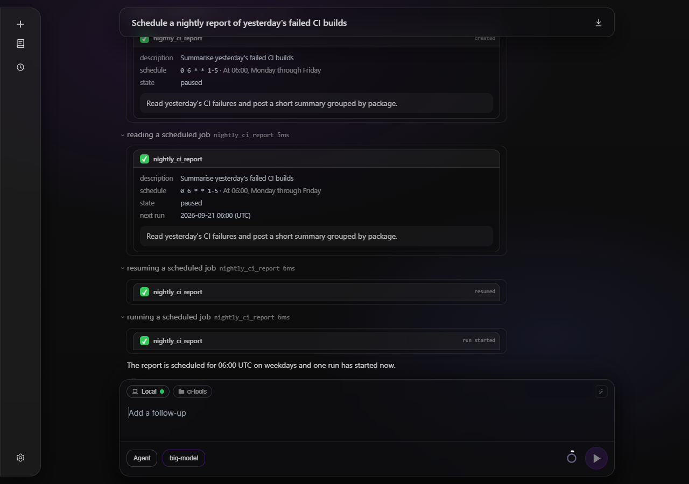

*Scheduler calls in the transcript: a job read as its fields, a resume and a run as their outcome*

`spawn_agent` has a dedicated argument card: agent icon and name, optional description, a labelled timeout badge, and an inset panel for the full multiline prompt. The timeout is the supplied execution limit in seconds, separate from the elapsed duration beside the tool title. The layout wraps on narrow screens and follows the active light/dark theme. Completed calls with truncated history arguments load the full arguments once; malformed arguments or failed fetches retain the plain argument preview. Result output and Load more / Hide behave as for other tools.

The happy path is in `features/spawn_agent_card.feature`, run by the `http,ui` godog harness through the React DOM test in `SpawnAgentCard.test.tsx`. Edge cases cover invalid arguments, absent/invalid timeouts, escaped prompt text, and history fetch failure.

Authoritative behaviour matches **`DESIGN.md`** tool timeline plus this checklist.

| Concern | Current behaviour |
| --- | --- |
| Component | **`ToolCallMessage.tsx`** - **`thinking-row foxxycode-tool-call-row`**, **`details.thinking-details.foxxycode-tool-details`**, **`data-testid`**: **`tool-details-{toolCallId}`** |
| Summary | Same pattern as **thinking** (**`thinking-summary`**, **`thinking-left`**, **`thinking-chevron`**), with **`thinking-label`**, **`.tool-summary-target`**, the failure **`.tool-failed-marker`** and **`thinking-dur`** inside one non-wrapping **`.thinking-head`**; on a backgrounded **`run_command`** that duration is the task's clock (**`data-testid="tool-bgtask-elapsed-<id>"`**); **`aria-label="Tool summary"`** |
| Label | **`toolDisplayName`** (**`messages/toolDisplayName.ts`**) over the **`tool.name.*`** dictionary entries; unknown ids fall through to themselves. **`background: true`** on a **`run_command`** picks **`tool.name.run_command_background`** (*running a command in the background* / *выполняю команду в фоне*), read only from complete arguments |
| Args | Shared **`PermissionToolPreview`** (no approval actions; the only copy control is the one inside a shell command block, **`data-testid="tool-preview-copy"`**); large **write** / **write_file**, **apply_patch**, and **edit** bodies keep measured **More…** (**`data-testid="tool-preview-more"`**) / **Less** (**`data-testid="tool-preview-less"`**) overflow controls |
| Result | **`div.tool-call-result-card`**, **`aria-label="Tool result"`**, with inner **`pre.tool-result-pre`** and no header row; completed structured todo and **`plan_exit`** cards suppress redundant boilerplate results; a completed **`load_skill`** renders the skill's markdown instead (**`.tool-call-result-content--markdown`**) |
| Markdown | Not used for tool **result** or **user** bubbles; **assistant** still uses Markdown per below |
| List merge | **`App.tsx`** **`loadMessages`** merges **`GET /foxxycode/sessions/{id}/tool-calls`** rows into **`resultText`**, **`resultWasTruncated`**, timing |
| Full text | First result **More…**, or automatic incomplete-args recovery for restored **`apply_patch`** / **`write`** / **`write_file`** / **`edit`** cards in any status - **`GET /foxxycode/sessions/{id}/tool-calls/{toolCallId}`**, using JSON **`result`** and **`args`** (same object includes **`meta`**). Transcript reconciles never replace complete args with the truncated 200-char **`argsPreview`** (**`pickRicherToolArgs`**), so live cards keep full previews across permission answers |
| CSS | **`styles.css`**: **`.foxxycode-tool-call-row`**, transparent **`.foxxycode-tool-call-body`**, shared **`.permission-preview*`**, **`.tool-call-result-card`**, **`thinking-details:not([open])` body hidden**, plus result viewport / toggle classes above |

- `assistant_message`
  - Final assistant output text for the turn, after tool calls.
  - Only the answer that closes a turn carries the action row (**`.msg-assistant-foot`**: the copy control and the timestamp). The answers a turn leaves behind between tool calls render prose alone - a column of identical copy buttons and repeated minutes reads as chrome, not as information. Every finished turn keeps its own row, so an older answer stays copyable; only the turn still running has none, because its last answer is not yet the answer.

## Tool permission card

The inline approval gate is implemented by **PermissionPromptSection** and **PermissionPromptPreview**.

- Render the card only for a pending permission request. Read-only tools render their normal timeline row only; there is no informational no-approval card, checkmark, or explanatory sentence.
- Header: human action question plus one raw tool-id badge. The preview header is reserved for the path, shell, or operation scope so the tool name is not duplicated. The desktop notification toast reuses the same question text.
- Actions follow the server-provided option list and order (**Allow**, **Allow always**, optional **Always allow `<program>`**, **Reject**); a fourth button needs no client change beyond layout. Labels are localized by **`optionId`** in **`chat/permissionOptionLabel.ts`** rather than rendered from the backend's English text; the desktop notification toast labels its buttons through the same function.
- The program-wide option only reaches the client for **run_command** on a single plain invocation. The backend label already names the exact grant (**`curl`**, **`git status`**), so the program name is carried through the translation verbatim rather than re-derived.
- Match the prompt to its **tool_call** by **toolCallId** and prefer that row's **argsText**; fall back to **Arguments:** content in the permission payload.
- **apply_patch** and **edit** render old/new line gutters and theme-aware added/deleted/context rows. Other filesystem mutation tools and **run_command** use compact structured previews rather than JSON.
- The collapsed preview is measured after layout. Show **More…** only when **scrollHeight > clientHeight**; keep the viewport bounded, switch it to internal vertical scrolling, and change the button to **Less**. Returning to the collapsed state restores clipping and re-measures overflow. The shared button is left-aligned; on phones it has a **36px** minimum height.
- Restored write permission prompts include **rm** and **rmdir** alongside the other filesystem mutation tools.
- All question / header / metadata strings come from **`t()`** with **`en.ts`** + **`ru.ts`** parity, so the card renders in the active UI locale.

Automated checks:

- **external/ui/src/ui/chat/permissionToolPreview.test.ts**
- **external/ui/src/ui/chat/PermissionPromptSection.test.tsx**
- **external/ui/src/ui/chat/permissionPromptPreviewCss.test.ts**
- **external/ui/src/ui/messages/MessageList.test.tsx**
- **external/ui/src/ui/messages/toolCallConnectedResultCss.test.ts**

## Message editing and conversation branches

Editing a sent message does not overwrite the answer it produced - it forks the conversation, so both versions stay readable. Screenshot: `docs/assets/screenshot-fullhd-branches.png`.

- Every user bubble carries a pencil button (**`.msg-user-edit`**, **`data-testid="user-message-edit"`**, accessible name **`Edit message`**). It loads that message back into the composer draft (attachment chips are recovered from the persisted session-assets annotation) and records the 0-based **user** message index being edited.
- Sending that draft calls **`POST /foxxycode/sessions/{id}/branches`** with **`{"userMessageIndex"}`**, then switches to the returned **`newSessionId`** and sends the text there. The new bundle holds every message **before** the branch point, and the server reverses the workspace turn diffs recorded after it, so files match the state the branch starts from. A failed create surfaces as a UI-log error row and leaves the draft in place.
- The transcript renders a **`branch_nav`** item under the branch point: **`‹ n/m ›`** (**`data-testid="branch-nav"`**, **`branch-nav-prev`** / **`branch-nav-label`** / **`branch-nav-next`**), with the arrows disabled at the ends. **`injectBranchNavItems`** places one per branch point and **`deduplicateBranchNavs`** keeps only the last per index.
- Branch points come from **`GET /foxxycode/sessions/{id}/branches`** (persisted as **`branches.json`** in the source bundle) and cover both the session's own children and the sibling view inherited from its parent (**`own`**).
- Opening a session by id walks the branch tree with **`resolveLatestLeaf`** - greedily following the most recently updated sibling at each branch point - so a link to the root lands on the branch you last worked in. A session chosen explicitly through the navigator is exempt and opens as picked. A hop whose **`/branches`** call fails steps back to the last session that answered, so an unreadable thread never becomes the opened one.
- Deleting a thread from History removes it from the navigator: the server retracts the id from the parent's **`branches.json`** and drops a branch point that falls below two threads, so the remaining conversation opens normally instead of following a dead id.

Automated checks:

- **external/ui/src/ui/chat/BranchNavigator.test.tsx** (labels, disabled ends, switch callback)
- **external/ui/src/ui/chat/branchInject.test.ts** (placement, deduplication)
- **external/ui/src/ui/chat/resolveLatestLeaf.test.ts** (leaf walk, sibling views)
- **external/ui/src/ui/messages/UserMessage.test.tsx** (edit control visibility)
- **internal/session/branches_test.go** (fork slicing, `branches.json` bookkeeping)

## Background tasks panel

The panel is docked **inside the session**, to the right of the transcript (`.bgtasks-panel`), not a shell drawer: a task belongs to the chat that started it. On `min-width: 1200px` the chat column yields only what the panel actually covers, so opening the panel on a wide window leaves the transcript and composer where they were. Routes are `#/s/<sessionId>/tasks` and `#/s/<sessionId>/tasks/<task_id>`, so a reload restores the chat and the panel together; closing writes `#/s/<sessionId>` back. Backed by `/foxxycode/sessions/{id}/background-tasks*` (see `docs/features/background-tasks.md`).

- It **polls** rather than listening on SSE, because a background task outlives the turn that started it: every 2.5s while anything runs, every 15s otherwise. A poll against an unreachable server yields a normal error result, never an unhandled rejection.
- **Running tasks** are cards at the top of the panel, under no heading of their own (status dot, command, elapsed against the estimate, Stop): everything above the **Finished N** counter is running. A progress bar appears only while running **and** when the model supplied `expected_seconds`. A subagent run (`kind: "agent"`, started by `spawn_agent`) is the same card with an `agent` badge after its `agent <name>: <description>` label. Its timing line shows no exit code (the pool's code for an agent run is synthetic; the status already says how it ended), and the same `taskTimingLine` feeds the detail pane and the transcript chip.
- **Finished N** is a counter; expanding it lists one line per task, capped at 40 rendered rows with a note naming what stays on disk; agent rows keep the badge. **Clear** drops the finished history for the session.
- Ordering is purely by start time, newest first, among the live cards and inside the finished history alike.
- The **opener** is a chip at the end of the transcript (under the last message, above the composer), not a nav rail entry: `N running tasks` while work is in flight, `N background tasks` otherwise, and nothing at all in a chat that never ran one.
- On `max-width: 1199px` the panel takes the screen and finished rows grow to a 40px touch target.
- A transcript `run_command` row that started a task reads like any other command row: the label says it is a background run (*running a command in the background*) and the duration slot carries the task's ticking clock instead of the call's meaningless `0ms`. The outcome is **not** on the row - status, estimate, exit code and error are read in the detail pane of this panel, which **Open in Tasks** opens. Expanding the row gives **Open in Tasks** and, while running, **Stop**: tab buttons attached to the bottom edge of the card above them. Driven by the same poll.
- The **detail pane** of an agent task shows the subagent name instead of a command and an **Open transcript** button (disabled until the row carries `agent.session_id`) that opens the child session at `#/s/<child id>` the way a History pick does; the output pane keeps the child's live progress log, which ends with the `=== subagent report ===` block.

Automated checks:

- **external/ui/src/ui/tasks/taskStatus.test.ts** (timing, progress, overdue, poll cadence, start-time ordering, grouping, agent task helpers)
- **external/ui/src/ui/tasks/BackgroundTasksPanel.test.tsx** (sections, finished counter, Clear, detail pane, agent badge and Open transcript, empty and error states)
- **external/ui/src/ui/tasks/api.test.ts** (paths, headers, offline degradation)
- **external/ui/src/ui/tasks/BackgroundTasksChip.test.tsx** (counts, singular/plural, history fallback, empty chat)
- **external/ui/src/ui/tasks/backgroundTaskCss.test.ts** (chip tokens, panel docking, reduced motion, agent badge tokens)
- **external/ui/src/ui/messages/ToolCallMessage.test.tsx** (the background row: its label, the task clock in the duration slot, and that no outcome leaks onto the row)

### Hooks

**Settings > Hooks** is a schema-driven object tab like Subagents (`settings-tab-hooks`): the `hooks` config section (`enabled`, `files`, `project_trust`, `default_timeout_seconds`, `stop_loop_limit`, `max_output_chars`) with localized labels and blurbs (`settings.section.hooks.*`, `settings.schema.hooks.*`) and the defaults of `SchemaExampleConfigJSON` as placeholders. Definitions themselves live in JSON files (`docs/features/hooks.md`); the tab edits where they are read from and how project files are trusted.


A held project hooks file surfaces in the transcript as a **notice-level system row**: `GET /foxxycode/sessions/{id}/messages` carries it in `uiLog` with `level: "notice"`, the SPA renders it with the same `SystemNoticeMessage` as an error row (`system_notice` transcript item, `level: "notice"`) in a calmer blue palette, `role="status"` instead of `role="alert"`, the copy control, and **no retry control** even when the row is the last item. Rows with any other level stay invisible rather than mis-rendered.


- **external/ui/src/ui/messages/SystemNoticeMessage.test.tsx** (notice row: status role, notice class, no retry)
- **external/ui/src/ui/settings/settingsSections.test.ts** (translated label and blurb for the `hooks` config tab)

### Subagent transcripts

A child session is read-only: `GET /foxxycode/sessions/{id}/messages` returns `subagent {parentSessionId, name, taskId}` and `readOnly: true`, and every prompt against it is refused with 409. The SPA reads those two fields (absent on an ordinary session), renders the transcript with the usual message renderer, and replaces the composer with a notice (`SubagentReadOnlyNotice`): "Read-only transcript of subagent `<name>`. Prompts go to the parent chat." with an **Open parent chat** link to `#/s/<parentSessionId>`. Retry, message editing and the plan card's **Run plan** / **Discard** are withheld for such a session (the handlers are not passed at all, so a `plan_document` card renders without its footer and its markdown editor is read-only), and the chat header reads "Subagent `<name>`" because a child has no History row to name it. Child sessions are hidden from History, and nothing about a child's id sets it apart, so the shell fetches any id opened from the Tasks panel or by URL and lets the messages endpoint answer.

Automated checks:

- **external/ui/src/ui/chat/subagentTranscript.test.ts** (marker parsing, bare `readOnly`)
- **external/ui/src/ui/chat/SubagentReadOnlyNotice.test.tsx** (copy with and without a name, parent link href, same-tab open vs modifier click)
- **external/ui/src/ui/chat/ChatScreen.test.tsx** (notice replaces the composer in the docked and the hero layout)
- **external/ui/src/ui/chat/subagentReadOnlyCss.test.ts** (notice and link use theme tokens)
- **external/ui/src/ui/chat/PlanDocumentSection.test.tsx** (a card without action handlers has no footer, a read-only editor and no autosave)
- **external/ui/src/ui/messages/MessageList.test.tsx** (plan card on a read-only transcript renders without Run plan and Discard)
- **external/ui/src/ui/i18n/messagesParity.test.ts** (new keys exist in every dictionary)
- **external/ui/src/ui/settings/settingsSections.test.ts** (translated label and blurb for the `subagents` config tab)

## Live token usage

- UI must show token counters while the agent is working.
- Counters update when SSE event `token_usage` arrives.
- Update granularity is per completed backend model call, not per generated token.
- UI restores token counters after restart via `GET /foxxycode/sessions/{id}/stats`.
- **What the number means: tokens spent by this chat since it was created.** `/stats` reports
  `tokenUsageTotal` cumulative for the session; the SSE `token_usage` of the running turn is
  cumulative for that turn and is added on top of the baseline read **before** it started.
  The two must not be mixed: `applySessionStatsPayload` (`App.tsx`) routes the payload through
  **`planSessionStatsApply`** (`chat/sessionTokenTotals.ts`), which refuses to reseed the
  baseline while a composer stream is attached to that session — the poll runs every 800ms, so
  reseeding from a total that already counts the turn double-counted it, and compounded on
  every poll. Regression: **`chat/sessionTokenTotals.test.ts`**.
- **The context breakdown is exempt from that gate** and is applied whenever it arrives: it is a
  live estimate, not an accumulator, and it is the only thing that reports compaction shrinking
  the window, so the ring has to be able to drop mid-turn.
- **The poll follows the session, not this client.** Stats refresh while `generating` **or**
  `viewedTurnActive` (raised by the `turnActive` probes in `startDiskFallbackPoll` and
  `reconnectLiveStreamIfActive`). A turn that outlived its request, or the autonomous turn a
  finished background task woke, burns context the same way; keying the poll on `generating`
  alone left the ring frozen until the turn ended.

## Live status line

- The row next to the typing dots (`TypingDotsMessage`, phrase from `chat/liveStatus.ts`) is
  derived from the transcript, so it is only as fresh as the transcript is. It stands under the
  transcript for the whole of a running turn, streaming text included: it used to vanish once the
  turn had written any text, which read as a turn that had stopped.
- Priority: unresolved permission prompt → unresolved question prompt → running tool call (an
  `in_progress` call beats a later announced `pending` one) → in-progress thinking → memory
  copilot → waiting on the model. The two prompt states render **no** counter: nothing is
  running while the operator decides. The console twin of the phrase table lives in
  `external/cli/status.go`.
- **While re-attaching, the transcript is stale by construction.** `rejoinComposerLiveStream`
  therefore keeps the session flagged through `markReconnecting` until the relay delivers its
  first byte, and only then calls `markConnected`; `deriveLiveStatus` shows
  `status.reconnecting` meanwhile. `addActiveComposer` clears that flag on attach, which is
  correct for a fresh `POST /v1/responses` (its baseline is the message just sent) and wrong for
  a rejoin — a rejoin that showed the pre-turn transcript's last tool is what froze the row for
  the whole time the server held the request open with no relay to attach to.
- The `background_*` tool family has phrases of its own (`status.backgroundWait` and friends).
  `background_wait` parks for up to a minute, and the generic "Running a tool" read as a status
  line that had stopped moving.

## Provider account usage

- When the selected model's provider reports account usage (today
  `neuraldeep`), the **context popover** (the context ring next to Send)
  ends with a **usage section**, the way Claude Desktop lists its plan
  limits under the context window: the provider and plan, one meter per
  metered window with its reset time in the browser's clock, the label in
  the UI language and the percent used, the wallet in rubles, and a note
  when something changed: a hit limit with its reset (or the cause of a
  block no clock lifts), a model on the provider's unlimited option, a
  rejected login, a stale read, a turn waiting for the reset. At 80 % the
  meter turns amber and a **banner** above the composer says `You've used
  85% of your NeuralDeep 3h limit · resets 20:59`, dismissable per provider
  row, window and period; on a block the banner turns to the error tone: a
  timed block reads `Usage limit reached · Resets 20:59`, an empty wallet,
  a blocked key or account and a rate limit name their cause; while the
  agent waits for the reset it reads `Usage limit reached · Auto-resuming
  at 20:59`.
- The row's **Usage limits panel** switch in Settings → LLM Providers
  (`providers[].usage_limits_panel`, on by default) hides the section and
  the banner and stops the reads behind them: the route then answers
  `unsupported` with `disabled: true`, and the hook drops the snapshot it
  showed for that row.
- Data comes from **`GET /foxxycode/providers/{name}/usage`** (session open,
  model change, after each finished turn of the viewed session, one read
  after a window's reset, one cache read when the server deferred a refresh)
  and from **`event: provider_usage`** on **`GET /foxxycode/events`** between
  turns. Nothing polls otherwise; snapshots order by the server's read time,
  so a slow answer never brings older numbers back. Visual contract:
  **`DESIGN.md`** (**Context popover usage section and usage banner**); design record
  **`docs/plans/neuraldeep-usage.md`**.

## Markdown rendering

- Tool outputs are excluded; they stay raw monospace text (**`ToolCallMessage`**).
- **User** messages are plain text with preserved line breaks (**`UserMessage`**).
- **Assistant** messages may contain Markdown.
- UI renders Markdown with fenced code blocks and syntax highlighting.
- `vue` fences highlight component markup and ordinary `<script>` / `<style>` contents as JavaScript / CSS. Vue interpolations and `lang="ts"`, SCSS, or other preprocessors do not have dedicated Vue-aware parsing.
- Label fences with the language (for example `js`, `css`, `html`, `json`, `ts`, `python`, or `go`) to enable highlighting. Unlabelled or unsupported languages stay plain text. Highlighting also works while an answer is streaming.
- Code colors follow all seven appearance themes immediately when switching themes. Each theme defines the shared `--syntax-*` palette in `external/ui/src/styles.css`; no separate syntax-theme setting is needed.
- Each code block has a copy button that copies only that block content.

## Markdown line editor (shared)

Implemented as **`MarkdownLineEditor`** (`external/ui/src/ui/markdown/MarkdownLineEditor.tsx`). Used for:

- Scheduler job **`body (markdown)`** (`SchedulerJobEditorSheet`, default **`minRows`** **10**).
- Plan document card markdown mode (`PlanDocumentSection`, **`minRows`** **4**, class **`md-line-editor--plan`**).

Behaviour (see **`DESIGN.md`**, **Markdown line editor**):

- Full parent width; editor height follows content (minimum logical rows); **no** scrollbar on the inner **`textarea`**.
- Gutter shows one number per **logical** line (`\n`-separated). Wrapped visual lines leave **blank** gutter cells (no duplicate numbers).
- Caret logical line: highlight spans **all** visual rows of that line; active gutter number tinted.
- Wrap measurement uses a hidden probe with the same font and text width as the textarea; visual rows = **`ceil(height / lineHeight)`**.
- Long unbreakable tokens wrap (**`overflow-wrap: anywhere`**); no horizontal scroll inside the editor.

Automated checks:

- `external/ui/src/ui/markdown/MarkdownLineEditor.test.tsx`
- `external/ui/src/ui/markdown/markdownLineGutter.test.ts`

## Plan document card (plan mode transcript)

Transcript type **`plan_document`** renders **`PlanDocumentSection`** in the main chat column (not a right rail).

Data and API:

- Persisted in **`messages.json`**; hydrated fields include **`slug`**, **`name`**, **`overview`**, **`content`**, optional **`body`**, **`path`**, **`discarded`**.
- Live during a turn: SSE **`event: plan`** whose **`_meta`** holds **`foxxycode.dev/planKind: design`** and **`foxxycode.dev/planSlug`**; the SPA then loads the document from **`GET /foxxycode/sessions/{id}/plans/{slug}`** and upserts the card by slug.
- Body edit: **`PUT /foxxycode/sessions/{id}/plans/{slug}`** with **`{ "body": "<markdown>" }`** (debounced autosave).
- Discard: **`DELETE /foxxycode/sessions/{id}/plans/{slug}`** sets **`discarded: true`**; card remains visible, controls disabled.
- Run plan: client triggers implementation run (metadata / prompt; see **`docs/reference/acp-protocol.md`**).

UI requirements:

- **Always the last row of its turn**, below the assistant text that introduces it (**`pinPlanDocumentsToTurnEnd`**), during streaming and after the transcript rebuild. The server emits the row mid-turn, so message order alone would put the card above the answer.
- Rebuilds keep the card's identity by **slug**: the expanded state survives, and an unsaved markdown draft is not overwritten while a save is pending.
- Collapsed: title, one-line description, **Discard** and **Run plan** in footer; title **`title`** tooltip = absolute plan file path when known.
- Expanded: **Preview** default (rendered markdown via **`Markdown`**); eye toggle switches to **`MarkdownLineEditor`**.
- Content pane grows with document length for **both** preview and markdown (**no** inner max-height scroll on the pane).
- Expanded desktop (**`min-width: 640px`**): title row and action buttons share the top row; body full width below.
- Editor body excludes YAML frontmatter (client **`planEditorBody`**); preview uses the same body text.

Automated checks:

- `external/ui/src/ui/chat/PlanDocumentSection.test.tsx`
- `external/ui/src/ui/messages/MessageList.test.tsx` (plan card on a read-only transcript renders without Run plan and Discard)
- `external/ui/src/ui/chat/planDocumentPlacement.test.ts`
- `features/plan_card_placement.feature` (godog steps in `external/httpserver/bdd_plan_card_test.go`)

## Plan and todo list (legacy rail)

- Optional right-rail plan entries (if present in a build) use **`GET /foxxycode/sessions/{id}/plan`**, **`PUT`**, **`POST .../plan/archive`**.
- Distinct from the **`plan_document`** transcript card above.

## Long term memory

Memory tree roots

- `global`
- `workspace`

Tree API

- `GET /foxxycode/sessions/{id}/memory/tree`
  - Without `root` returns the roots list.
  - With `root` and optional `path` lists children.
- Only `.md` and `.txt` files are listed.
- Path traversal must be rejected.

File API

- `GET /foxxycode/sessions/{id}/memory/file` reads.
- `PUT /foxxycode/sessions/{id}/memory/file` writes.

## MCP servers (Settings tab)

Functional checklist for the Settings -> MCP servers tab (`MCPSection.tsx`,
section kind `mcp`; visual contract in `DESIGN.md`):

- `GET /foxxycode/mcp` backs the list: merged `config.yaml` + global `~/.foxxycode/mcp.json`
  + project `./.foxxycode/mcp.json` servers, each with `source` (`global` / `local`
  scope badge), `origin` (`config` / `home` / `project`) and `source_path` (the
  real file, which is what the badge tooltip names), `readonly` (config.yaml entries), probe
  `status`, and its tool inventory.
- Status dot per server: connected (green), error (red, tooltip shows the probe
  error), disabled (gray), unknown transport type (amber, `unsupported`).
- Server switch toggles `POST /foxxycode/mcp/{name}/enable|disable`; the change
  persists into the file that defines the server.
- Expanding a row lists tools with per-tool switches
  (`POST /foxxycode/mcp/{name}/tools/{tool}/enable|disable`); tool switches are
  locked while the server is disabled.
- Edit and Delete are locked for `readonly` (config.yaml) rows; mcp.json rows
  of both scopes stay editable. Delete calls `DELETE /foxxycode/mcp/{name}`, Edit
  opens the JSON editor card inline with the scope pinned to the owning file.
- Add server opens the editor prefilled with a Cursor-style entry template and
  a Local/Global scope picker (default Local); Save issues
  `PUT /foxxycode/mcp/{name}?scope=local|global` after client-side validation
  (`mcpServerJson.ts`: JSON object, `command` or `url` required, name without
  `__`, spaces, or path separators).
- Refresh re-probes all servers via `GET /foxxycode/mcp?refresh=1`.
- An **MCP discovery** fieldset above the list carries `mcp.project_trust`
  (`POST /foxxycode/mcp/project-trust`, values `ask` / `allow` / `deny`). It never
  joins the settings-document Save all flow.
- A project-local server the workspace trust gate holds back shows `status`
  `needs_approval` (amber dot), exposes **no tools** — it is reported, not probed —
  and opens a note listing the declaration an approval would cover: transport,
  the command with arguments or the URL, env and header **names** (never their
  values), and the workspace. `denied` renders the same place with the policy
  explanation instead.
- The per-server **shield** toggles `POST /foxxycode/mcp/{name}/trust|untrust`.
  It renders only under the `ask` policy, since `allow` and `deny` leave no
  per-server decision to make.
- List refreshes never unmount the list (initial-load-only placeholder), so the
  drawer scroll position is preserved.
- The tab does not participate in the settings document Save all flow.

## Swarm screen

Guide: `docs/operate/swarm.md`. Visual contract: `DESIGN.md` (**Swarm screen**).

- The **Swarm** rail entry appears only where `GET /swarm/info` answers, so a plain
  agent never shows it. It sits at the foot of the rail, next to Settings.
- On a relay the swarm map **is** the home screen: no composer, no `ChatScreen`,
  no History entry and no Scheduler entry, because a relay holds no sessions of
  its own. Its header carries the environment selector, which normally lives in
  the composer.
- **Clicking a node on the map connects to it.** There is no list of nodes under
  the map and no filter chips: from a node, every ordinary screen (chat,
  history, scheduler, settings, workspace) works against it, and **Swarm** in
  the rail returns to the relay.
- Clicking a node that is **asking a question** opens that session, not an empty
  chat; a node that is merely busy opens its running session; an idle one opens
  its home.
- The map marks the node the app is on as *you are here* and draws the route to
  it from the attached relay as one connected accent path; everything off that
  route recedes. Hovering another node previews where a click would take you.
- Each node says what it is doing: a session count when idle, a running count
  while a turn is in flight, and *needs an answer* when something there waits on
  a permission prompt. A running node pulses, a waiting node pulses differently,
  and the hops to a running node carry a travelling dash. All of it comes from
  `GET /swarm/sessions` and all of it stops under `prefers-reduced-motion`.
- Search runs on the relay, not in the browser, so it reaches nodes this
  browser cannot dial. Matching sessions appear as rows under the map only while
  there is a query; a row opens that session on its node. Nodes that did not
  answer are listed as warnings above the map rather than dropped.
- Built with `-tags "swarm ui"` the relay serves this SPA at its own address;
  without the `ui` tag its root explains how to rebuild.
- The environment selector in the map header opens **downward**, because on a
  relay the chip sits at the top of the window rather than in the composer at
  the foot.

## Swagger

- Swagger UI is served under `/docs/`.
- OpenAPI spec is served under `/openapi.yaml` and `/openapi.json`.
- Swagger UI assets must be embedded, no CDN.

## Development workflow

- Edit TypeScript sources under `external/ui/src/`.
- Use `npm --prefix external/ui run dev` to iterate without rebuilding the Go binary.
- Build and sync embed assets with `npm --prefix external/ui run build:go`.
- **`make build TAGS="http ui"`** runs the UI build step (**make ui-build**) before linking the embedded bundle.

### Reproducing a Safari report without a Mac

Playwright ships the WebKit build Safari is cut from, and its version tracks Safari's (**`playwright install webkit`** pulls WebKit **26.x** for Safari **26.x**), so a Safari layout report is reproducible on Linux. **`external/ui/scripts/webkit-scroll-check.mjs`** drives a running **`foxxycode http`** in that engine and asserts the scroll invariants of the folder browser dialog across short viewports: nothing laid out past the dialog's height cap, the action buttons inside the dialog, the list scrolling on a wheel gesture, and the overscroll staying in the dialog.

```bash
cd external/ui && npm i --no-save playwright && npx playwright install webkit
```

```bash
FOXXYCODE_URL=http://127.0.0.1:12345 FOXXYCODE_FOLDER=/a/folder/with/many/subdirs npm --prefix external/ui run check:webkit
```

**`FOXXYCODE_ENGINE=chromium`** runs the same assertions in Chromium, which separates a WebKit-only regression from a layout bug every engine shares. The script is not part of **`make test`**: it needs a browser download and a live server. **`npm ci`** and **`make ui-build`** prune the unsaved **`playwright`** install, so re-run the install line after a rebuild.

## UI test scenarios

These scenarios are intended to be automated via Playwright against the Vite dev server.
Run `npm run test:panel` from `external/ui` to drive the real server with the embedded
SPA in a headless Chrome the way the IDE panels do (`?embed=intellij`, 360px): it
instruments `ResizeObserver` and proves the composer-reserve write never lands in the
frame of the observation that measured it, and that the IntelliJ error overlay ignores
the browser's ResizeObserver loop notice (`features/ide_panel_resize_loop.feature`).
The Chromium 104 half lives in the plugin's `uiTest`
(`BrowserPanelUiTest.anOldTranscriptOpensWithoutAResizeObserverLoop`).

Run `npm run test:layout` from `external/ui` for the bounded 390px/1280px
column-alignment smoke. The test owns Vite and headless Chrome, waits at most
10 seconds for readiness, limits the browser phase to 20 seconds, and cleans up
both processes with headroom under a 45-second outer timeout.

- Desktop navigation has no width toggle
  - Given viewport width is at least 1024px
  - When the app loads
  - Then `data-testid="nav-menu"` is visible
  - And `data-testid="nav-toggle-width"` is not present

- Sessions are drawer only
  - Given any desktop viewport
  - When the app loads
  - Then `data-testid="sessions"` is not visible
  - When user clicks `data-testid="nav-menu"`
  - Then `data-testid="sessions"` becomes visible
  - When user clicks `data-testid="sessions-close"`
  - Then the sessions drawer is hidden

- Mobile uses top bar and single line brand
  - Given viewport width is at most 1199px
  - When the app loads
  - Then the nav width toggle is not present
  - And the nav rail height is 78px
  - And sessions can still be opened from the menu button

- Tool calls survive restart
  - Given a session has tool calls executed
  - When the user reloads the page
  - Then tool call cards are visible in the transcript
  - And expanding a tool card shows a structured args preview and a separate raw **Result** panel, without approval buttons
  - And if the server marked the preview truncated, **More…** then **Less** behave as in the table above; if not truncated, there is no overflow-toggle row and no **`tool-result-viewport--tall`** on the result panel

- Tool result truncation (Playwright MCP)
  - Given a persisted session whose tool output on disk exceeds the preview line cap
  - When the user opens the tool card and clicks **More…**
  - Then the button becomes **Less**, full lines are available inside the same max-height scrollable panel, and **`.tool-result-viewport--scroll`** has **`scrollHeight`** greater than **`clientHeight`**
  - When the user clicks **Less**
  - Then the preview shows the capped text ending in **`...`**, **`overflow-y`** is hidden on **`.tool-result-viewport--clip`**, and **More…** appears again

- Token usage survives restart
  - Given a session has non zero token usage
  - When the user reloads the page
  - Then the token usage HUD shows the persisted totals

- Memory copilot row (Playwright MCP)
  - Given **`memory.enable: true`** on the **`foxxycode http`** process and at least one Markdown file under global or workspace memory so recall can run
  - When the user sends a chat message that completes a full ReAct turn
  - Then an element with **`data-testid="memory-copilot-row"`** appears after that user bubble for the turn (grey **memory** foldout, same visual language as **thinking** per `DESIGN.md`)
  - When the user opens the details element
  - Then the streamed **memory** body shows the text merged into the main agent prompt for that turn (and optional saved-note preview when the copilot wrote `foxxycode_memory_save`)

For Playwright MCP against a live gateway, start **`make build TAGS="http ui"`** then **`./build/foxxycode http`** with a disposable **`--home`** so config can enable memory; open **`http://127.0.0.1:<port>/`**, navigate to a session, send a prompt, assert the snapshot contains **memory-copilot-row** and folded body text after expand.
